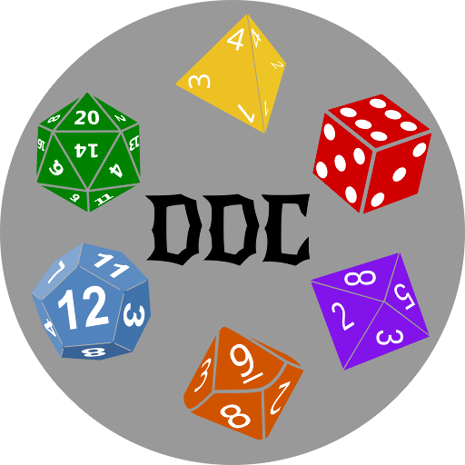
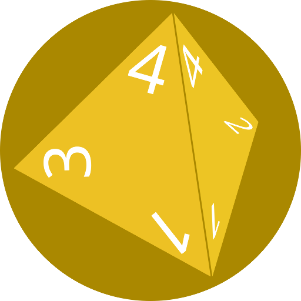
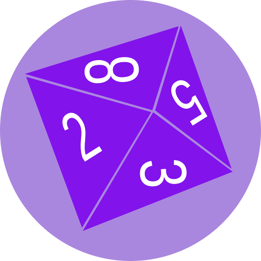
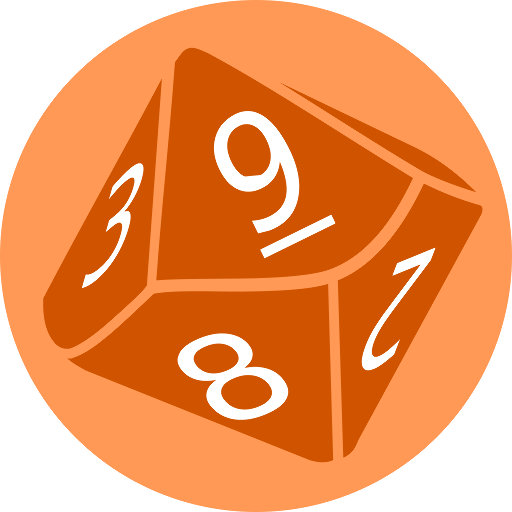
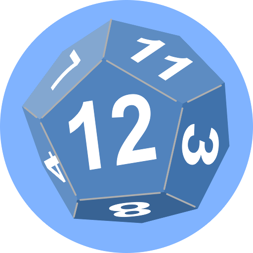
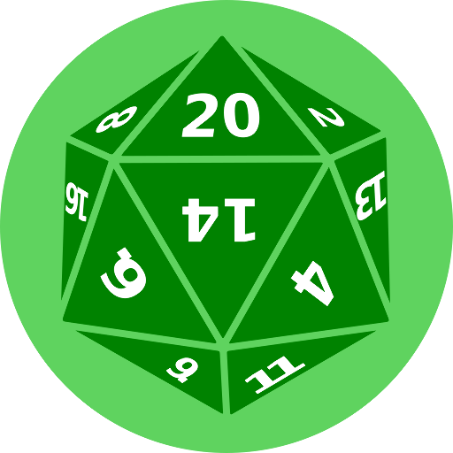

Arbitrage Trading
=================

[Go up to the CCC HW page](../index.html) ([md](../index.md))

### Overview

In this assignment you are going to create a Python program to perform [arbitrage trading](../../slides/applications.html#/arbitrage) on the blockchain.  Your trading will be between a number of different DEX instances from the [DEX](../dex/index.html) ([md](../dex/index.md)) assignment.  This program must be written in Python in a file called `arbitrage_trading.py`.  We provide a number of DEXes for you to use on the course blockchain.

Beyond general experience with programming Solidity (which you have at this point it the course), this assignment requires:

- That you completed the [DEX](../dex/index.html) ([md](../dex/index.md)) assignment.  This is for understanding of how our DEXes work; your DEX does not have to be function as we will provide the DEXes.
- That you completed the [Ethereum Tokens](../tokens/index.html) ([md](../tokens/index.md)) assignment; this is also for the understanding, and your Token Cryptocurrency does not need to be functional.
- Familiarity with the [arbitrage trading](../../slides/applications.html#/arbitrage) section of the lecture slides, including the [CPAMM](https://aaronbloomfield.github.io/ccc/slides/applications.html#/cpamm) trading method.

In addition to your source code, you will submit an edited version of [arbitrage.py](arbitrage.py.html) ([src](arbitrage.py)).


### Changelog

Any changes to this page will be put here for easy reference.  Typo fixes and minor clarifications are not listed here.  So far there aren't any significant changes to report. 

<!--

### DEX

*This section is only if you want to use your own DEXes.  If you plan on using the ones on the course blockchain, you can skip this section.  You should initially use the provided DEXes, and then come back to this section if you want to try it with yours.*

You will need to deploy five (or so) instances of your DEX.  The intent is to have a difference in exchange rates between these, and your program below will take advantage of these differences.  Before you deploy them, however, read this section through.

There is a lot to do to get this all set up: you have to deploy a TokenCC contract, five (or so) DEXes, initialize all the DEXes via `createPool()`, and then perform some trades to create a difference in the exchange rates.  While this can all be done manually, we can automate that via a smart contract.  Consider the following function:

```
function setup(uint numdex, uint amt_eth, uint amt_tc) public payable {
    require (msg.value > numdex * amt_eth * 1 ether, "Must supply enough eth");
    // create and fund the DEXes
    for ( uint i = num_dexes; i < num_dexes+numdex; i++ ) {
        dexes[i] = payable(address(new DEX()));
        TokenCC(tokencc).approve(dexes[i],amt_tc * 10**TokenCC(tokencc).decimals());
        DEX(dexes[i]).createPool{value: amt_eth * 1 ether}(amt_tc * 10**TokenCC(tokencc).decimals(), 
                                 3, 1000, tokencc, etherpricer);
    }
    num_dexes += numdex;
}
```

This handles all the deployment of the DEXes.  As the addresses of the DEXes and the TokenCC contract are stored in public variables (a `dexes` mapping and a `tokencc` field, respectively), we can get their addresses after this function runs -- we'll need those when we write our arbitrage trading program.  Note that this function requires supplying ETH with the call -- if you are creating 5 DEXes with 10 ETH per DEX, then you have to supply it with 50 ETH plus gas fees (or just make it 51 ETH).

We also want to make a few exchanges on the DEXes to vary the exchange rates.  Consider the following function:

```
function configureDEXes() public payable {
    require (msg.value > 10 ether, "Must supply enough eth");
    // excahnge with the DEXes
    uint balance = TokenCC(tokencc).balanceOf(address(this));
    bool success;
    (success,) = address(dexes[1]).call{value: 1 ether}("");
    require(success,"DEX exchange call 1 didn't succeed");
    (success,) = address(dexes[2]).call{value: 2 ether}("");
    require(success,"DEX exchange call 2 didn't succeed");
    (success,) = address(dexes[3]).call{value: 3 ether}("");
    require(success,"DEX exchange call 3 didn't succeed");
    (success,) = address(dexes[4]).call{value: 4 ether}("");
    require(success,"DEX exchange call 4 didn't succeed");
    // give the sender the TC obtained
    uint xferamt = TokenCC(tokencc).balanceOf(address(this)) - balance;
    TokenCC(tokencc).transfer(msg.sender,xferamt);
}
```

When supplied with 10 ETH, this will make a few exchanges.  We can't put this code in the `setup()` function, above, as that would run over the gas limit.

We provide these functions, and a few others, in an [Arbitrage.sol](Arbitrage.sol.html) ([src](Arbitrage.sol)) file for you to use.  ***NOTE:*** Just using this blindly without understanding what it does will not be successful -- you need to understand the code that is being called.  You will not be submitting this file, so feel free to adapt it as desired.  Note that we create a constant EtherPriceOracle in that contract, as we need to pass in an EtherPriceOracle to the `createPool()` function to initialize the DEX.  However, we don't call any functions on the DEX that use the EtherPriceOracle, so using the constant one is fine here.

In addition to your TokenCC.sol and DEX.sol files (and any supporting files so they can compile), you will need the
[IEtherPriceOracle.sol](../dex/IEtherPriceOracle.sol.html) ([src](../dex/IEtherPriceOracle.sol)) and [EtherPriceOracleConstant.sol](../dex/EtherPriceOracleConstant.sol.html) ([src](../dex/EtherPriceOracleConstant.sol)) files.

-->

### Web3.py

You will need to read the [introduction to web3.py](../../docs/web3py.html) ([md](../../docs/web3py.md)).  While you do not need to have all of that memorized, you do need to understand it all!  The intent is that you will use that page as a reference while you write this assignment.

#### Connecting

The following code will handle the connection based on the values in the `arbitrage_config.py` file, which is introduced below.  After reading this part, you may want to come back to it again once the `arbitrage_config.py` file has been introduced.

```
from web3 import Web3
from web3.middleware import geth_poa_middleware
import arbitrage_config
if arbitrage_config.config['connection_is_ipc']:
    w3 = Web3(Web3.IPCProvider(arbitrage_config.config['connection_uri']))
else:
    w3 = Web3(Web3.WebsocketProvider(arbitrage_config.config['connection_uri']))
w3.middleware_onion.inject(geth_poa_middleware, layer=0)
print(w3.is_connected())
```

The code above will connect either through a local geth.ipc endpoint or a server's `wss://` connection based on the values in the `arbitrage_config.py` file:

- If the `connection_is_ipc` value is `True`, then the `connection_uri` value will have the form `/path/to/geth.ipc`
- If the `connection_is_ipc` value is `False`, then the `connection_uri` value will have the form `wss://server.univeristy.edu/path/to/geth`

The value for the second one is provided on the Canvas landing page, and in the provided `arbitrage_config.py` file.

### Market Theory

#### When to make an trade

Your program will need to compute it's *holdings*, which is the dollar amount of all the ETH and TC that it has.  You will use some fixed price for ETH (say, $100) and for TC (say, $10) for initial testing -- this value is provided in the `arbitrage_config.py` file, which is described below.

You will first need to obtain the various information (prices, $x$/$y$/$k$ values at each DEX, etc.).  Then you will need to make a *profitable trade*.  A profitable trade is defined here as a trade where the overall value of *holdings*, in USD, increases.  You must account for gas fees when determining this!  The formula to determine if you will make a profit is whether:

> $ethAmountAfter \ast ethPrice + tcAmountAfter \ast tcPrice - gasFees > ethAmountBefore \ast ethPrice + tcAmountBefore \ast tcPrice$

The *gasFees* is just the amount Ethereum charges for a transaction; DEX fees are not part of that value (the DEX pays out less, to the two amount-after variables will be less as a result, and thus will take DEX fees into account).

Note: there are other reasonable ways to determine "profit".  In particular, if one believes that the price of the currency will grow, then the total amount of that currency (not the total USD value) would be another metric.  For our purposes, we will just use the USD value of the holdings.

This formula also accounts for the DEX fees (the amount after is lower as a result of those).

Although the price of our (fake) ether will vary, you don't know if it will go up or down -- thus, the value for *ethPrice* should be the current price, and thus will be the same on each side of the equation above.

We are going to call this a *single trade*.  This is when you make one transaction at a single DEX to increase your holdings.

<!--

However, it could be that making *two* trades at once is profitable, whereas making one would not -- you must consider this possibility as well.  For example, imagine that ETH is worth $100, TC is worth $1, and you have 10 ETH and no TC, for a holdings of $1000.  We'll assume a constant exchange rate, even though our DEXes use $x \ast y = k$ to compute the exchange rate.  If a DEX 1 has a 1:100 ETH:TC exchange rate, then making that trade would not increase the holdings -- you would get $10 \ast 100 = 1,000$ TC for your 100 ETH, still worth $1000, but but the gas fees would lower that amount slightly, causing a loss of holdings.  However, if another DEX could trade that TC back for *more* ETH -- say it had a 1:50 ETH:TC exchange rate -- then you could trade that 1,000 TC for 20 ETH, making a profit.  Thus, you  must consider making two trades to make a profit as well.  We are going to call this a *double trade*.

You can assume the number of DEXes involved, $d$, is relatively small, so you can compute $d^2$ different combinations.  We will not be testing it with more than, say, half a dozen DEXes.

-->

#### Arbitrage goal

For each DEX, and for each of the two directions (ETH -> TC and TC -> ETH), find the (DEX,currency,amount) combination that maximizes your profit.  

Consider the most profitable such transaction among all the available DEXes.  If that transaction increases your holdings in USD, then take that action.  It's also possible that a *double trade* would yield a profit, where as a single trade would not (for example, exchanging some ETH for some TC in one DEX, and then trading that TC back for more ETH at a different DEX).  We are not considering double trades for this assignment.


#### How much to trade

We can formulaically determine how much to trade.  The full derivation of the formulas in this section is being omitted here, but you can see that full derivation [here](extra.html) ([md](extra.md)).  First we need to define a number of variables:

- The DEX values are $x_d$, $y_d$, and $k_d$
- The current prices are $p_e$ and $p_t$, the price of ETH and TC, respectively
- The quantity of each that we currently have is $q_e$ and $q_t$, for the quantity of ETH and TC, respectively
- Our holdings, in USD, are $h_{before}$ (our current holdings, before any potential transaction) and $h_{after}$ (our holdings after the transaction)
- The gas fees, computed as per the [introduction to web3.py](../../docs/web3py.html) ([md](../../docs/web3py.md)) page, are $g$; this is in units of ETH.  Gas fees are discussed below (in the "Assignment" section).  Note that this is NOT the price (in gwei) per gas step, nor the gas price in USD, but the total expected cost in ether of the transaction.
- $f$ is the percentage (out of 1.0) obtained after the DEX fees are removed.  So if $f_n$ is the fee numerator (say, 3) and $f_d$ is the fee denominator (say, 1000), then $f=1-f_n/f_d$.  As an example, if $f_n=3$ and $f_d=1000$, then $f=0.997$.  Note that this fee applies to both ETH and TC transactions, but only on the amount paid out.  You should query the DEXes to get their fee amounts.

The above values are all fixed for each time the program runs -- either from the config file (described below) or by querying the DEXes.  Different DEXes will have different values for $x_d$, $y_d$, and $k_d$, of course.  The only values that the program chooses are the amount of ETH that we trade in (we'll call this $\delta_e$) or the amount of TC that we trade in (we'll call this $\delta_t$).  As we are only considering a single trade, only one of them will be non-zero.

The formulas that we need are (derivations [here](extra.html) ([md](extra.md))):

- Our current holdings, in USD, are: <!-- $h_{before} = q_{e} \ast p_{e} + q_{t} \ast p_{t}$ --> 
- If we trade in TC, then our holdings after (in USD) are: <!-- $h_{after} = (q_{e} + f \ast x_{d}-f \ast k_d/(y_{d}+\delta_{t})) \ast p_{e} + (q_{t}-\delta_{t}) \ast p_{t} - g \ast p_e$  --> 
- If we trade in ETH, then our holdings after (in USD) are: <!-- $h_{after} = (q_{t} + f \ast y_{d}-f \ast k_d/(x_{d}+\delta_{e})) \ast p_{t} + (q_{e}-\delta_{e}) \ast p_{e} - g \ast p_e$  --> 

For a single trade, want to find the maximum profit for the two $h_{after}$ formulas *for each DEX*.  We take the derivative, then set it equal to zero to find the roots (details [here](extra.html) ([md](extra.md)), if you are interested).  The roots will give us the maximum and/or minimum points.  This gives us:

- If we traded in TC, then the maxima or minima is at: <!-- $\delta_{t}=-y_d\pm$ &#8730; $(f \ast k_d \ast p_e/p_t)$ --> 
    - Note that $p_e$ is in the numerator in that fraction, and that fraction is different than the fraction in the next formula
- If we traded in ETH, then the maxima or minima is at: <!-- $\delta_{e}=-x_d\pm$ &#8730; $(f \ast k_d \ast p_t/p_e)$ --> 
    - Note that $p_t$ is in the numerator in that fraction, and that fraction is different than the fraction in the previous formula
<!-- - Those two formulas do not render well in HTML, but the entire parenthetical is what we take the square root of -->

A few notes on those:

- If you want to cut-and-paste these formulas into your program, the [derivations page](extra.html) ([md](extra.md)) has them in text form
- Neither of these are guaranteed to make a profit!  It could be that it just loses the least amount instead.  But if a profit can be made, then one of those will be the maximum profit.
- How much profit is determined from the $h_{after}$ formulas, above
- Because the variables in the square root can never be negative, and because the fraction denominators can never be zero, the square root will always return real values
- However, the values to trade (meaning $\delta_e$ or $\delta_t$) may be negative, and you should ignore them in that case
- The values to trade (meaning $\delta_e$ or $\delta_t$) may be larger than your balance; if so, then you should consider how much profit can be made from trading in all of your balance in that case (but, if it's ether, then you have to deduct the gas cost before you trade it all in).


### Assignment

Your assignment is to create a program that attempts to make a profit by arbitrage trading.  For the purposes of this assignment, a *profit* means an increase in the value of your holdings in USD; the holdings are computed from the amount of ETH and TC your program controls as well as the current price of each.  

You must take gas estimation into account!  Otherwise, if you were only to make 0.001 ETH, but it costs 0.002 ETH in gas, you are losing money.  How to estimate gas fees is discussed on the [introduction to web3.py](../../docs/web3py.html) ([md](../../docs/web3py.md)) page -- once you create a transaction, you call `eth.estimate_gas()`.  The expected gas values will be in the tens of thousands of gwei -- 36,000 to 65,000 is a reasonable guess, but yours may be higher or lower.

When providing a transaction, you also have to supply the gasPrice.  For this assignment, you should use the value is in the `arbitrage_config.py` file (described below), which will typically be set to 10 gwei.  This gas estimate times the gas cost (10 gwei) will allow you to compute the cost of gas in ether, which is the $g$ variable in the formulas above.

Your program must be in Python.  It must be named `arbitrage_trading.py`.

In practice, your program would listen for events from any of the DEXes, and any time the exchange rate of any of the DEXes changed, it would re-run the analysis.  In order to make this assignment gradable, we are going to ignore events, and your program will consider all trade possibilities each time it is run.


#### Values to query the DEXes for

Each DEX will have to be queried to get values for $x$, $y$, and $k$; from this, you can determine the exchange rate ($y/x$ or $x/y$).  You will also have to query the DEXes for the fee amount (`feeNumerator()` and `feeDenominator()`).  Note that different DEXes, even for the same coin, can have different exchange rates and different fee amounts.


#### Values provided


The program will import an `arbitrage_config.py` file to provide many of the values, a sample of which is shown below.  The correct file for this semester is available on the Canvas landing page.

```
config = {
    # you will have to change these values for it to work
    'account_address': '0x123456789ABcdEf0123456789aBCDeF123456789',
    'account_private_key': hexbytes.HexBytes('0123456789abcdef0123456789abcdef0123456789abcdef0123456789abcdef'),
    'connection_uri': '/path/to/geth.ipc',
    'connection_is_ipc': True, # set to false if it's a ws:// connection
    # once set, these should only be changed as necessary as you are testing your code
    'price_eth': 100.00,
    'price_tc': 10.0,
    'max_eth_to_trade': 10.0,
    'max_tc_to_trade': 100.0,
    'gas_price': 10, # in gwei
    # once set, you should not have to change these
    'dex_addrs': [
                  '0x123456789abcdef0123456789abcdef123456789', 
                  '0x123456789abcdef0123456789abcdef123456789', 
                  '0x123456789abcdef0123456789abcdef123456789', 
                  '0x123456789abcdef0123456789abcdef123456789',
                  '0x123456789abcdef0123456789abcdef123456789',
                  '0x123456789abcdef0123456789abcdef123456789'
                  ],
    'tokencc_addr': '0x123456789abcdef0123456789abcdef123456789',
    'chainId': 12345678,
}
```

The `output()` function, below, will also be in the [arbitrage_config.py](arbitrage_config.py.html) ([src](arbitrage_config.py)) file, a `getTXNResult()` function for you to use, and the relevant ABIs.

You may assume that the arbitrage_config.py will always be present and properly structured, and that all values will be valid.  The parts of the `config` dictionary are:

- Values that you must modify:
    - `account_address`: the address of *your* Ethereum account that this program is controlling -- it is the balance that this account has, in both ETH and TC, that constitutes the holdings of this account.  You are welcome to create a different account for this assignment -- just be sure to use that account as the `eth_coinbase` value when you submit the required `arbitrage.py` file.
    - `account_private_key`: the (decrypted) private key for that account, used to initiate transactions; this must be in the exact format shown above
        - You will have obtained the decrypted version of your private key in the [Private Ethereum Blockchain](../ethprivate/index.html) assignment -- you may have to run through that part again if you lost it or are now using a different account
        - That key was likely in the form `b'0123456789abcdef0123456789abcdef0123456789abcdef0123456789abcdef'` -- just copy the hex code (meaning without the leading `b'` and trailing `'`) into the `HexBytes()` constructor to make it the same format as the code above.
    - `connection_is_ipc`: whether the connection URI (which is on the next line in this file) is a geth.ipc file or a URL -- this will determine how the web3 provider is created
        - Your code MUST be able to handle both types of connections!
    - `connection_uri`: how to connect to the blockchain -- this will either be the path to a geth.ipc file or a URL to the course server; see the [introduction to web3.py](../../docs/web3py.html) ([md](../../docs/web3py.md)) for details -- you either have to pass it to a `Web3.IPCProvider()` call or a `Web3.WebsocketProvider()` call
- Values you are welcome to modify, but you can complete the assignment with them as-is
    - `price_eth`: the current price of ETH, in USD, as a float -- this is without all the extra decimal places
    - `price_tc`: the current price of TC, in USD, as a float -- this is without all the extra decimal places
    - `max_eth_to_trade`: the maximum amount of ether to send for a given transaction.  Your code needs to explicitly check this, otherwise you are going to trade your entire quota in one go (see below for quota issues).  This is also meant to allow you to limit your trade to a reasonable value (say, 10 ether) rather than accidentally trading everything you have by mistake.
    - `max_tc_to_grade`: same as the previous, but for TCC
    - `gas_price`: the gas price, in gwei, of a single gas step
- Values we are providing, and you should not modify them unless you are deploying your own DEXes
    - `dex_addrs`: the smart contract addresses of the various DEX smart contracts; you can assume that there will be at least two in this list
    - `tokencc_addr`: the smart address of the TokenCC smart contract
    - `chainId`: the chainID for the course blockchain

You will need to edit some those values in arbitrage_config.py for your particular situation.

We provide a few other things in arbitrage_config.py: the ABI for IDEX and ITokenCC for you to use.  We also provide a function called `getTXNResult()` that will attempt to figure out what happened on a transaction function call (the return value or revert reason).  You can see these in the [arbitrage_config.py](arbitrage_config.py.html) ([src](arbitrage_config.py)) file.


#### Output

Your program will analyze the various values at the different DEXes, and make a change (or not).  Your output must be in the exact format shown below.  If no profitable trades are possible, then you should output `No profitable arbitrage trades available`.  If an trade is made, then the output should be of the exact form:

```
Exchanged -123.0000 ETH for 2.3400 TC; fees: 1.23 USD; prices: ETH 12.30 USD, TC: 1.23 USD; holdings: 34.30 USD
```

<!--

If two trades are made, then print out two lines of that form.  Keep in mind that each program execution will either make one single trade or one double trade.  

-->

To ensure you output in the correct format, we provide a function that will print the appropriate lines in the required format.  This function is also provided in the [arbitrage_config.py](arbitrage_config.py.html) ([src](arbitrage_config.py)) file.

```
def output(ethDelta, tccDelta, fees, holdings_after):
    if ethDelta == 0 and tccDelta == 0:
        print("No profitable arbitrage trades available")
        return
    assert ethDelta * tccDelta < 0, f"Exactly one of ethDelta {ethDelta} and tccDelta {tccDelta} should be negative, the other positive"
    if ethDelta < 0:
        print("Exchanged %.4f ETH for %.4f TC; fees: %.2f USD; prices: ETH %.2f USD, TC: %.2f USD; holdings: %.2f USD" %
              (abs(ethDelta), abs(tccDelta), fees, config['price_eth'], config['price_tc'], holdings_after))
    else:
        print("Exchanged %.4f TC for %.4f ETH; fees: %.2f USD; prices: ETH %.2f USD, TC: %.2f USD; holdings: %.2f USD" %
              (abs(tccDelta), abs(ethDelta), fees, config['price_eth'], config['price_tc'], holdings_after))
```

***YOUR FINAL PROGRAM SHOULD PRODUCE NO OTHER OUTPUT*** other than the result of calling the `output()` function, above.

If there are no profitable transactions available, then pass in 0 for the first two parameters; the values of the last two parameters do not matter in this case.  When a transaction is made, then one of `ethDelta` or `tccDelta` should be negative -- that's the one that is being sold.  The other should be positive, and is how much of the other you received for that exchange.  These values should be the amount of coin being bought or sold as a floating-point number, and without all the decimals (so 1.5 TC rather than 15000000000 TC).  The prices for ETH and TC are pulled from `config` dictionary in `arbitrage_config.py`, so they do not have to be passed into this function.  The `fees` and `holdings_after` parameters should be in USD.

The `fees` value that you are reporting is just the USD value of the Ethereum transaction fees.  The DEX fees were deducted from the amount obtained.


### Testing

To see if your program makes the right decision, you can hard-code the $x$, $y$, and $k$ values in your arbitrage_trading.py program and print out the results to see if it computed the correct values to trade.

The geth-config.toml file that you used in the [HW S4: Private Ethereum Blockchain](../ethprivate/index.html) ([md](../ethprivate/index.md)) assignment opens up a web socket.  Thus, you can connect in two ways:

- Use the course connection (which is on the Canvas landing page) or `ws://localhost:8546`; you have to set `connection_is_ipc` to `False` for this
- Use your geth.ipc file, but then you have to set `connection_is_ipc` to `True`.

Which one you use must be read from the `arbitrage_config.py` file so that we can modify them when we test your submission.

#### Testing setup

[{style='width:300px;float:right'}](img/ddc.webp){target='_blank'}

To help you in your testing, we have deployed six DEXes that all trade the same coin, but at different rates.  The coin is Dragon Dice Coin (DDC), whose image is shown to the right.  The six different DEXes all trade at a *fixed* exchange rate (but still uses CPAMM!) -- which means that multiple trades will *not* change their $x$, $y$, or $k$ values.  This is not realistic in a real-world situation, of course, but it is useful for testing.  The six different DEXes have the icons of different sided dice, which correspond to their exchange rates:

- [{style='width:50px;vertical-align:middle'}](img/d4c.webp){target='_blank'} D4 exchanges at a rate of 1:4 (ETH:DDC)
- [{style='width:50px;vertical-align:middle'}](img/d6c.webp){target='_blank'} D6 exchanges at a rate of 1:6 (ETH:DDC)
- [{style='width:50px;vertical-align:middle'}](img/d8c.webp){target='_blank'} D8 exchanges at a rate of 1:8 (ETH:DDC)
- [{style='width:50px;vertical-align:middle'}](img/d10c.webp){target='_blank'} D10 exchanges at a rate of 1:10 (ETH:DDC)
- [{style='width:50px;vertical-align:middle'}](img/d12c.webp){target='_blank'} D12 exchanges at a rate of 1:12 (ETH:DDC)
- [{style='width:50px;vertical-align:middle'}](img/d20c.webp){target='_blank'} D20 exchanges at a rate of 1:20 (ETH:DDC)

Just to clarify: all six of these DEXes exchange the same DDC coin, but at different exchange rates.  The individual dice images are used for the images of the DEXes; the multi-die image to the right is the image of the coin.  The DEXes all follow the [IDEX.sol](../dex/IDEX.sol.html) ([src](../dex/IDEX.sol)) interface, and the DDC coin follows the [ITokenCC.sol](../tokens/ITokenCC.sol.html) ([src](../tokens/ITokenCC.sol)) interface.

***IMPORTANT NOTE:*** These DEXes follow [CPAMM](https://aaronbloomfield.github.io/ccc/slides/applications.html#/cpamm), so the amount they give you will depend on the $x$, $y$, and $k$ values that they report.  Thus, you will not get *exactly* a 1:4 trade from the d4 DEX, but instead will get what a [CPAMM](https://aaronbloomfield.github.io/ccc/slides/applications.html#/cpamm) trade will provide.

The addresses of all these DEXes, as well as DDC, are on the Canvas landing page and are provided in an `arbitrage_config.py` file, which is available in Canvas' Files.

#### Obtaining DDC

The [ITokenCC.sol](../tokens/ITokenCC.sol.html) ([src](../tokens/ITokenCC.sol)) interface has a `requestFunds()` function, which you just had revert in the [dApp Tokens](../tokens/index.html) ([md](../tokens/index.md)) assignment.  For DDC, that function will pay you 100 DDC on each call.  This will allow you to obtain DDC for use in your exchange testing.

Of course, you can also exchange ether for DDC with any of the DEXes to obtain DDC.

#### Limiters

The problem with fixed exchange rates is that it is easy to deplete the DEX of funds -- one could exchange 1 ETH for 20 TC via the D20 DEX, then back for 5 ETH via the D4 DEX, and repeat forever.  This would deplete the reserves of the DEXes and also cause the blockchain size to balloon.  It would also prevent other students from using the DEXes.  For this reason, there are three limiters in effect for DDC and these DEXes:

- You may not make more than 1 exchange to any DEX every 60 seconds.  This is checked by looking at the block timestamp.  Remix will not always be able to judge correctly when 1 minute has passed; see the [Auction assignment](../auction/index.html) ([md](../auction/index.md)) for details (in the "Notes and Hints" tab, under "`block.timestamp()` behavior").  This time limit is for any DEX, so if you exchange with one DEX, you have to wait to exchange with any of the others.
- You may not receive more than 10,000 ether from all of these DEXes combined.  This is a total, and is independent of how much you have paid back to the DEXes.  Thus, if you exchange for 10,000 ether from one of the DEXes, and then exchange it back for DDC with that same DEX, this limit will still take effect and none of these six DEXes will allow any further exchanges for ether.  Thus, you should try exchanging for smaller values (say, 10 ether).  This is one of the primary purposes for the `max_eth_to_trade` value in `arbitrage_config.py`.
- You may not own more than 100,000 DDC at any one time.  Unlike the previous limitation, this is a single snapshot, so if you are at the limit, and you exchange some back, you can then exchange for more DDC.

These values can be changed by the course instructor, although that may take some time (i.e., it's not instantaneous).  However, you should use smaller amounts in your testing -- don't start by trading in a huge amount of ether, or all of your DDC, as this will cause you to hit your limits very quickly.

Keep in mind that the difficult part of this assignment is making the calculations.  During testing you can have your code make those calculations, print out the result (and lots of intermediate values), but not make the actual trade on the blockchain.  Once you think you have it working, then call the code to actually make the trade.

When you finally submit your solution, it should print out exactly one line, as described above, and make the trade.

Lastly, these DEXes have the ability to be "turned off" so that any attempt at a transaction will revert with an appropriate error message (either "trading not currently enabled" or "this DEX has been destructed").  In the former case, it will be turned on again soon.  In the latter case, the DEXes were likely replaced -- check the Canvas landing page for new DEX (and DDC) addresses.

#### Usage

The different DEX addresses are available from the Canvas landing page, in the `arbitrage_config.py` file in Canvas' Files.  The intent is for you to comment out different DEXes in that file so that you can test it with different pairs.  The version of [arbitrage_config.py](arbitrage_config.py.html) ([src](arbitrage_config.py)) in the github repo does not have the addresses of the six DEXes deployed on the course-wide blockchain, but the version linked to from the Canvas landing page does.

Let's assume a standard price ratio of 1:10 (ETH:DDC).  This means that the arbitrage_config.py file might have lines such as:

```
'price_eth': 100.00,
'price_tc': 10.0, 
```

This is as is provided in the arbitrage_config.py file on the Canvas landing page.  Furthermore, the provided file has the `dex_addrs` list formatted as follows:

```
'dex_addrs': [
              '0x123456789abcdef0123456789abcdef123456789', # d4 dex
              '0x123456789abcdef0123456789abcdef123456789', # d6 dex
              '0x123456789abcdef0123456789abcdef123456789', # d8 dex
              '0x123456789abcdef0123456789abcdef123456789', # d10 dex
              '0x123456789abcdef0123456789abcdef123456789', # d12 dex
              '0x123456789abcdef0123456789abcdef123456789', # d20 dex
             ],
```

You can easily comment out different DEXes for your testing.  The following three examples assume the prices listed above ($10 for DDC and $100 for ETH).

- If only the lower three DEXes that are available (d4, d6, and d8), then it will be more profitable to exchange DDC for ETH at the lowest numbered DEX available.  Exchanging 4 DDC ($40) for *about* 1 ETH ($100) at the d4 DEX will generate a profit of *about* $60 minus fees.  This is better than exchanging at the d6 DEX (profit of *about* $40 minus fees) and the d8 DEX (profit of *about* $20 minus fees).
    - The "*about*" moniker is because the profit is slightly less than the amount due to [CPAMM](https://aaronbloomfield.github.io/ccc/slides/applications.html#/cpamm).
- If only the upper three DEXes available (d10, d12, and d20), then the most profitable exchange will be the highest numbered DEX.  Exchanging 1 ETH ($100) for *about* 20 DDC ($200) will generate a profit of *about* $100 minus fees.  This is better than exchanging at the d12 DEX (profit of *about* $20 minus fees).
- The d10 DEX is never profitable if the price ratio is also 1:10.  It exchanges at the same rate as the current prices, but once fees (both DEX and gas) are subtracted, money will be lost.
.

#### Specific Examples

We assume that the prices in `arbitrage_config.py` are set to the standard 100 for ether and 10 for TC.  There are four specific examples below; these are the visible Gradescope submission tests.  These examples were from an account that started with 11 ether, but was not allowed to trade for than 10 ether (as per the `arbitrage_config.py` file).

- Example 1: starting with 11 ETH, 0 TC and all the DEXes yields about 1.0 ETH and exactly 180.909 TCC
    - Formally: `Exchanged -10.0000 ETH for 180.9091 TC; fees: 0.11 USD; prices: ETH 100.00 USD, TC: 10.00 USD; holdings: 1908.87 USD`
- Example 2: starting with 11 ETH, 100 TC and the upper three DEXes yields about 1.0 ETH and exactly 280.909 TCC
    - Formally: `Exchanged -10.0000 ETH for 180.9091 TC; fees: 0.11 USD; prices: ETH 100.00 USD, TC: 10.00 USD; holdings: 2908.82 USD`
    - The 280.909 comes from the initial balance of 100 TC plus the DEX trade gain of 180.909 TC
- Example 3: starting with 11 ETH, 100 TC and the lower three DEXes yields about 30.90 ETH and no TCC
    - Formally: `Exchanged -100.0000 TC for 19.8988 ETH; fees: 0.12 USD; prices: ETH 100.00 USD, TC: 10.00 USD; holdings: 3089.75 USD`
    - The 30.90 ether comes from the initial balance of 11 plus the DEX trade gain of about 19.90 ether
- Example 4: staring with 11 ETH, 100 TC and only the d10 DEX yields no trade
    - Formally: `No profitable arbitrage trades available`


### Real-world profit?

Could you use this program in the real world with real ETH?

Well, sorta.

The concepts are the same.  But you would have to make a few changes:

- The DEX addresses would be different, of course, since that would be on the real Ethereum blockchain.
- You would listen for events from the DEXes to trigger the analysis -- we know how to do that from the [DAO & web3 assignment](../daoweb3/index.html) ([md](../daoweb3/index.md)) in Javascript, and the function calls are similar in web3.py.
- You would need to consider double (or triple) trades, not just single trades.
- They are going to use a different set of exchange functions, and different DEXes are likely to have different interfaces (and thus different ABIs); thus you would need *separate* code to interact with each individual DEX.
- I'm guessing you would want to test your code really, really, REALLY well if you were about to put a whole bunch of money into it.
- We assumed a fixed price based on what was in the config file.  If the USD value of the holdings was your metric, then you would need a means to get real-time prices.  You could also use a different metric, such as how much of each currency you had in your holdings.
- One of the big issues here is speed -- if an arbitrage opportunity does exist, and your program takes 20 seconds to figure that out, it is going to get beat by a program written in a faster language that can do it in 10 seconds.  The difference between those would mean that the other one would get in the block before yours, and make the profit instead.
- You would likely be making *limit* orders instead of *market* orders (meaning you place an upper bound on the exchange rate when you place an order) -- we have ignored limit orders in this course.

But the concepts are certainly the same!

### Notes and Hints

- Be sure to put the `chainId` value in *each* transaction that you call from Python -- things don't always work well otherwise.  The sample transactions on the [introduction to web3.py](../../docs/web3py.html) ([md](../../docs/web3py.md)) page all have this value present.  Be sure to set it to the correct value for the course blockchain!
- On Macs, there seems to be a problem using web3 via Python.  When connecting to the course endpoint (the one with the `wss://` start of the URI), if you get an error such as: `ssl.SSLCertVerificationError: [SSL: CERTIFICATE_VERIFY_FAILED]`, try running going into your application/python_3.11 directory (might be different on your machine) and running the "Install Certificates.command" script
- Write a function that, given a transaction, will print out if it succeeds or fails (reverts), and if it reverts, will state why.  You can get the status of the transaction in the `'status'` field of the transaction receipt (`w3.eth.wait_for_transaction_receipt()`), and the provided `getTXNResult()` function in the arbitrage_config.py file will return both the success (or failure) and, if it fails, the reversion message.
- Consider writing separate functions that will compute the holdings, as that will make your code easier to manage when you have to compute both $h_{before}$ and $h_{after}$ (the holdings before and after).
- In web3.py, be sure to include a 'from' field in the transaction for the account that is sending the transaction.
- Gas: recall how gas is computed: the number of steps times the price per step.  The latter (price per step) is set in the arbitrage_config.py file.  For the former, you should try to use `w3.eth.estimate_gas()`.  If that is causing problems, then the estimated gas amounts can be posted to Piazza.  In either case, the *actual* gas used is not likely to be the exact amount as the estimate, so you will have to get the ether balance after the transaction.
- Keep in mind that the DEX fees, which are in addition to the gas fees, also need to be taken into account.
- When working through the examples, and getting your code to run correctly, be sure that the amounts are all in the same unit (ether versus wei, etc.).

### Execution Runs

Below are some sample executions.  Note that these runs print a *lot* of output so that you can understand what is going on.  Your program should only print the one line via the `output()` function.

For the execution runs, do not pay attention to the DEX addresses, as they will be different than what you are dealing with.  Also, ignore the starting amount of ether or TCC -- it is either sufficient for that transaction or zero, depending on the execution run.


#### All DEXes, sufficient ETH, no TCC

If all DEXes are enabled, and the account has sufficient ether but no TCC, the following is an example execution run.  In particular, given sufficient funds and the availability of the D20 DEX, it will always choose that to exchange.

```
Connected: True
Account: 0x15b6d9ACa8b6B09745653F36b193c612a824d16D
TokenCC decimals: 10

ETH balance: 495.6973727043121 with price: $100.0
TCC balance: 0.0 with price: $10.0
Holdings: 49,569.74 USD

DEX 0 @ 0xf3e8ac6d4a3e7fa6bc023c2260ee58822e2e982f, symbol: D4C
    k = 40000.0, x = 100.0, y = 400.0, f = 0.995
    trading in TC minima/maxima:          0.00 TC;  holdings after:     49569.73 USD; difference:        -0.01
    trading in TC minima/maxima:      -1030.87 TC;  holdings after:     76137.17 USD; difference:     26567.44
    trading in ETH minima/maxima:       -36.91 ETH; holdings after:     50932.28 USD; difference:      1362.54
    trading in ETH minima/maxima:      -163.09 ETH; holdings after:     76167.17 USD; difference:     26597.44
DEX 1 @ 0x4987a13d818df9170778297603a937dc837714b1, symbol: D6C
    k = 60000.0, x = 100.0, y = 600.0, f = 0.995
    trading in TC minima/maxima:          0.00 TC;  holdings after:     49569.73 USD; difference:        -0.01
    trading in TC minima/maxima:      -1372.66 TC;  holdings after:     80972.88 USD; difference:     31403.14
    trading in ETH minima/maxima:       -22.73 ETH; holdings after:     50086.57 USD; difference:       516.83
    trading in ETH minima/maxima:      -177.27 ETH; holdings after:     80992.88 USD; difference:     31423.14
DEX 2 @ 0x68429fb5fb49f1b8310110fd26357d21ed8183a8, symbol: D8C
    k = 80000.0, x = 100.0, y = 800.0, f = 0.995
    trading in TC minima/maxima:          0.00 TC;  holdings after:     49569.73 USD; difference:        -0.01
    trading in TC minima/maxima:      -1692.19 TC;  holdings after:     85363.49 USD; difference:     35793.75
    trading in ETH minima/maxima:       -10.78 ETH; holdings after:     49685.96 USD; difference:       116.22
    trading in ETH minima/maxima:      -189.22 ETH; holdings after:     85373.49 USD; difference:     35803.76
DEX 3 @ 0x029e1e74421be44460c29b56e56cfbee0244333a, symbol: D10C
    k = 100000.0, x = 100.0, y = 1000.0, f = 0.995
    trading in TC minima/maxima:         -2.50 TC;  holdings after:     49569.79 USD; difference:         0.05
    trading in TC minima/maxima:      -1997.50 TC;  holdings after:     89469.66 USD; difference:     39899.93
    trading in ETH minima/maxima:        -0.25 ETH; holdings after:     49569.79 USD; difference:         0.05
    trading in ETH minima/maxima:      -199.75 ETH; holdings after:     89469.66 USD; difference:     39899.93
DEX 4 @ 0x7a199e0fbbb26c75df0dbb4b9b26ef363d260ab6, symbol: D12C
    k = 120000.0, x = 100.0, y = 1200.0, f = 0.995
    trading in TC minima/maxima:       -107.30 TC;  holdings after:     49665.66 USD; difference:        95.93
    trading in TC minima/maxima:      -2292.70 TC;  holdings after:     93373.79 USD; difference:     43804.05
    trading in ETH minima/maxima:         9.27 ETH; holdings after:     49655.67 USD; difference:        85.93
    trading in ETH minima/maxima:      -209.27 ETH; holdings after:     93363.79 USD; difference:     43794.05
DEX 5 @ 0xe32368eaf6b456c99bd0514177181ed396df57eb, symbol: D20C
    k = 200000.0, x = 100.0, y = 2000.0, f = 0.995
    trading in TC minima/maxima:       -589.33 TC;  holdings after:     51306.25 USD; difference:      1736.52
    trading in TC minima/maxima:      -3410.67 TC;  holdings after:    107733.20 USD; difference:     58163.46
    trading in ETH minima/maxima:        41.07 ETH; holdings after:     51256.25 USD; difference:      1686.52
    trading in ETH minima/maxima:      -241.07 ETH; holdings after:    107683.20 USD; difference:     58113.46

Best amount of 41.06735979665885 exceeds ETH max of 10.0
Best transaction: DEX # 5, trading in ETH: True, ETH transacted: 10.0, TCC transacted: 51256.254611099444

Trading in 10.0 ETH: 10000000000000000000 wei at DEX 0xe32368eaf6b456c99bd0514177181ed396df57eb symbol D20C

Gas estimate (gwei): 107000
ETH & TCC before: 495.6973727043121 0.0
waiting for eth->tcc txn to be mined; txn 0x6cf0a845776a3ff97913856cd0133f1a66d38c20f21e1994d88d1765bfba4836
The TXN was mined successfully
ETH & TCC after: 485.69567145431205 180.9090909092 

Exchanged 10.0000 ETH for 180.9091 TC; fees: 0.11 USD; prices: ETH 100.00 USD, TC: 10.00 USD; holdings: 50378.66 USD

Final ETH balance: 485.69567145431205
Final TC balance: 180.9090909092
Holdings before: $49,569.74 USD
Holdings after: $50,378.66 USD
```

#### Lower DEXes, sufficient ETH & TCC

If only the lower three DEXes are available (D4, D6, and D8), then the trade will be TCC -> ETH.

```
Connected: True
Account: 0x15b6d9ACa8b6B09745653F36b193c612a824d16D
TokenCC decimals: 10

ETH balance: 465.69297913431205 with price: $100.0
TCC balance: 542.7272727276 with price: $10.0
Holdings: 51,996.57 USD

DEX 0 @ 0xf3e8ac6d4a3e7fa6bc023c2260ee58822e2e982f, symbol: D4C
    k = 40000.0, x = 100.0, y = 400.0, f = 0.995
    trading in TC minima/maxima:        230.87 TC;  holdings after:     53329.11 USD; difference:      1332.54
    trading in TC minima/maxima:      -1030.87 TC;  holdings after:     78564.01 USD; difference:     26567.44
    trading in ETH minima/maxima:       -36.91 ETH; holdings after:     53359.11 USD; difference:      1362.54
    trading in ETH minima/maxima:      -163.09 ETH; holdings after:     78594.01 USD; difference:     26597.44
DEX 1 @ 0x4987a13d818df9170778297603a937dc837714b1, symbol: D6C
    k = 60000.0, x = 100.0, y = 600.0, f = 0.995
    trading in TC minima/maxima:        172.66 TC;  holdings after:     52493.40 USD; difference:       496.83
    trading in TC minima/maxima:      -1372.66 TC;  holdings after:     83399.71 USD; difference:     31403.14
    trading in ETH minima/maxima:       -22.73 ETH; holdings after:     52513.40 USD; difference:       516.83
    trading in ETH minima/maxima:      -177.27 ETH; holdings after:     83419.71 USD; difference:     31423.14
DEX 2 @ 0x68429fb5fb49f1b8310110fd26357d21ed8183a8, symbol: D8C
    k = 80000.0, x = 100.0, y = 800.0, f = 0.995
    trading in TC minima/maxima:         92.19 TC;  holdings after:     52102.79 USD; difference:       106.22
    trading in TC minima/maxima:      -1692.19 TC;  holdings after:     87790.33 USD; difference:     35793.75
    trading in ETH minima/maxima:       -10.78 ETH; holdings after:     52112.79 USD; difference:       116.22
    trading in ETH minima/maxima:      -189.22 ETH; holdings after:     87800.33 USD; difference:     35803.76

Best amount of 230.87241182350022 exceeds TC max of 100.0
Best transaction: DEX # 0, trading in ETH: False, ETH transacted: 100.0, TCC transacted: 53329.1107042372

Trading in 100.0 TC: 1000000000000 tcc_wei at DEX 0xf3e8ac6d4a3e7fa6bc023c2260ee58822e2e982f D4C
ETH & TCC before: 465.69297913431205 542.7272727276
waiting for tcc->eth txn to be mined; txn 0x1cbef0f25021a620088feecf26abf1303322108686b77e12d029e5876d3e2a73
The TXN was mined successfully
ETH & TCC after: 485.5917184843121 442.7272727276 

Exchanged 100.0000 TC for 19.8987 ETH; fees: 0.12 USD; prices: ETH 100.00 USD, TC: 10.00 USD; holdings: 52986.44 USD

Final ETH balance: 485.5917184843121
Final TC balance: 442.7272727276
Holdings before: $51,996.57 USD
Holdings after: $52,986.44 USD
```

#### Only D10 DEX, sufficient ETH & TCC

The D10 DEX exchanges the assets at the same amount as the price ratio (1:10 for the DEX, and the default prices are 10:100 USD), so with gas fees, there cannot be a profitable trade.

```
Connected: True
Account: 0x15b6d9ACa8b6B09745653F36b193c612a824d16D
TokenCC decimals: 10

ETH balance: 485.5917184843121 with price: $100.0
TCC balance: 442.7272727276 with price: $10.0
Holdings: 52,986.44 USD

DEX 0 @ 0x029e1e74421be44460c29b56e56cfbee0244333a, symbol: D10C
    k = 100000.0, x = 100.0, y = 1000.0, f = 0.995
    trading in TC minima/maxima:         -2.50 TC;  holdings after:     52986.50 USD; difference:         0.05
    trading in TC minima/maxima:      -1997.50 TC;  holdings after:     92886.37 USD; difference:     39899.93
    trading in ETH minima/maxima:        -0.25 ETH; holdings after:     52986.50 USD; difference:         0.05
    trading in ETH minima/maxima:      -199.75 ETH; holdings after:     92886.37 USD; difference:     39899.93
Best transaction: DEX # 0, trading in ETH: 0, ETH transacted: 0, TCC transacted: 0

No profitable arbitrage trades available
```


#### Middle DEXes, sufficient ETH & TCC

If the middle DEXes are available (D8, D10, and D12), and there is sufficient ETH and TCC, it will exchange TCC for ETH at the D8 DEX.  However, the maxima is not at 100 TCC, but a bit less.


```
Connected: True
Account: 0x15b6d9ACa8b6B09745653F36b193c612a824d16D
TokenCC decimals: 10

ETH balance: 485.5917184843121 with price: $100.0
TCC balance: 442.7272727276 with price: $10.0
Holdings: 52,986.44 USD

DEX 0 @ 0x68429fb5fb49f1b8310110fd26357d21ed8183a8, symbol: D8C
    k = 80000.0, x = 100.0, y = 800.0, f = 0.995
    trading in TC minima/maxima:         92.19 TC;  holdings after:     53092.67 USD; difference:       106.22
    trading in TC minima/maxima:      -1692.19 TC;  holdings after:     88780.20 USD; difference:     35793.75
    trading in ETH minima/maxima:       -10.78 ETH; holdings after:     53102.67 USD; difference:       116.22
    trading in ETH minima/maxima:      -189.22 ETH; holdings after:     88790.20 USD; difference:     35803.76
DEX 1 @ 0x029e1e74421be44460c29b56e56cfbee0244333a, symbol: D10C
    k = 100000.0, x = 100.0, y = 1000.0, f = 0.995
    trading in TC minima/maxima:         -2.50 TC;  holdings after:     52986.50 USD; difference:         0.05
    trading in TC minima/maxima:      -1997.50 TC;  holdings after:     92886.37 USD; difference:     39899.93
    trading in ETH minima/maxima:        -0.25 ETH; holdings after:     52986.50 USD; difference:         0.05
    trading in ETH minima/maxima:      -199.75 ETH; holdings after:     92886.37 USD; difference:     39899.93
DEX 2 @ 0x7a199e0fbbb26c75df0dbb4b9b26ef363d260ab6, symbol: D12C
    k = 120000.0, x = 100.0, y = 1200.0, f = 0.995
    trading in TC minima/maxima:       -107.30 TC;  holdings after:     53082.37 USD; difference:        95.93
    trading in TC minima/maxima:      -2292.70 TC;  holdings after:     96790.49 USD; difference:     43804.05
    trading in ETH minima/maxima:         9.27 ETH; holdings after:     53072.37 USD; difference:        85.93
    trading in ETH minima/maxima:      -209.27 ETH; holdings after:     96780.50 USD; difference:     43794.05
Best transaction: DEX # 0, trading in ETH: False, ETH transacted: 92.1883209278185, TCC transacted: 53092.66645715084

Trading in 92.1883209278185 TC: 921883209278 tcc_wei at DEX 0x68429fb5fb49f1b8310110fd26357d21ed8183a8 D8C
ETH & TCC before: 485.5917184843121 442.7272727276
waiting for tcc->eth txn to be mined; txn 0x03f9db92b51037203781e732b2ec0634073d11eb8aad7a0898962845987a61f4
The TXN was mined successfully
ETH & TCC after: 495.8716256215284 350.5389517998 

Exchanged 92.1883 TC for 10.2799 ETH; fees: 0.12 USD; prices: ETH 100.00 USD, TC: 10.00 USD; holdings: 53092.55 USD

Final ETH balance: 495.8716256215284
Final TC balance: 350.5389517998
Holdings before: $52,986.44 USD
Holdings after: $53,092.55 USD
```


### Submission

You will need to fill in the various values from this assignment into the [arbitrage.py](arbitrage.py.html) ([src](arbitrage.py)) file.  That file clearly indicates all the values that need to be filled in.  That file, along with your Python source code, are the only files that must be submitted.  The 'sanity_checks' dictionary is intended to be a checklist to ensure that you perform the various other aspects to ensure this assignment is fully submitted.


There is only one submission for this assignment.

Submission 1: Submit your `arbitrage_trading.py` source code file, along with your completed `arbitrage.py` file, to Gradescope.  You should not submit the arbitrage_config.py file.

<!--

#### Execution runs

The submission will make three execution runs, all on the same account.  The account will start with 10 ether and 0 TCC.  For all the execution runs, the following value are set:

- gas price: 10 gwei
- ether price: $100
- TCC price: $10
- max ether to trade: 5
- max TCC to trade: 50

Each run assumes the state from the previous run.  The trades are:

- Before first run: 10 ether, 0 TCC, holdings of 1000.00 USD
- First run: with all the DEXes enabled in the config file, it should send 5 ether (the max allowed) to the d20 DEX
    - That will result in a receipt of 94.7619 TC
    - Output line: `Exchanged -5.0000 ETH for 94.7619 TC; fees: 0.18 USD; prices: ETH 100.00 USD, TC: 10.00 USD; holdings: 1447.45 USD`
    - Balances after: 4.99826916 ether (5 ether minus gas fees), TC balance of 94.7619047620, holdings of $1,447.45
- Second run: with only the d10 DEX enabled in the config file, it should not find a profitable trade
    - Output line: `No profitable arbitrage trades available`
    - Balances after: same as above, since no trades were made
- Third run: with only the lower 3 DEXes enabled (d4, d6, and d8), it should send 50 TC (the max allowed) to the d4 DEX
    - That will result in a gain of 11.0544 ether
    - Output line: `Exchanged -50.0000 TC for 11.0544 ETH; fees: 0.12 USD; prices: ETH 100.00 USD, TC: 10.00 USD; holdings: 2052.89 USD`
    - Balances after: 16.052676835555555 ether, TC balance of 44.7619047620, holdings of $2,052.89

These should happen fairly quickly, as the Gradescope auto-grader can bypass the 60-second DEX waiting period.
-->
