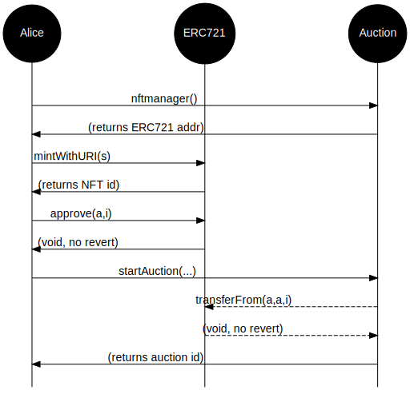

Decentralized NFT Auction
=========================

[Go up to the CCC HW page](../index.html) ([md](../index.md))


### Overview

In this assignment you will write a smart contract, in Solidity, to handle auctions for NFTs.  The NFTs will be ERC-721 tokens.

Once deployed to our private Ethereum blockchain, anybody should be able to mint an NFT and then initiate an auction.  Anybody could then submit a bid to the auction.  To prevent somebody from placing a bid and then not paying, one has to transfer ETH to the smart contract when a bid is placed -- it is the transfer of this ETH (along with the associated function call) that actually places the bid.  Anybody who is outbid will have their ETH returned, and they can choose (or not) to place a higher bid.  Once the auction is completed, the ETH from the winning bid is transferred to the person who initiated the auction (minus some fees), and the NFT is transferred to the winning bidder.

Writing this homework will require completion of the following assignments:

- [Connecting to the private Ethereum blockchain](../ethprivate/index.html) ([md](../ethprivate/index.md))
- [dApp introduction](../dappintro/index.html) ([md](../dappintro/index.md))
- [Ethereum Tokens](../tokens/index.html) ([md](../tokens/index.md)); if you did not get it working properly, then speak to me, and I will provide an alternative deployed contract for you to use.

The intent is that you are going to re-use the three NFT images that you created in the Tokens assignment.  You can also create new images, if you would like, as long as you follow the guidelines in that assignment (public domain, nothing that will get me in trouble, file naming, in the `ipfs/` directory, etc.).  As before, in this course, owning the NFT does NOT imply ownership of the image -- the assumption is that you don't actually own the original image, since it's in the public domain.

You will also need to be familiar with the [Ethereum slide set](../../slides/ethereum.html#/), the [Solidity slide set](../../slides/solidity.html#/), and the [Tokens slide set](../../slides/tokens.html#/)

In addition to your source code, you will submit an edited version of [auction.py](auction.py.html) ([src](auction.py)).

### Changelog

Any changes to this page will be put here for easy reference.  Typo fixes and minor clarifications are not listed here.  So far there aren't any significant changes to report.

### Task 1: Auction contract

You are going to create and deploy a decentralized auction smart contract.  The contract you will be creating will allow for a decentralized auction for NFTs.  

This section is meant as a high-level overview of the process; the detailed specifications are in the next two sections.

- Each Auctioneer contract has a single ERC-721 compliant NFT Manager that manages all of its NFTs; that NFT Manager is created in the constructor.  Any user can get the NFT manager via a call to `nftmanager()`.
    - The user has to create the NFT on that contract using the standard methods from the NFTmanager contract that we saw in the Tokens assignment
    - Once the NFT is minted, the Auctioneer has to be approved, via the `approve()` function on the NFT manager, to take control of the NFT
    - So the expected function calls for this part are:
        - On the `Auctioneer` contract: call `nftmanager()` to get the address of the NFT Manager
        - On that `NFTmanager` contract: call `mintWithURI()` to create the NFT
        - On that `NFTmanager` contract: call `approve()` to allow the Auctioneer to take control of that NFT
        - (Note that the above two lines are the only ones needed to be called on the NFT Manager contract for an auction; all successive calls are on the Auctioneer contract)
- The user can then start an auction via the `startAuction()` function, and this involves setting the auction duration, reserve (minimum) price, and various other parameters.  If this function does not revert, then the auction will start.
    - The person who started the auction is called the 'initiator'
    - If the Auctioneer can't transfer the NFT ownership to itself, the function reverts
    - A diagram for this process, including the interaction with the NFTManager contract, is shown below (in the next section)
- The reserve price is the minimum bid that is considered acceptable for this auction.  To make life easier, we can just start out the auction amount at the reserve price.  Keep in mind that all monetary amounts are in wei.
- Anybody can bid on the auction -- a bid is placed by transferring ETH to the Auctioneer contract via a call to `placeBid()`, and specifying which auction it is for via a parameter to that function call
    - This function should revert if:
        - If the bid is on an inactive auction or after the auction close time
        - If the amount bid is less than or equal to the current maximum bid
    - Otherwise, if the amount bid is (strictly) higher than the previously highest bid, then the sender is the new winning bidder; the previously highest winning bidder is refunded his/her ether
    - If one is currently the winning bidder, they can still place a *higher* bid -- their old ether is returned, just like if it were somebody else placing the bid
- Once we are past the auction end time, the auction can be closed via a call to `closeAuction()`
    - If there are no bids, then NFT ownership is transferred to the initiator
    - Otherwise the NFT is transferred to the winning bidder, and the ether (minus a percentage fee) is transferred to the initiator via `safeTransferFrom()` (*not* `transferFrom()`)
    - Once closed, an auction cannot be re-opened, although a new auction with the same NFT later can be created
- The auction contract will keep a fee of 1% of the value of a *winning* bid
    - Any auction that does not succeed -- no bids or does not meet the reserve price -- does not collect a fee
    - Anybody can view the fees via the `unpaidFees()` and `totalFees()` functions; the deployer of the auction smart contract, and ONLY that address, can and collect those fees via a call to `collectFees()`
    - Integer division here is fine to determine the 1% fee; we don't care about rounding issues
- There are three events that must be emitted at the appropriate times; for each, the parameter is the auction ID:
    - `auctionStartEvent()`: when `startAuction()` is successfully called
    - `auctionCloseEvent()`: when `closeAuction()` is successfully called
    - `higherBidEvent()`: when a new (and higher) bid is placed on an NFT via `placebid()`


### Task 2: IAcutioneer interface

This task is to understand the IAuctioneer interface.  Formally the task is to develop an `Auctioneer` contract that implements the following `IAuctioneer` interface below.  The provided [IAuctioneer.sol](IAuctioneer.sol.html) ([src](IAuctioneer.sol)) file has more comments for this interface.  There is a lot that some of these funcctions have to do, and that is specified in the comments in the IAuctioneer.sol file.

Your contract line must be *exactly*:

```
contract Auctioneer is IAuctioneer {
```

The interface is as follows.  There are much more detailed comments in the [IAuctioneer.sol](IAuctioneer.sol.html) ([src](IAuctioneer.sol)) file.


```
// SPDX-License-Identifier: GPL-3.0-or-later

pragma solidity ^0.8.16;

import "./IERC165.sol";

interface IAuctioneer is IERC165 {

    // Holds the information for each auction
    struct Auction {
        uint id;            // the auction id
        uint num_bids;      // how many bids have been placed
        string data;        // a text description of the auction or NFT data
        uint highestBid;    // the current highest bid, in wei
        address winner;     // the current highest bidder
        address initiator;  // who started the auction
        uint nftid;         // the NFT token ID
        uint endTime;       // when the auction started
        bool active;        // if the auction is active
    }


    // there needs to be a constructor, but those are never listed in an interface


    // the following are just the getter methods for the public variables in the contract

    function nftmanager() external view returns (address);

    function num_auctions() external view returns (uint);

    function totalFees() external view returns (uint);

    function unpaidFees() external view returns (uint);

    function auctions(uint id) external view 
            returns (uint, uint, string memory, uint, address, address, uint, uint, bool);

    function deployer() external returns (address);    


    // The following are functions you must create

    function collectFees() external;

    function startAuction(uint m, uint h, uint d, string memory data, 
                          uint reserve, uint nftid) external returns (uint);

    function closeAuction(uint id) external;

    function placeBid(uint id) payable external;

    function auctionTimeLeft(uint id) external view returns (uint);


    // the three events that needs to be emitted at the appropriate times

    event auctionStartEvent(uint indexed id);

    event auctionCloseEvent(uint indexed id);

    event higherBidEvent (uint indexed id);


    // also supportsInterface(), because IAuctioneer inherits from IERC165
}
```

This interface is provided in the [IAuctioneer.sol](IAuctioneer.sol.html) ([src](IAuctioneer.sol)) file.  This interface extends the [IERC165.sol](IERC165.sol.html) ([src](IERC165.sol)) interface, which requires the implementation of a `supportsInterface()` function -- your Auctioneer class thus supports two interfaces (IAuctioneer and IERC165).

For a contract to transfer ETH to another account, you can use code such as the following; this was also [discussed in the Solidity slide set](../../slides/solidity.html#/payeth).  Note that the address to pay to is in variable `a`, and the value -- in wei -- is in `v`:

```
(bool success, ) = payable(a).call{value: v}("");
require(success, "Failed to transfer ETH");
```

As you are testing it, you will notice in Remix that the button for `placeBid()` is red -- that is because this is a `payable` function.  When you call this function, after setting the correct auction ID as the parameter, you will need to transfer some ETH along with the call.  In the deployment pane in Remix, just enter a numerical value in the 'Value' box, and select the right denomination (wei, gwei, ether, etc.).  That amount of ETH will be transferred along with the function call.  If the call reverts, then you get that money back (minus the gas fees, if it tried to send the transaction to the blockchain).  If you have a mistake in your function code, you will likely lose that ETH -- this is why we are testing this on the Javascript deployment environment in Remix and then on a private blockchain where the ETH has no value.

<!--
Some people are having problems in Remix with determining the return value of a transaction -- if this is happening to you, you can create a function such as `getPendingAuctionID()` that, given an address, returns the pending (but not yet started) auction ID for that address.  We will not check for this function.
-->

Test all this thoroughly in Remix!  You will need to deploy your Auctioneer contract in Remix's Javascript environment to test everything working together.  Recall that you have to select the right contract to deploy in the "Contract" list, else Remix may not know which one to deploy.  Be sure to develop via incremental development, else you will not be able to figure out where your bug is.

One it works, deploy it to our private Ethereum blockchain.  You should test it there as well.  You will need to submit the contract address of the deployed Auctioneer.  If you deploy it multiple times, just submit the most recent contract address.  Once it is deployed to our private Ethereum blockchain, you can view it on the auctions page, the URL of which is on the Collab landing page; a link to this will also be shown on the explorer page for your Auctioneer contract.  This auctions web page will make it far easier to see what is going on with your auctions.  Note that the explorer will only display this link if it knows that the contract implements IAuctioneer, and it only knows that if your `supportsInterface()` method is written and correct.


#### `startAuction()` method

The `startAuction()` method requires a bit more explanation.  The process is as follows:

- Alice will first mint an NFT with the NFT manager of this auction contract
- Alice will `approve()` the auctioneer contract for her newly minted NFT
- Alice will call `startAuction()`; as part of this process, the auctioneer will transfer ownership of Alice's NFT to itself, and revert if it cannot do so

Below is a diagram of the flow of this process.




### Task 3: Create auctions

You should create two auctions in your Auctioneer contract (you'll create a third one below as well).  It's fine if you create more (such as from testing) -- we will only look at the two requested here.  These two auctions will use two of your three NFT images.  In particular, if you have one NFT that you like more than the others, or is "better", you will want to save it for the course-wide auction, below.

Note that you can perform these calls through Remix (via calling an external contract, as described in the [dApp introduction](../dappintro/index.html) ([md](../dappintro/index.md)) assignment) or through geth calls (as described in the [Solidity slide set](../../slides/solidity.html#/debtor)).

#### Auction 1

The first one should be an auction that has fully ended by due date/time of the assignment.  Basically, we want it to be a closed auction.  There should be a few bids on this auction.  You can create multiple accounts for this -- just call `personal.newAccount()` a few more times -- each account is in the `eth.accounts` list, and you will have to unlock each one with `personal.unlockAccount()`.  To get ether into those other accounts you can:

- Transfer ETH to that account (see the [Connecting to the private Ethereum blockchain](../ethprivate/index.html) ([md](../ethprivate/index.md)) assignment for how to transfer ETH) 
- Request funds from the Ether faucet into that account

You can also get classmates to bid on your auction, although that is not required.  This auction will use the first of your (three) NFTs.  You will be submitting the auction ID for this auction as well as the NFT token ID.

You *SHOULD* call `closeAuction()` on this auction.

#### Auction 2

The second auction should end *two weeks* after the assignment is due.  Just get it on the day two weeks later -- we don't really care about the time, as long as the date is 14 days after the assignment due date.  Basically, we want to see an active auction.  This, also, should have a few bids on it.  This auction use the second of your (three) NFTs.  You will be submitting the auction ID for this auction as well as the NFT token ID.


#### View your auctions

There is a web page to view your auctions, and the URL for it is on the Collab landing page.  You can also get a link to it from the explorer page for your deployed smart contract.  This can be used to view any auction smart contract that implements the IAuctioneer interface.  This means you can view the class auctions as well (which are done in the next section).


### Task 4: Class Auctions

You are going to participate in a class-wide auction manager.

We have deployed an auction manager, and the contract address for that Auctioneer contract is on the Collab landing page.  As above, you can perform these calls through Remix (via calling an external contract, as described in the [dApp introduction](../dappintro/index.html) ([md](../dappintro/index.md)) assignment) or through geth calls (as described in the [Solidity slide set](../../slides/solidity.html#/)).

You should use the third of your (three) NFTs.  You should create an auction that ends *one week* after the due date of the assignment (again, we are looking for the day -- we don't care too much about the time of day).  You will need to submit the auction ID from the auction you created as well as the NFT token ID.  ***YOUR RESERVE*** should be no higher than 5 ETH.

Lastly, bid on at least *three* auctions that are not your own.  Depending on when you submit your assignment, there may not be any (or any interesting) auctions available to bid on.  That's fine -- you don't have to have those bids completed by the time the assignment is due; you have an extra few days to place your bids.  We are going to judge lateness on this assignment by the Gradescope submission time, and the information you have to submit does not include the transaction hashes of the bids.  We are going to check whether you bid on the auctions by looking if your `eth.coinbase` account, the address of which you will submit below, initiated bids on any one of your classmate's submitted NFT manager addresses by two days after the due date.  Note that you have to place the bid via Remix or geth; the course website just displays the auctions.

**MAKE YOUR BIDS REASONABLE!!!**  If the current highest bid is 0.5 ETH, don't suddenly bid 5,000 ETH.  Doing so is going to require others who need to bid on that NFT to have to obtain a lot more ETH, which will increase the blockchain size and the difficulty, which will make it harder for everybody else in the class.  This will make me very cranky.  Any successive bid should be no more than about 1 ETH more than the previous bid.

### Notes and Hints

- We are going to grade this by creating a very short auction -- a minute or so.  In your `startAuction()`, only one of the time parameters must be non-zero.
- When a successful auction finishes, you will have to transfer the NFT to the winning bidder; you should use `safeTransferFrom()` instead of `transferFrom()` (see [here](https://ethereum.stackexchange.com/questions/120996/what-is-the-difference-between-safetransferfrom-and-transferfrom-functions-i) for details)
- Make sure that *anybody* can mint an NFT via your NFT Manager
- Remix does not seem to show return values for transactions to the blockchain (but will do it when deployed to the Javascript environment).  You can check the explorer page for your transaction to check the return value.
- To get the current time in a contract, use `block.timestamp` -- it returns a UNIX timestamp.  Likely you should keep track of all your times this way.  You can search online for UNIX timestamp converters, if you need them.  Note that the `now` keyword, which was used in lieu of `block.timestamp`, is deprecated, and you should use `block.timestamp` instead.

### Submission

You will need to fill in the various values from this assignment into the [auction.py](auction.py.html) ([src](auction.py)) file.  That file clearly indicates all the values that need to be filled in.  That file, along with your Solidity source code, are the only files that must be submitted.  The `sanity_checks` dictionary is intended to be a checklist to ensure that you perform the various other requirements to ensure this assignment is fully submitted.

There are *three* forms of submission for this assignment; you must do all three.

Submission 1: You must deploy you `Auctioneer` smart contract (which will deploy its own `NFTmanager` contract) to our private Ethereum blockchain.  It's fine if you deploy it a few times to test it.  But the final deployment for the `Auctioneer` should only have the auctions specified in task 3, above.  Save the contract addresses of that deployment, as it will go in the auction.py file that you submit below.

Submission 2: You have to create a number of auctions: two in your auction manager, and one in the course-wide auction manager.  These have specific close dates, and there should be multiple bids on the first two.  This is detailed in tasks 3 and 4, above.

Submission 3: You should submit your `Auctioneer.sol` file and your completed `auction.py` file, and ONLY those two files, to Gradescope.  All your Solidity code should be in that first file, and you should specifically import the various interfaces.  Those interface files will be placed in the same directory on Gradescope when you submit.  **NOTE:** Gradescope cannot fully test this assignment, as it does not have access to the private blockchain. So it can only do a few sanity tests (correct files submitted, successful compilation, valid values in auction.py, etc.).
