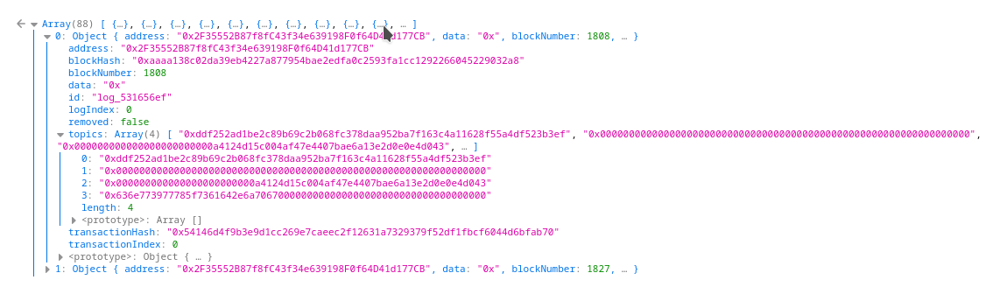

DAOs and Web3
=============

[Go up to the CCC HW page](../index.html) ([md](../index.md))

### Overview

In this assignment you are going to create a Decentralized Autonomous Organization (DAO).  The DAO will issue NFT tokens (that you created in the [Ethereum Tokens](../tokens/index.html) ([md](../tokens/index.md)) assignment) to keep track of who are members, allow members to submit proposals, and allow voting on those proposals.  For the purposes of this assignment, a proposal consists of a reason (which can be any string), an amount to pay, and an account address to pay it to.  You will then make a Web3 interface for this DAO that will allow anybody with a standard web browser to see the status of the DAO and the proposals.

Beyond general experience with programming Solidity (which you have at this point it the course), this assignment requires:

- That you completed the [Ethereum Tokens](../tokens/index.html) ([md](../tokens/index.md)) assignment as we will be using your NFTmanager contract for our ERC-721 tokens (if yours is not working, you can use the default ERC721.sol contract provided in that assignment)
- Familiarity with the [Decentralized Autonomous Organizations (DAO)](../../slides/applications.html#/daos) section of the lecture slides
- That you have a working account on the CS departmental servers.  If you are unsure, you can view the CS computing page, which has a link to the password reset page (a link to there is on the Collab landing page)

In addition to your source code, you will submit an edited version of [daoweb3.py](daoweb3.py.html) ([src](daoweb3.py)).


### Changelog

Any changes to this page will be put here for easy reference.  Typo fixes and minor clarifications are not listed here.  So far there aren't any significant changes to report.


### Create the DAO

A [Decentralized Autonomous Organization (DAO)](../../slides/applications.html#/daos) allows members to submit and vote on proposals.  For the purposes of this assignment, these proposals always have some amount of ether associated with them.  A proposal is whether to pay the amount of ether to a particular account address, which is also specified in the proposal.  One example of what to use a DAO for is a charity organization that focuses on one particular type of area (education, environment, etc.): members vote on what to donate money to (and how much to donate), and a successful proposal means that organization receives the amount of ether specified in the proposal.

As far as this assignment is concerned, we are not concerned as to *what* your DAO is for, only that it works.

Your contract must implement the provided IDAO interface below.   Your contract opening line must be: `contract DAO is IDAO {`.  This interface was adapted from the [open-source code for The &ETH;AO](https://github.com/blockchainsllc/DAO/blob/develop/DAO.sol), but was heavily modified to both work with current versions of Solidity and to fit better with this assignment.  In particular, we removed a number of features, since this assignment is really about Web3; what was removed included splitting off a sub-DAO, including transaction data in the proposal, anything relating to quorum or quorum modifications, blocking members, vote freezes, etc.  In a real DAO, these would need to be implemented as well.

The file is [IDAO.sol](IDAO.sol.html) ([src](IDAO.sol)).  That file has many comments to explain how it works; those comments are not shown below.  


```
// SPDX-License-Identifier: GPL-3.0-or-later

import "./IERC165.sol";

pragma solidity ^0.8.16;

interface IDAO is IERC165 {

    // A struct to hold all of our proposal data
    struct Proposal {
        address recipient;      // The address where the `amount` will go to if the proposal is accepted
        uint amount;            // The amount to transfer to `recipient` if the proposal is accepted.
        string description;     // The amount to transfer to `recipient` if the proposal is accepted.
        uint votingDeadline;    // A UNIX timestamp, denoting the end of the voting period
        bool open;              // True if the proposal's votes have yet to be counted, otherwise False
        bool proposalPassed;    // True if the votes have been counted, and the majority said yes
        uint yea;               // Number of Tokens in favor of the proposal; updated upon each yea vote
        uint nay;               // Number of Tokens opposed to the proposal; updated upon each nay vote
        address creator;        // Address of the shareholder who created the proposal
    }

    //------------------------------------------------------------
    // These are all just public variables; some of which are set in the
    // constructor and never changed

    function proposals(uint i) external view returns (address,uint,string memory,uint,bool,bool,uint,uint,address);
    function minProposalDebatePeriod() external view returns (uint);
    function tokens() external view returns (address);
    function purpose() external view returns (string memory);
    function votedYes(address a, uint pid) external view returns (bool);
    function votedNo(address a, uint pid) external view returns (bool);
    function numberOfProposals() external view returns (uint);
    function howToJoin() external view returns (string memory);
    function reservedEther() external view returns (uint);
    function curator() external view returns (address);

    //------------------------------------------------------------
    // Functions to implement

    receive() external payable;
    function newProposal(address recipient, uint amount, string memory description, 
                          uint debatingPeriod) external payable returns (uint);
    function vote(uint proposalID, bool supportsProposal) external;
    function closeProposal(uint proposalID) external;
    function isMember(address who) external view returns (bool);
    function addMember(address who) external;
    function requestMembership() external;

    // also supportsInterface() from IERC165

    // Events to emit

    event NewProposal(uint indexed proposalID, address indexed recipient, uint indexed amount, string description);
    event Voted(uint indexed proposalID, bool indexed position, address indexed voter);
    event ProposalClosed(uint indexed proposalID, bool indexed result);

}
```

This may look like a lot, but it's not quite as much as it seems:

- Ten of the functions are just public variables
- Six of the functions are 3 lines or less (including the constructor and `supportsInterface()`)
- That only leaves three significant functions to implement: `newProposal()`, `vote()`, and `closeProposal()`


The files you will need are:

- [IDAO.sol](IDAO.sol.html) ([src](IDAO.sol)): what you have to implement
- [IERC165.sol](../tokens/IERC165.sol.html) ([src](../tokens/IERC165.sol)): this is unchanged from all previous assignments
- [IERC721Metadata.sol](../tokens/IERC721Metadata.sol.html) ([src](../tokens/IERC721Metadata.sol)): this unchanged from the [Ethereum Tokens](../tokens/index.html) ([md](../tokens/index.md)) assignment
- [IERC721.sol](../tokens/IERC721.sol.html) ([src](../tokens/IERC721.sol)): this unchanged from the [Ethereum Tokens](../tokens/index.html) ([md](../tokens/index.md)) assignment

You will need the [IDAO.abi](IDAO.abi) file, which contains the ABI for the IDAO interface -- you'll need this when writing your Javascript code to interact with the interface.

You will also need your NFTManager.sol file from the [Ethereum Tokens](../tokens/index.html) ([md](../tokens/index.md)) assignment, and any other .sol files that are needed to allow that to compile (such as ERC721.sol, Strings.sol. Address.sol, etc.).

The requirements on this section are intentionally vague -- the intent is to let you program your DAO any way you want.  The only requirement is that your DAO must fulfill the spirit of the [IDAO.sol](IDAO.sol.html) ([src](IDAO.sol)) interface.  As far as we are concerned, a proposal description primarily consists of a single string -- perhaps it's a URL, perhaps a statement, etc.

Don't overthink this!  The intent is just for you to get a working DAO.  It doesn't have to be perfect.  In fact, this is the easier part of this homework, since we've all written a bunch of Solidity programs by now.  The longest methods here are 8 lines.

#### Notes


- You can create a `constant` variable if the value is not going to change.  This is done via `uint constant public override minProposalDebatePeriod = 600;`.  This saves gas versus not having it be a constant
- Recall how `receive()` works -- this was described in the "Background" section of the [DEX assignment](../dex/index.html) ([md](../dex/index.md))
- The code to transfer ether to an address shown under the interface in the "IAuctioneer Interface" section of the [Auction assignment](../auction/index.html) ([md](../auction/index.md))
- Creating another contract upon deployment is shown in the constructor of [DEXtest.sol](../dex/DEXtest.sol.html) ([src](../dex/DEXtest.sol)) from the [DEX assignment](../dex/index.html) ([md](../dex/index.md)); having your DAO deploy it's own NFTManager will make life easier for you
- The `tokens` field is just an `address` of your NFTmanager, and you will have to cast it to call a function: `NFTmanager(tokens).mintWithURL(...);`, for example.
- If you just want to transfer (fake) ether to the contract in Remix without calling a `payable` function, enter the amount in the "Value" box of the deployment pane, choose the right denomination, and click the "Transact" button in the "Low level interactions" box at the bottom of the deployed contract info.  This works in any of the deployment environments.  Note that this will call your `receive()` function (which doesn't have to do anything for this assignment, but it must be there).
- You have to specify a recipient for each proposal -- you can create additional accounts (via `personal.newAccount()` in geth) to use as recipients.  Or send it to a classmate's account.  Or send it to the faucet account.  Any of those is fine.


#### Unique URIs in NFTManager

Your NFTManager, from the [Ethereum Tokens](../tokens/index.html) ([md](../tokens/index.md)) assignment, should have required a unique URI for each NFT minted.  For this assignment we don't care *what* the URI is, only that they have a NFT.  In particular, for this assignment, the URI does not need to resolve to an actual image.  This also means that you don't have to change the `_baseURI()` function from what you wrote in the previous assignment.  For that matter, you don't have to change anything in your NFTManager.sol file at all for this assignment (assuming you got it working).

However, you still have to have a unique URI for each one.  One way to do this is to use their account address.  The [Strings.sol](../tokens/Strings.sol.html) ([src](../tokens/Strings.sol)) file was used in the [Ethereum Tokens](../tokens/index.html) ([md](../tokens/index.md)) assignment (it was imported by [ERC721.sol](../tokens/ERC721.sol.html) ([src](../tokens/ERC721.sol))).  You will also need [Math.sol](../tokens/Math.sol.html) ([src](../tokens/Math.sol)) for Strings.sol to compile.  Strings.sol has a `toHexString()` function that takes in an `address` as a parameter.  This function will convert the address into an ASCII hex string with the leading '0x'.  However, this hex string will be 42 characters long, and our NFTManager doesn't allow more than 32 character strings.  You can use the following `substring()` method to reduce it to a 32 character string:

```
function substring(string memory str, uint startIndex, uint endIndex) public pure returns (string memory) {
    bytes memory strBytes = bytes(str);
    bytes memory result = new bytes(endIndex-startIndex);
    for(uint i = startIndex; i < endIndex; i++)
        result[i-startIndex] = strBytes[i];
    return string(result);
}
```

You would call it such as:

```
string memory uri = substring(Strings.toHexString(addr),2,34);
```


### Web3 Introduction

You are going to write a web interface that shows the status of your DAO and the proposals therein.  This web page will only read from the blockchain.

There are a few strict requirements for this section: *all* of your code -- both HTML and Javascript -- must be in a *single* file called `dao.html`.  That file must be in your `~/public_html/` directory on your CS server account.  This means that the URL for your page will be `https://www.cs.virginia.edu/~mst3k/dao.html`, where `mst3k` is your userid.

This is not a class on user interfaces, so we are not expecting an amazing looking website -- we are going to grade it on the functionality, not the appearance.  That being said, it needs to be readable and navigatable.

#### Setup

- Log into your CS server account.  You can try using ssh from the command line: `ssh mst3k@portal.cs.virginia.edu` (works in Linux, Mac OS X, and Windows Subsystem for Linux).  You can also download [SecureCRT](https://virginia.service-now.com/its/?id=itsweb_kb_article&sys_id=65a00a3cdb11db404f32fb671d9619bb), which is a GUI ssh client.
    - Don't know your password, or you never received it?  Follow the reset password link on the CS computing page (a link to which  is on the Collab landing page)
- You will likely want to edit the file on your home computer and copy it over to the CS servers to test it.
    - Create, on your local computer, a file called `dao.html` that just has `hello world` as the contents (we don't need HTML tags for now)
    - There are two ways you can transfer it:
    	- Via `scp` on the command line: `scp dao.html mst3k@portal.cs.virginia.edu:~/public_html/` (works for Linux, Mac OS X, and WSL)
    	- Install [SecureFX](https://virginia.service-now.com/its/?id=itsweb_kb_article&sys_id=d1450ab4db51db404f32fb671d9619c5), which is a GUI scp client
- View the web page at `https://www.cs.virginia.edu/~mst3k/dao.html`, changing `mst3k` for your userid
- Copy a few files over: while all of *your* code must be in a single file, you are going to include the `web3.js` library.  To put that into the correct place on portal, execute the following commands **ON portal.cs**:
  ```
mkdir -p ~/public_html/
cd ~/public_html/
wget https://github.com/ChainSafe/web3.js/raw/1.x/dist/web3.min.js
wget https://github.com/ChainSafe/web3.js/raw/1.x/dist/web3.min.js.map
```

#### Background

You are *encouraged* to look at the examples of web3 usage provided so far in class, and to copy/adapt the code therein.  Note that you can copy from the materials provided by the course, NOT your classmates!  The ones we have seen are:

- polls.php: for the Poll contract in [dApp Introduction assignment](../dappintro/index.html) ([md](../dappintro/index.md))
- debts.php: for the in-class coding exercise in [the solidity slide set](../../slides/solidity.html#/debtor)
- auction.php: for the Auctioneer contract in [dApp Auction assignment](../auction/index.html) ([md](../auction/index.md))
- dex.php: for the DEXes in [DEX assignment](../dex/index.html) ([md](../dex/index.md))

The links to all of these are on the Collab landing page.

You are welcome to look at the blockchain explorer code as well, but that won't be as useful for this assignment.  When you go to each of the pages listed above (and, if necessary, enter a valid smart contract address), you can view the page source to see what is going on.  Loading up the developer console make make it easier to view the code, and -- later on -- see any Javascript errors.  Note that while these example URLs have an extension of .php, what you are viewing is still HTML and Javascript.

### Javascript

Most function calls execute quickly.  But some, such as those querying a blockchain, can take some time to return a value.  In Javascript, these are called `async` functions.  While `async` functions might execute quickly, Javascript assumes they will take some time.  You have two options here -- you can either tell Javascript to wait for the call to return, or give it a code block to execute whenever it does return.  If you choose the first option, it will hang until that `async` call completes.  If you choose the second option, it will move on, and later (in another thread) execute that code block when the `async` call does finally complete.

Consider the following Javascript code; this is from poll.php, which was used to display the Poll of your smart contract from the [dApp Introduction](../dappintro/index.html) ([md](../dappintro/index.md)) assignment.

```
var contractAddress = '0x01234567890abcdef01234567890abcdef012345';

let web3 = new Web3('URL');

abi = [...]; // the source has the full ABI, which is removed here for clarity

contract = new web3.eth.Contract(abi,contractAddress);

const getNumChoices = async() => {
    return await contract.methods.num_choices().call();
}

const getChoiceInfo = async(i) => {
    let x = await contract.methods.choices(i).call();
    return [x.name,x.votes];
}

const setChoiceInfo = async(i) => {
    getChoiceInfo(i).then(l => { document.getElementById("choice_"+i).innerHTML = l[0]; 
                                 document.getElementById("votes_"+i).innerHTML = l[1];
                                 // this next line is not thread-safe!!!
                                 document.getElementById("total_votes").innerHTML = parseInt(document.getElementById("total_votes").innerHTML) + parseInt(l[1]);
                                });
}
```

Four variables are defined:

- The `contractAddress` line is the hard-coded address of the Poll smart contract.  You should also hard-code the address, although this will mean editing the HTML file if you re-deploy it to a different smart contract address
- The `web3` variable is the connection to the geth node itself.  The value for `URL` is provided on the Collab landing page.  Note that the value for `URL` must be in quotes.
- The `abi` variable is the ABI for the contract itself.  This should be replaced by the entire ABI, not just `[...]`.  You can obtain this via Remix -- in the Compilation tab, after you compile, there is a copy link next to the text "ABI" at the bottom of that pane.  Note that you will have to remove all white space in what you copy from Remix.  You can also copy the ABI for this assignment from the Collab landing page.
- The `contract` variable is the connection to the specific smart contract that we are accessing.

You will notice that many of the fields and methods here are the same as in geth.  Indeed, what we call `web3.eth.blockNumber` here is just `eth.blockNumber` in geth.  They are also the same steps we've used before to call a function from geth -- we saw this in the [Debtors example](../../slides/solidity.html#/debtor), and those commands are listed in the [Geth reference document](../../docs/geth_reference.html) ([md](../../docs/geth_reference.md)).

We then define three `async` functions:

- `getNumChoices()` is a function that takes in no parameters (the parameters -- or lack thereof -- are listed in the parenthesis after the `async` keyword).  This calls the `num_choices` getter function in the [Poll.sol](../dappintro/Poll.sol.html) contract, which implements the [IPoll.sol](../dappintro/IPoll.sol.html) interface.  Note that we have to put `await` in front of it, since that is also an `async` call, and we wait it to wait (aka block) until the function eventually returns.  And, unlike in geth, we put parentheses both after `num_choices` and after `call`.  This function waits until `num_choices()` returns, and then returns that value.
- `getChioceInfo()` is a function that takes in one parameter, the choice ID -- that parameter is indicated in the parenthesis after the `async` keyword.  This calls `choices()` which is a getter function for the Choice struct from [Poll.sol](../dappintro/Poll.sol.html).  Note that this function also waits (blocks) until that call completes, as indicated by the `await` keyword.  The obtained struct has three fields -- `id`, `name`, and `votes`.  This function returns two of them in a list.
- `setChioceInfo()` is a function that takes in one parameter, the choice ID -- that parameter is indicated in the parenthesis after the `async` keyword.  This function calls `getChoiceInfo()` to get the Choice fields from the smart contract.  You will notice the `.then(` part -- we are specifying the code block to execute when the async call returns.  This function will not block -- it kicks off the call to `getChoiceInfo()`, and immediately returns.  Once `getChoiceInfo()` does return the data (remember: a list containing the name and votes of the choice), it will execute the code block.  Note the `l =>` part -- this is binding the return value from `getChioceInfo()`, which is a list, to the variable `l`, which is then used in the code block.  The details of the code block will be discussed below, but it basically updates a few fields of the HTML page.


To call this code, we use the following:

```
function loadTable() {
    // The "main" part of this script -- once we know how many choices there are.
    document.getElementById("total_votes").innerHTML = "0";
    getNumChoices().then(val => {
        // set that value in the "Total number of choices:"  paragraph
        document.getElementById("num_choices").innerHTML = val;
        // create the table body to list the votes and choices
        text = "<tr><th>ID</th><th>Votes</th><th>Choice</th></tr>";
        // for each of the choices, create a separate table row with unique IDs
        for ( var i = 0; i < val; i++ )
            text += "<tr><td id='id_" + i + "'>" + i + "</td><td id='votes_" + i + "'></td><td id='choice_" + i + "'></td></tr>";
        // write the table to the HTML page; this must happen BEFORE we start filling in the votes and choices
        document.getElementById("choice_list").innerHTML = text;
        // call the async function that will fill in the number of votes and choices into the table
        for ( var i = 0; i < val; i++ )
            setChoiceInfo(i);
    });
    getPurpose().then(val => {
        // update the purpose field
        document.getElementById("purpose").innerHTML = val;
    });
}

loadTable();
```

We'll get to `document.getElementById()` shortly, but it's just updating part of the HTML page.  You will notice that this calls `getNumChoices()`, an `async` function, and gives it a code block to execute when that function does return.  Like Python, there is no `main()` function, so we have to call `loadTable()` to kick all this off.

As mentioned above, you are *encouraged* to use the code provided in the pages that the course has used so far.  A number of Javascript functions therein will be of use in formatting your display -- in particular, `convertTimestamp()`, `short_hash()`, and `copy_link()`.


#### Debugging Javascript

Your web browser can load up the developer window (ctrl-shift-C, perhaps).  This window has a Console tab, which is quite useful for debugging Javascript.  You will likely have to reload the page *after* you have opened up the developer window.  This console is just like the geth console -- you can type Javascript commands into it, and access variables that were defined in the `<script>` sections of your webpage.  In your Javascript code, you can use `console.log()` to print out values to this Javascript console.  This is useful in debugging, and can be called from regular and `async` functions.


### HTML and CSS

We assume you are familiar with the basics of HTML.  If not, you can quickly come up to speed with [an appropriate web search](https://duckduckgo.com/?q=html+tutorial).

Below is some sample HTML code to start with:


```
<!DOCTYPE HTML>
<html lang="en">
	<head>
		<title>DAO Information</title>
	    <meta charset="utf-8">
	    <script src="web3.min.js"></script>
	    <style></style>
    </head>
	<body style="margin-top:0">
		<h2>DAO Information</h2>
		<p>The DAO information is:</p>
		<p>Total proposals: <span id="total_proposals">loading...</span></p> <!-- line 12 -->
		<table id="dlist center"></table>
		<script>
// Javascript code here
		</script>
	</body>
</html>
```

A few notes:

- Comments in HTML start with `<!-- ` and end with ` -->`; you don't have to use them, but you'll see comments throughout the example code
- You'll have to fill in the Javascript code, adapted from above, where indicated
- For the styling -- in the `<style></style>` tags -- you can leave it blank or cut-and-paste the style information from any of the above mentioned reference pages (choices.php, debts.php, auctions.php, or dex.php) -- they all have the same CSS code.
- You'll notice that the table has no rows -- the `loadTable()` Javascript function adds them.
- The 'total proposals' line does not have a value.  Once that value is determined (done in a function analogous to the `getNumChoices()` function), you can update that value via the code `document.getElementById('total_proposals').innerHTML = var;`, where `var` is the Javascript variable that holds the number of proposals.  This looks for the element with the id of `total_propsals`, which is the `<span>` element on line 12, and updates the value inside (meaning it replaces "loading...").


### Events

There are multiple ways to see when *something* happens on a blockchain, and they all involve listening for events that were emitted by the contracts (or the EVM itself).

#### Subscriptions

A web3 *subscription* is when the web3 library is listening for an event or multiple events.  To do so, we specify the specific contract that we are listening to.  Consider the following code:

```
function subscribeToPollEvents() {
    var options = { address: '0x01234567890abcdef01234567890abcdef012345' };
    var sub = web3.eth.subscribe('logs', options, function(err,event) {
        if ( !err )
            console.log("event error: "+event);
    });
    // pay attention to these subscription events:
    sub.on('data', event => loadTable() )
    sub.on('error', err => { throw err })
}

subscribeToChoiceEvents();
```

There are a number of things going on here:

- The `options` variable is just the options that we are specifying -- in this case, we are only specifying the address of the contract.  Again, we can hard-code the contract address, but will have to change it here as well if we re-deploy our smart contract.  You can also use the `contractAddress` Javascript variable defined above.  If you wanted to listen to multiple contracts, you could put their address in a list (Javascript uses square brackets for lists).
- The `sub` variable is when we actually subscribe to the events.  We are subscribing to *all* events for this contract (we could have filtered it to only some events).  If there is an error, we print that in `console.log()` -- which is viewable in the browser's developer console. Note that, in Javascript, you can pass a function as a parameter.  And, in this case, you can define that function in the parameter list itself.
- The two `sub.on` calls specify the particular types of things we are listening for -- data events (normal events emitted from a contract) and errors (we just output that error via `throw`).  These are the only two that we need to listen for in this assignment, but others exist, such as `changed` and `connected`.
- Note that if *any* event occurs, then it will call `loadTable()`, which we defined above.  This will cause the entire table to regenerate, updating itself in the process.  A more complicated script could only update parts of the table -- you can see this in the dex.php code -- a change to the price of our (fake) ETH will update all the columns that use that value, whereas a change in one of the DEXs will update just that row.
- We call all this via the `subscribeToChoiceEvents()` call, which is on the last line of the above code block -- this only needs to be called once, and it will execute the code any time an event is emitted by the contract.

There are a number of aspects of events that we are not covering in this assignment -- in particular, one can listen for specific events, or specific events with specific parameters; see the first answer [here](https://ethereum.stackexchange.com/questions/35997/how-to-listen-to-events-using-web3-v1-0) for an example.  One can also listen for the mining of a block -- the dex.php code does this, as that is how it knows to update the (fake) ETH price (to see how, search for "newBlockHeaders" in the source code for dex.php).  The dex.php also updates a single row when a transaction occurs.


#### Past Events

This part is not required at all for this assignment, but was included for completeness.  Feel free to skip it if you are not interested.

You can find all the past events that a contract (or many contracts) emitted.  The blockchain explorer uses this to find when an NFT was minted or transferred, or when a TokenCC is minted or transferred; both emit the `Transfer()` event (this is done in the ERC20.sol or ERC721.sol contract).  In Javascript, you use the `getPastLogs()` function.  

As an example, we will examine a NFTManager contract.  Pick any deployed NFTManager, and get it's address.  Go to any of the .php pages that *already* load up the web3 Javascript library.  Load up the Javascript console (ctrl-shift-C).  Enter the following commands, putting in the appropriate value (the address of the NFTManager we are getting the events of):

```
var addr='0x01234567890abcdef01234567890abcdef012345'
```

You can then pull up the past logs via:

```
logs = await web3.eth.getPastLogs({fromBlock:0,toBlock:'latest',address:addr})
```

You can then examine the `logs` variable by just typing `logs` in the Javascript console.  For the course-wide NFTManager from the tokens assignment, this is the result (you may see different values, but the concepts are the same):



The relevant fields are:

- The `address` is the address of the contract that emitted the event
- The `topics[0]` field is the hash of the name of the event.  If you enter `Transfer(address,address,uint256)` into an [online Keccak generator](https://emn178.github.io/online-tools/keccak_256.html), you will get this exact hash.  That event prototype is from the [IERC721.sol](../tokens/IERC721.sol.html) ([src](../tokens/IERC721.sol)) file.
- `topics[1]` through `topics[3]` contain any `indexed` parameters (in `Transfer()`, all three parameters are indexed).
    - Since this was a mint call, the `from` was the 0 address, which is why `topics[1]` is also the zero address
    - `topics[2]` tells us it was issued to the contract at `0xa4124d15c004af47e4407bae6a13e2d0e0e4d043`; you have to remove a bunch of leading zeros to get the actual address
    - The NFT ID is in `topics[3]`, and is `0x636e773977785f7361642e6a7067000000000000000000000000000000000000`, which in base-10 is `44974148043982904058537301730497507547781710262921643124073893516105207513088`
- If there were any non-`indexed` parameters in the event, they would be in the `data` field

The `logs` variable is a list of these entries, and one can quickly go through them in a `for` loop to examine what events were emitted.

Lastly, this can be done in the geth terminal as well.  However, the version of Javascript in geth is quite old, and doesn't have the `async` functionality, so we have to use different syntax:

```
var addr="0x01234567890abcdef01234567890abcdef012345"
filter=web3.eth.filter({fromBlock:0,toBlock:'latest',address:addr})
eth.getLogs(filter.options)
```

The result, though, is (more or less) the same.


### Your task

Your task is for your `dao.html` page to display all the relevant information about the DAO's proposals and balance.  It should update every time an event is received; it can update the entire table rather than a specific row.  A screen shot of the information we are looking for is below.  Note that you should display this information, but the exact formatting is up to you.  And if you want to display more, that's fine too.  A human is going to check this part of the assignment, so there is more leeway because it is not being auto-graded.


You don't have to implement the copy link in the Creator column.  Note that ***ALL*** of your HTML, CSS, and Javascript code must in the dao.html file.  The *only* thing that can be separate is the web3.js file, which is included in the HTML template above.

Once deployed, the DAO contract for your final submission should contain at least three proposals: one of which should have expired by the time the assignment is due, and one which will stay open for one week after the assignment (just get the right date; we don't care what time on that day).  The third one is up to you.


### Submission

You will need to fill in the various values from this assignment into the [daoweb3.py](daoweb3.py.html) ([src](daoweb3.py)) file.  That file clearly indicates all the values that need to be filled in.  That file, along with your Solidity source code, are the only files that must be submitted.  The 'sanity_checks' dictionary is intended to be a checklist to ensure that you perform the various other aspects to ensure this assignment is fully submitted.


There are *four* forms of submission for this assignment; you must do all four.

Submission 1: You must deploy your DAO smart contract to our private Ethereum blockchain.  It's fine if you deploy it a few times to test it.  

Submission 2: You need to have your dao.html properly working at https://www.cs.virginia.edu/~mst3k/dao.html, where `mst3k` is your userid.  This means it needs to be in your `~/public_html` directory on the departmental servers.  You should have web.js (or web3.min.js) in that website directory as well.  Needless to say, it should properly connect to your deployed DAO smart contract.

Submission 3: You need to add some data to your DAO contract, as specified above.  In particular, that means at least three proposals (one of which has expired, one of which stays open for one week).  Also make the specified Ethernet account address -- indicated on the Collab landing page -- is a member of your DAO so that that address can perform tasks on your DAO to grade it.

Submission 4: You should submit your `DAO.sol` file, your `dao.html` file, and your completed `daoweb3.py` file, and ONLY those three files, to Gradescope.  All other imported files will be provided by Gradescope (including NFTManager.sol, if needed).   **NOTE:** Gradescope cannot fully test this assignment, as it does not have access to the private blockchain. So it can only do a few sanity tests (correct files submitted, successful compilation, valid values in daoweb3.py, etc.).
