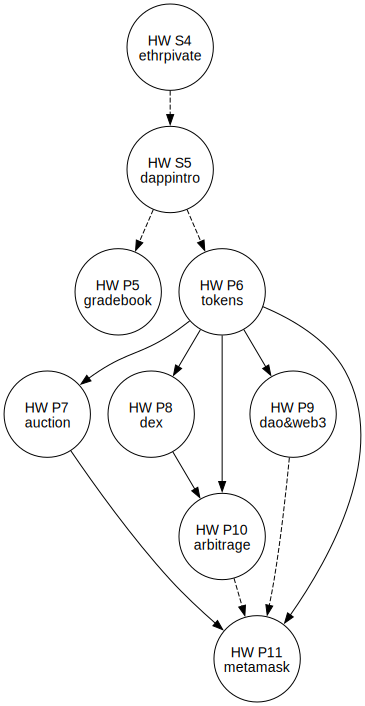

Cryptocurrency: Homeworks
=========================

[Go up to the main CCC readme](../readme.html) ([md](../readme.md))

You will be bound by the requirements on the [Homeworks policies page](../uva/hw-policies.html) ([md](../uva/hw-policies.md)), so please read that!  The due dates are all listed on the [main UVA page](../uva/index.html) ([md](../uva/index.md)).

### Programing homeworks

These are larger programming homeworks.

- [P1: Introductory homework](intro/index.html) ([md](intro/index.md))
- [P2: ECDSA implementation](ecdsa/index.html) ([md](ecdsa/index.md))
- [P3: BTC parser](btcparser/index.html) ([md](btcparser/index.md))
- [P4: Bitcoin scripting](btcscript/index.html) ([md](btcscript/index.md))
- [P5: dApp Gradebook](gradebook/index.html) ([md](gradebook/index.md))
- [P6: dApp Tokens](tokens/index.html) ([md](tokens/index.md))
- [P7: dApp Auction](auction/index.html) ([md](auction/index.md))
- [P8: DEX](dex/index.html) ([md](dex/index.md))
- [P9: DAO & web3](daoweb3/index.html) ([md](daoweb3/index.md))
- [P10: Arbitrage trading](arbitrage/index.html) ([md](arbitrage/index.md))
- [P11: MetaMask](metamask/index.html) ([md](metamask/index.md))

### Smaller homeworks

These are smaller homeworks that take less time.  They are typically readings or self-guided tutorials.

- S1: Google course introductory survey: the link for the survey is on the Canvas landing page
- S2: Read the [Bitcoin whitepaper](https://bitcoinwhitepaper.co/)
- S3: read (some of) the [Ethereum whitepaper](https://ethereum.org/en/whitepaper/) ([PDF](https://blockchainlab.com/pdf/Ethereum_white_paper-a_next_generation_smart_contract_and_decentralized_application_platform-vitalik-buterin.pdf)): you can skip (or quickly browse) the first 3 sub-parts of the 'History' section ('Bitcoin', 'Mining', and 'Merkle Trees'); also skip the 'references and further reading' section at the end; what's left is 24 pages in the PDF to read
- [S4: Private Ethereum Blockchain](ethprivate/index.html) ([md](ethprivate/index.md))
- [S5: dApp Introduction](dappintro/index.html) ([md](dappintro/index.md))

### Homework dependencies

A dashed arrow means the concepts are used, whereas a solid arrow means that the artifacts created (programs) are used.

