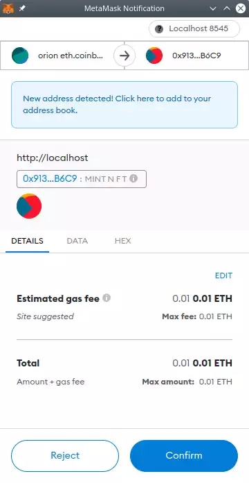

Metamask Assignment
===================

[Go up to the CCC HW page](../index.html) ([md](../index.md))


### Overview

You are going to create a web interface for the Auctioneer contract you created in the [dApp Auction](../auction/index.html) ([md](../auction/index.md)) assignment.  This web interface will allow for the creation of NFTs and the ability to start and stop auctions, as well as bidding on running auctions.  The web page you create will reside on the departmental servers, just like with the [DAO & web3](../daoweb3/index.html) ([md](../daoweb3/index.md)) assignment. 

### Changelog

Any changes to this page will be put here for easy reference.  Typo fixes and minor clarifications are not listed here.  So far there aren't any significant changes to report.


### Pre-requisites

Writing this homework will require completion of the following assignments:

- [Private Ethereum Blockchain](../ethprivate/index.html) ([md](../ethprivate/index))
- [DAO & web3](../daoweb3/index.html) ([md](../daoweb3/index.md)) (this is for the experience with web3; the artifacts of that assignment are not needed for the current one)
- [Ethereum Tokens](../tokens/index.html) ([md](../tokens/index.md))
- [Arbitrage trading](../arbitrage/index.html) ([md](../arbitrage/index.md)) (this is for the experience with web3; the artifacts of that assignment are not needed for the current one)
- [dApp Auction](../auction/index.html) ([md](../auction/index.md))


### Setup: Auctioneer

We are going to use your Auctioneer contract, from the [dApp Auction](../auction/index.html) ([md](../auction/index.md)) assignment.  You will also need your NFTmanager contract, from the [Ethereum Tokens](../tokens/index.html) ([md](../tokens/index.md)) assignment, as well.  If you did not get yours working, then contact the course staff, and we can deploy them for you to use.

Before you deploy yours, however, we need to make a few changes to our Auctioneer.sol contract.  We recommend saving this updated version in a separate file, such as `Auctioneer_v2.sol`.

**Change 1:** The first change is due to an error in the specification in the [dApp Auction](../auction/index.html) ([md](../auction/index.md)) assignment.  The change is this: *all* monetary amounts should be in *wei*.  This includes:

- The `reserve` and `highestBid` fields of the `Auction` struct
- The return value of `fees()` (which is probably just a getter function from a public variable)
- The `_reserve` parameter to `createAuction()`

To make this change, check for each time you modify those fields of the `Auction` struct, for how you store it in `fees`, and the code in the `createAuction()` function.

**Change 2:** To make everybody's lives easier, each Auctioneer contract will deploy it's *own* NFTmanager.  We saw how this was done in the testing section of the [DAO & web3](../daoweb3/index.html) ([md](../daoweb3/index.md)) assignment and in the [Arbitrage.sol](../arbitrage/Arbitrage.sol.html) contract in the [Arbitrage trading](../arbitrage/index.html) ([md](../arbitrage/index.md)) assignment.  This way we won't have to pass in the address of the NFT manager every time we want to deal with an NFT which will make our lives easier.  To make this change, add the following as a public variable to your contract:

```
address public override nftmanager;
```

This will create an associated getter function as well.  This `override` is because it will override the updated AuctionManager_v2.sol contract, which is provided below.

Also add the following line in your constructor; if you don't have a constructor, add one with just the following line:

```
nftmanager = address(new NFTmanager());
```

The rest of your Auctioneer code should be unaffected by this change.  The only time the NFTmanager address comes up is when it is read in during the `onERC721Received()` function, and when it's stored in the `Auction` struct.  But that code should work just fine with this change -- we are just going to be saving that same NFTmanager in all the `Auction` structs.  This is a bit of a waste of gas, but it simplifies our modifications for this assignment.  And gas is free for us in this course.

**Change 3:** We are going to add a method to the Auctioneer to mint an NFT, which it does by calling the NFTmanager's `mintWithURI()` method.  Copy and paste the following code into your Auctioneer_v2 contract:


```
mapping (address => uint) public override lastMintedNFT;

function mintNFT (string memory uri) public override returns (uint) {
    uint ret = NFTmanager(nftmanager).mintWithURI(msg.sender,uri);
    lastMintedNFT[msg.sender] = ret;
    return ret;
}

function tokenURI(uint tokenID) public view override returns (string memory) {
    return NFTmanager(nftmanager).tokenURI(tokenID);
}
```

The `mintNFT()` function allows us to create a new NFT without having to interact with the NFTmanager contract, which will simplify the work we have to do below.  This assumes that the NFT is being minted for the sender, which is a reasonable assumption in this case.  As mentioned in the [Arbitrage trading](../arbitrage/index.html) ([md](../arbitrage/index.md)) assignment, it's challenging to obtain the return value of a transaction, so we save the just minted NFT ID in the `lastMintedNFT` mapping, which we can then read via a regular call.  (This means if you mint two NFTs in succession, without getting the ID of the first before you mint the second, then you won't know the ID of the first; we are going to ignore this use case for simplicity).  The `tokenURI()` just passes the call to the NFTmanager -- having this function here allows us to not have to interact with two smart contracts, as the Auctioneer will forward that request on for us.  This uses up more gas, but will make it much simpler for us in this assignment.

**Change 4:** Make sure anybody can mint an NFT with your NFTmanager.  Basically ensure there is no `require()` statement in your NFTmanager's `mintWithURI()` function that prevents anybody from minting a NFT.

**Change 5:** As a result of these changes, your Auctioneer_v2.sol contract will now support the updated [AuctionManager_v2.sol](AuctionManager_v2.sol.html) ([src](AuctionManager_v2.sol)) interface.  Other than changing a few comments (changing all 'gwei' instances to 'wei'), the changes for this assignment are the first few lines of the contract.  In particular, your contract line should be `contract Auctioneer_v2 is AuctionManager_v2 {`. In addition to implementing the above functions, this means you have to change your `import "AuctionManager.sol";` line to `import "AuctionManager_v2.sol";`.  Your `supportsInterface()` function will have to support the new interface (you don't have to indicate support of the old AuctionManager.sol interface, just the new AuctionManager_v2.sol interface).  The ABI for that interface can be found in the [AuctionManager_v2.abi](AuctionManager_v2.abi) file.  Although you likely won't need it, you can get the link for the NFTmanager ABI as well; it's actually the ABI for the IERC721full interface: [IERC721.abi](IERC721full.abi).

**Finalizing:** Once that modification is done, you should deploy your Auctioneer_v2.sol contract to the blockchain.  Save the contract address, as it will be needed below.

### Setup: MetaMask


This assignment uses the [MetaMask](https://metamask.io/) extension to Google Chrome.  Unfortunately, it does not run in any other browser; meaning you can't use Firefox, Safari, Edge, or Internet Explorer.  You have to use Chrome for this assignment.

Here are the MetaMask setup steps:

1. If you haven't already, install [Google Chrome](https://www.google.com/chrome)
2. Install the [MetaMask](https://metamask.io/) extension; you will see a pop-up like the image to the right
   - Note that on some systems it is presented as a web page rather than a pop-up, but the content of the web page is the same as the pop-up shown to the right
   - When MetaMask first installs, it will ask you if you already have a secret recovery phrase or to create a wallet -- you want to create a wallet
   - It will ask you to enter a password -- remember it, as you will need it each time you start up MetaMask
   - Click the network drop-down box -- in the image to the right it says "localhost:8545", but in your version it will likely say "Ethereum Mainnet".
      - In that drop-down list, select "show/hide test networks"
      - That will bring you to the spot in the settings where you have to flip a toggle to "show test networks"
    - In settings, click on Networks in the left-hand pane, then click on the "localhost:8545" network
      - Change the chain ID to the (base-10) value for our blockchain; that value can be found on the Collab landing page
      - Then click save
    - Back in the network selection box, you should now be able to select "localhost:8545" as your network -- this is going to connect to the get node that we will be starting in a moment
3. Obtain your decrypted private key for the account that you want to use.  This was done in Part 4 of the [Private Ethereum Blockchain](../ethprivate/index.html#part-4-extract-private-key) ([md](../ethprivate/index)) assignment, and you also used that in the [Arbitrage trading](../arbitrage/index.html) ([md](../arbitrage/index.md)) assignment.  It will be a hex value of the form `0123456789abcdef0123456789abcdef0123456789abcdef0123456789abcdef`
4. Start your geth node.  Among any other flags that you are using, you need to supply the `--http` flag when you start geth
   - This causes geth to start listening to port 8545 on your computer (aka localhost), which is how MetaMask will connect
   - Does it not connect?  Make sure you are running your geth node with the `--http` flag.
5. Configure your account in MetaMask.  To do so, click on the MetaMask icon () next to the address box.  You will see something similar to the image to the right.  Sometimes there is a noticeable delay when clicking that icon before the pop-up windows appears.
    - Click on the circular icon in the upper-right of the MetaMask window -- in the image to the right it looks like: , but will likely look different in yours
    - Click on "import account" (NOT create account!)
    - Paste in your decrypted private key and click on 'import'
    - You should now see your balance in the account pop-up window
    - You will likely want to rename the account -- MetaMask just calls them "account 1", "account 2", etc., and makes it hard to delete "account 1".  To rename your account, in the MetaMask window in the image to the right, click on the vertical ellipsis (&vellip;) to the right of the account name, then click on "account details", then click on the pencil/edit icon to the right of the account name.

At this point, the MetaMask extension should be connected to your account on the private Ethereum blockchain -- you can tell if this is the case because it will report your balance in the MetaMask window.  Note that if you restart Chrome, you may have to enter your MetaMask password.  Also, it will say "Not connected" to the left of the account name -- that's fine for now, since we have not yet created a web page for it to connect to.
<br clear="all">

<!---

### Background: Function Call Encoding

We are going to be reading from the blockchain using the web3.js library that you used in the [DAO & web3](../daoweb3/index.html) ([md](../daoweb3/index.md)) assignment.  In fact, you are encouraged to start with the code of the NFT auction manager web site that was provided to you in the [dApp Auction](../auction/index.html) ([md](../auction/index.md)) assignment.  The intent of this current assignment is to add features to that web page.

We are going to be using a *different* mechanism to write to the blockchain as we do to read from it.  Reading from the blockchain is still using the web3.js code, and that should mostly be all done for you in the web site that was provided to you in the [dApp Auction](../auction/index.html) ([md](../auction/index.md)) assignment.

Why a separate system?  A few reasons.  One is that it lowers the amount of work to make it reasonable in a single assignment.  Another is that calling the read-only functions with web3.js is much easier.  And using this combination is still safe and secure, so it could be used in production.

The catch: in order to be able to call a smart contract that is a *transaction*, as opposed to a *call*, we have to encode the function call in hex ourselves.  To this end, you will need to read through the [function call encoding tutorial](../../docs/function_call_encoding.html) ([md](../../docs/function_call_encoding.md)).  You need to understand all of what is in there, as you will have to write Javascript code to do that encoding!  We aren't expecting you to have it memorized, but instead to use that document as a reference.

-->

### Background: HTML forms and Javascript

The intent is for you to start with the web site that was provided to you in the [dApp Auction](../auction/index.html) ([md](../auction/index.md)) assignment, and add some features.  The URL of that web site is on the Collab landing page -- you can just save that as a new HTML file, which you will want to name `auctions.html`.  Note: you have to view that page with an address else most of the relevant code will not be shown.  The link to that page with an address is also on the Collab landing page.  You are going to create a few web forms, each of which will call a different Javascript function.  Those forms -- and paired functions -- will perform the various actions that we need to perform on the Auctioneer: minting new NFTs, starting a new auction, closing an auction, and bidding on an auction.

##### Ensure MetaMask is installed and enabled

We want to ensure that any viewer of this web page has MetaMask properly installed.  The following code will do that:

```
<script>
  if ( window.ethereum === undefined )
    window.alert("Please install MetaMask; this page will not work properly without that extension installed");
</script>
```

This is useful as it will give a warning to those using other browsers, or those on Chrome without the MetaMask extension installed, that the site won't work properly.  In a fully developed web site, we would display the rest of the page differently if it is run without MetaMask.  For this assignment, you should just display that warning.  It's fine for this assignment if the rest of your page does not display correctly without MetaMask installed.  You can put this code right after the `<body>` opening tag.

##### Connecting to MetaMask

The first thing a user has to do is enable the MetaMask extension to use the site; this is usually phrased as "connecting to MetaMask".  To do this, we add the following code to our HTML file (adapted from [here](https://docs.metamask.io/guide/getting-started.html#connecting-to-metamask)).

```
<button class="enableEthereumButton">Enable Ethereum</button>
<script>
  const ethereumButton = document.querySelector('.enableEthereumButton');
  ethereumButton.addEventListener('click', () => {
    // will start the metamask extension
    ethereum.request({ method: 'eth_requestAccounts' });
  });
</script>
```

This connection will persist through a page reload, and -- on some operating systems at least -- will persist thorough a browser restart.

The expectation is that any user will click on that button to connect to MetaMask.  You do not need to handle the case when a user tries to use the rest of the page without first connecting via this button.

##### Web3.js library

We could interact with MetaMask directly, but using web3.js, which we are familiar with, is going to make life much easier -- it will do all the encoding of parameters into calls, etc.

Previously, we defined the `web3` variable as such (`URL` is on the Collab landing page):

```
let web3 = new Web3('URL');
```

We are now going to *add* a line:

```
let web3 = new Web3('URL');
let web3mm = new Web3(window.ethereum);
```

You will notice that we are creating *TWO* connections to the blockchain.  The first connection is through the normal URL as was done in the [DAO & web3](../daoweb3/index.html) ([md](../daoweb3/index.md)) assignment and as is done in the auctions.php page that you are basing your code off of; that URL is on the Collab landing page.  This first connection is *read-only*.  The second connection is through MetaMask, which injects the `window.ethereum` object, and Web3.js can just connect via that.  We will be able to send transactions through the second connection.

The reason we are doing two connections is because the first one supports subscriptions, which is what allows the table to be updated upon an event emission -- you did that in the [DAO & web3](../daoweb3/index.html) ([md](../daoweb3/index.md)) assignment, and the auctions.php does that as well.  However, that first connection does not allow sending transactions to the blockchain.  The second connection, which is through MetaMask, does not support subscriptions (so no automatic updating of the tables), but does allow sending transactions to the blockchain.

As both are wrapped in the Web3 constructor, they operate the same way.

As a general rule, any one Javascript function should use only one of those connections, as they may be slightly out of sync with each other (the MetaMask one has about a 5 second delay, for example).  If you are sending transactions to the blockchain, you have to use the `web3mm` one.  Otherwise, use the `web3` one.  As you will only have four functions that send transactions to the blockchain, only those four will use `web3mm`.

Likewise, we need an auction contract interface that connects through the `web3mm` connection.  Currently there is this line of code in the HTML file:

```
auctionContract = new web3.eth.Contract(auctioneerAbi,auctioneerContractAddress);
```

We are going to *add* a line:

```
auctionContractmm = new web3mm.eth.Contract(auctioneerAbi,auctioneerContractAddress);
```

If a function is using the `web3mm` connection, then it should use the `auctionContractmm` contract interface.


##### HTML and Javascript

Below is an example HTML form and associated Javascript function.  This will call the `mintNFT()` function on your smart contract.

```
<script>
  const mintNFT = async() => {
    try {
      const eth_coinbase = await web3mm.eth.getCoinbase();
      var str = document.getElementById('nftstring').value;
      await auctionContractmm.methods.mintNFT(str).send({from:eth_coinbase, gas:1000000, gasPrice:100000000000});
      const nftid = await auctionContractmm.methods.lastMintedNFT(eth_coinbase).call();
      const nfturi = await auctionContractmm.methods.tokenURI(nftid).call();
      window.alert("NFT ID: "+nftid+"\n"+nfturi);
    } catch (error) {
      console.error(error);
    }
  }
</script>

<form onsubmit='return false;'>
  <p>NFT URI / string: <input type='text' id='nftstring'>
  <input type='button' value="mint!" onClick="mintNFT();" style="width:200px"></p>
</form>
```



There is a lot going on here, and you will need to understand it in order to be able to adapt it for the other function calls that you need to make.

- Notice that we are using the `web3mm` connection, since we are connecting through MetaMask.
- We are also using the `auctionContractmm` contract, which is the one that connected through the `web3mm` connection.
- We define the `mintNFT()` function which is an `async` function; `async` functions were described in the [DAO & web3](../daoweb3/index.html) ([md](../daoweb3/index.md)) assignment.  Note that while this function has the same name as the `mintNFT()` function in the smart contract, they are still different functions.
- One way to deal with `async` functions is to give it a code block to execute when the function returns.  The other is to have it to wait until the `async` function returns.  We chose the latter here by putting the `await` keyword in front of the various `async` calls in that function.  Note that `await` can ONLY be called in an `async` function (and in one other situation that does not apply to us here); this is a Javascript restriction.  Also note that any variable that you `await` for a value for must be a `const`.
- To get the user's coinbase account address, we call `await web3mm.eth.getCoinbase();` -- that's the account they are logged into via MetaMask.
- The `auctionContract.methods.mintNFT(str)` line is where the transaction itself occurs.  You will notice that this uses `send()`, not `sendTransaction()`.  So this is similar to the [geth commands we know](../../docs/geth_reference.html) ([md](../../docs/geth_reference.md)), but just different enough to drive us up the wall learning a slightly different syntax for how to call the transaction.
- For this assignment, keep the gas at 1 million and the gas price at 10 gwei (which is 10000000000 wei); yes, this is a  lot of gas, but since our ETH is free, we aren't worried about it.
- Looking at the form, we see that the text box has an ID of `nftstring` (3rd line from the bottom).  The `document.getElementById('nftstring').value` gets the value currently typed into the text box.
- After `await`ing for the various function calls, we then display the results via an alert box: `window.alert("NFT ID: "+nftid+"\n"+ntfuri);`.  A full fledged website would have a better UI for displaying this, but an alert box is sufficient for us.  We assume the user will remember his/her NFT ID, and we do not have to handle the case when they forget it.
- We put everything into a try-catch clause, as this will allow printing out of the error if one occurs.  You can view that in the Javascript developer console.
- In the form, you will notice that the form tag has the value `onsubmit='return false;'`.  We want this entire web page to do all the work, and we are not submitting a form (which will reload the page).  This clause prevents form submission from hitting Enter in the text box.
- Also in the form, the button has `onClick="mintNFT();"` which will launch the `mintNFT()` Javascript function when it is clicked.
- If you are familiar with HTML, you will notice that there is no `submit` button, as we do not want the form to be submitted (and cause a reload).  If you are not familiar with HTML, and don't know what that means, you can ignore this bullet point.

When this Javascript function is called, MetaMask will pop up a window, such as what is shown to the right, to verify that you really want to send that transaction.  This happens on the `auctionContract.methods.mintNFT(str)` line, since that's the only line that is actually *sending* a transaction; the other lines are doing read-only calls.  You will have to click 'confirm' for the transaction to be sent to the blockchain.

Once it is confirmed, it will take a second or so for the transaction to reach the P2P network, and then a second or two for it to be auto-mined into the blockchain.  However, MetaMask can take a while (5-10 seconds) to realize that the transaction has occurred.  So it can easily take 10 seconds for the pop-up window to appear.
<br clear='all'>

### The Task


Finally!  We can get to the whole reason for this party.

Your task is to create a web interface to your Auctioneer_v2.sol contract, which now fulfills the [AuctionManager_v2.sol](AuctionManager_v2.sol.html) ([src](AuctionManager_v2.sol)) interface.  MAKE SURE IT'S THE UPDATED VERSION that you developed above!  That updated version was discussed in the "Setup: Auctioneer" section, above.  Our web page looked like the image to the right; this is the bottom of the web page, and the auction table itself was above what is shown.  Yours need not look similar, but it does need to be usable.

As you are starting with the web site that was provided to you in the [dApp Auction](../auction/index.html) ([md](../auction/index.md)) assignment (see below for starting on that), the read-only parts of this assignment are already done for you.  You will have to change the contract ID, of course -- you should hard-code that into your HTML / Javascript code (just replace the address that is there -- it may be there multiple times).  Note: you have to view that page with an address else most of the relevant code will not be shown.  The link to that page with an address is on the Collab landing page.

For this assignment, you only need to create an interface with four of the Auctioneer functions -- `createAuction()`, `closeAuction()`, `placeBid()`, and `mintNFT()`.  You will also need to have a means to transfer the NFT over, which is discussed next.  Note that the interface for `mintNFT()` was provided for you, above.  In particular, you do NOT have to create an interface for `cancelAuction()`.  We discussed how to create a HTML form interface, and the Javascript code to make it work, above.

In addition to those four functions to the Auctioneer_v2, you will also need a function that allows the transfer of an NFT over.  This is the `safeTransferFrom()` function call in [IERC721.sol](../auctions/IERC721.sol.html) -- and recall that the NFTmanager inherits from that contract.  Thus, you will need to create a contract interface to that contract (similar to how `auctionContractmm` was created) -- be sure to use `web3mm`!  You can hard-code the address for the NFTmanager, and you can obtain that by calling `nftmanager()` on your Auctioneer_v2 contract.  Note that two of the three parameters are already known -- the `from` (the account that MetaMask uses, which was obtained in the `mintNFT()` function, above) and the `to` (the address of the Auctioneer_v2 contract).  So only the NFT ID is what is needed.

For the `placeBid()` function, you will have to take in the amount that they want to bid.  This should be a floating-point value of the ether to place the bid for, and your Javascript will have to convert that to wei.

The forms for these five functions should be on that same page -- in particular, you will only be submitting one page, called `auctions.html` (note the plurality of the filename!).  You can put those forms on the bottom, along with the MetaMask connect button described above.  As with the [DAO & web3](../daoweb3/index.html) ([md](../daoweb3/index.md)) assignment, since this is not a course in user interfaces, it will not be graded on it's beauty.  But it still has to be usable.

Any calls to four of these functions (`createAuction()`, `closeAuction()`, `placeBid()` and the function to transfer the NFT) will have that change reflected in the table of auctions, which will automatically update when an event is emitted.  When `mintNFT()` is called, it performs the transaction and then perform a web3.js call to get the NFT ID.  It just displays that ID via a popup alert box.

When this assignment is complete, anybody should be able to create NFTs, initiate auctions, bid on existing auctions, and close auctions when they are done.  As for the NFT images, we will still provide just a file name, and the URL prefix will be the same Collab link as in the [Ethereum Tokens](../tokens/index.html) ([md](../tokens/index.md)) assignment; that prefix is on the Collab landing page.
<br clear='all'>

### Web page start-up

To get the auctions.html web page set up:

- Get the contract address of your deployed Auctioneer_v2.sol contract
- Go to the auctions.php web site (the address is on the Collab landing page), and enter that smart contract address to view those auctions
    - You have to view that page with an address else most of the relevant code will not be shown. The link to that page with an address is on the Collab landing page.
- Ensure that the resulting page does not display any errors (view the console in the developer tools)
- View the source of the web page
- Save that into auctions.html
- Deploy auctions.html to your account on the departmental server
- View that page -- ensure it shows the same result, and also has no errors
- Edit that file, and update the ABIs to the new versions: [AuctionManager_v2.abi](AuctionManager_v2.abi) for `auctioneerAbi` and [IERC721.abi](IERC721full.abi) for `nftManagerAbi`
- Add the code provided above:
    - The declaration of the `web3mm` variable and the `auctionContractmm` variable
    - The code to ensure MetaMask is installed
    - The code to connect to Ethereum
    - The code for the Javascript function and the form
- Redeploy and then reload the page, and mint a new NFT -- it should mint it properly, and without any errors.  You should be able to view that transaction on the explorer (look at the list of transactions for your account).


<!--

### Calling a smart contract function

Unlike web3.js, it's more difficult (read: annoying) to call a function via MetaMask.  Consider this Javascript code from the [MetaMask page on sending transactions](https://docs.metamask.io/guide/sending-transactions.html#example):

```
const transactionParameters = {
  nonce: '0x00', // ignored by MetaMask
  gasPrice: '0x09184e72a000', // customizable by user during MetaMask confirmation.
  gas: '0x2710', // customizable by user during MetaMask confirmation.
  to: '0x0000000000000000000000000000000000000000', // Required except during contract publications.
  from: ethereum.selectedAddress, // must match user's active address.
  value: '0x00', // Only required to send ether to the recipient from the initiating external account.
  data:
    '0x7f7465737432000000000000000000000000000000000000000000000000000000600057', // Optional, but used for defining smart contract creation and interaction.
  chainId: '0x3', // Used to prevent transaction reuse across blockchains. Auto-filled by MetaMask.
};

// txHash is a hex string
// As with any RPC call, it may throw an error
const txHash = await ethereum.request({
  method: 'eth_sendTransaction',
  params: [transactionParameters],
});
```

This is the Javascript code that will have to be run, in some function that you define, in order to execute a transaction.  MetaMask has already connected to the blockchain and unlocked the account, so you can directly make the transaction as shown above.

For this assignment:

- `nonce`: MetaMask ignores this, so just putting `0x00` is fine
- `gasPrice`: We are going to use a fixed 10 gwei, like we did in the [Arbitrage trading](../arbitrage/index.html) ([md](../arbitrage/index.md)) assignment.  10 gwei is $10 \ast 10^{18}$ wei, which is 0x2540be400 in hex.
- `gas`: Since our (fake) ETH is free, you can put a large value, such as 100,000 here (which is 0x186a0 in hex).  In practice we would perform a gas estimate, like we did in the [Arbitrage trading](../arbitrage/index.html) ([md](../arbitrage/index.md)) assignment.
- `to`: That's your smart contract's address.
- `from`: That's obtained from the MetaMask extension, and the `ethereum.selectedAddress` will do that for you.
- `value`: How much ether, expressed in wei, you are sending in with this function call.  Note that this must also be in hex!
- `data`: This is the hex code to call the function on the smart contract.  How to encode that is described in the [function call encoding tutorial](../docs/function_call_encoding.html) ([md](../docs/function_call_encoding.md)).
- `chainId`: Apparently filled in by MetaMask, but the value for our course chain is on the Collab landing page.

Once those parameters are set correctly, the last four lines in the above code will call that function.

-->

### Troubleshooting

- "Invalid sender" error when you are submitting a transaction: while there are lots of things that could cause this, you will want to check that your chain ID is set correctly.  Click on the MetaMask fox icon (), then the circular account icon in the top right (, although your may look different), then Settings, then Networks, then click on the "localhost:8545" network.  Make sure the chain ID is set correctly; it's on the Collab landing page, if you forget what it is.  It should be set using it's base-10 value.
- MetaMask RPC error / Header not found.  If you get the following error: ` "[ethjs-query] while formatting outputs from RPC '{"value":{"code":-32603,"data":{"code":-32000,"message":"header not found"}}}'"`, try switching your network to Mainnet and then back to localhost:8545, as some have reported that this fixes the issue.
- If MetaMask suddenly stops appearing to send your transactions, they may have gotten "stuck".  Each successive Ethereum transaction must have the next highest nonce.  If there is a gap, then it will queue the transaction until the gap is resolved.  If a block is removed from the blockchain due to being in a shorter chain, such a gap can appear.  To resolve this, since everything here is free, spam some transactions (not calls) to the blockchain.  Calling `collectFees()` a bunch of times from an Auctioneer contract will do the trick.


### Grading

The grades on this are going to be rather binary -- if it works, then full (or close to full) credit.  If it doesn't work, then very little or no credit.  In particular, there will be very little partial credit awarded on this assignment.

### Submission

There are *five* forms of submission for this assignment; you must do all five.

Submission 1: You should submit just your `auctions.html` contract to Gradescope.  In particular, you are NOT submitting any Solidity code for this assignment.  **NOTE:** Gradescope cannot fully test this assignment, as it does not have access to the private blockchain. So it can only check that the right file has been submitted.

Submission 2: You need to have your web page deployed on the departmental servers.  It should be in your `~/public_html` directory there.

Submission 3: You must have deployed your Auctioneer_v2 smart contract to our private Ethereum blockchain.  It's fine if you deploy it a few times to test it.  Presumably the smart contract address for this is in the auctions.html file that you submitted to Gradescope (and that you put on the departmental server).

Submission 4: You need to start a few auctions.  Mint some NFTs, start some auctions.  You should start three auctions using the NFT images that you created for the [dApp Auction](../auction/index.html) ([md](../auction/index.md)) assignment.

Submission 5: You will need to submit your information via a Google form, the link to which is on the Collab landing page.
