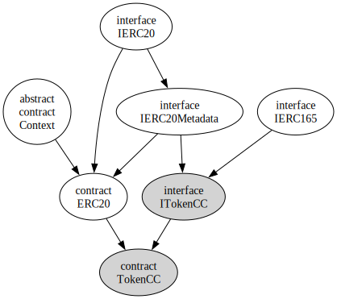

Ethereum Tokens
===============

[Go up to the CCC HW page](../index.html) ([md](../index.md))

### Overview

In this assignment you are going to develop and deploy two types of tokens on our private Ethereum blockchain.  You will develop a cryptocurrency using the [ERC-20 token standard](https://ethereum.org/en/developers/docs/standards/tokens/erc-20/), and you will deploy an NFT (non-fungible token) manager using the [ERC-721 token standard](https://ethereum.org/en/developers/docs/standards/tokens/erc-721/).

The actual amount of code developed in this assignment is relatively small.  The complexity is understanding the code of the existing implementations and extending them.

As you develop the items in this assignment, keep in mind that -- on our private Ethereum blockchain -- it is possible to track back whose smart contracts are whose.

### Changelog

Any changes to this page will be put here for easy reference.  Typo fixes and minor clarifications are not listed here.  So far there aren't any significant changes to report.

### Pre-requisites

You will have to have completed the [connecting to the private Ethereum blockchain](../ethprivate/index.html) assignment as well as the [dApp Introduction](../dappintro/index.html) assignment.  You will also need to be familiar with the [lecture slides on Tokens](../../slides/tokens.html#/).  For some of the tasks below you will need to launch your geth node, connecting to the course server, and start up a geth Javascript terminal; how to do all that is all described in the [connecting to the private Ethereum blockchain](../ethprivate/index.html) assignment.  You will also need to launch a geth terminal, which is also described in the that assignment.

If you have not successfully completed those two assignments, then you will not be able to complete this assignment.

### Part 1: ERC-20 Fungible Token

In this part, you will create a fungible token that follows the (enhanced) [ERC-20 token standard](https://ethereum.org/en/developers/docs/standards/tokens/erc-20/).  This token will represent a token cryptocurrency.  You will use this code in future assignments, such as where you will then be creating a decentralized cryptocurrency exchange for the cryptocurrency that you are creating here.

#### Part 1, task 1: Name your cryptocurrency

You can pick any name that you want.  You can not use the name of the course cryptocurrency or of an [existing cryptocurrency](https://coinmarketcap.com/).  Feel free to be funny and creative here, but please be appropriate in your selection.  Also keep in mind that, in this course, it is possible for somebody to figure out who deployed what cryptocurrency by analyzing the blockchain.  

You will need to create both a name and an abbreviation.  Your name and abbreviation cannot already exist.  To see if an abbreviation exists, see if there is a file with that abbreviation in the `cclogos/` directory in Collab's resources -- if so, then some other student has claimed that abbreviation.  To claim one, put a file named `xyz.png` (where `xyz` is your cryptocurrency abbreviation) there.  You can put a placeholder file there while you work on the logo (below).  Please make the file name be all lower case.

Following in the precedent for currently existing cryptocurrencies, abbreviations are at most four characters, but typically three, and possibly two.  You can have letters and numbers, but not symbols; the first character of the abbreviation must be a letter.  The abbreviation when representing the cryptocurrency is always rendered in upper case (i.e., "BTC"), but the logo file name is all lower case with a ".png" extension (i.e., "btc.png").

#### Part 1, task 2: Create a logo

You will need to create a logo for your cryptocurrency.  The logo that you submit should be 512x512 pixels in size.  Use a fun color!  Create a neat logo!  But please make sure the logo is appropriate.  You can look at the types of logos on a site such as [coinmarketcap.com](https://coinmarketcap.com) for ideas.

The logo itself should be a circular logo with a transparent background outside the circle (just like what is on coinmarketcap.com).  Note that your logo must be readable if the size were reduced to a 32x32 pixel version.  The submission must be a .png file, and it will have to be named `logo.png`.  You can use a free program such as [GIMP](https://www.gimp.org/) to edit your program.  You can use this [logo-template.png](logo-template.png) file as a starter file -- it is the correct size and has a transparent background.

For some examples, see [cryptologos.cc](https://cryptologos.cc/) and [this github site](https://github.com/coinwink/cryptocurrency-logos).

#### Part 1, task 3: Review the starter code

The code we are going to start with is the [OpenZeppelin ERC-20 implementation](https://github.com/OpenZeppelin/openzeppelin-contracts/blob/v4.0.0/contracts/token/ERC20/ERC20.sol).  This code was the same as was discussed in class.

The included code is:

- [Context.sol](Context.sol.html) ([src](Context.sol)) is a better way to get the context rather than `msg.sender` and `msg.data`
- [IERC165.sol](IERC165.sol.html) ([src](IERC165.sol)), as [discussed in lecture](../../slides/tokens.html#/erc165)
- [IERC20.sol](IERC20.sol.html) ([src](IERC20.sol)), as [discussed in lecture](../../slides/tokens.html#/erc20)
- [ITokenCC.sol](ITokenCC.sol.html) ([src](ITokenCC.sol)), as [discussed in lecture](../../slides/tokens.html#/erc20); this is an [abstract contract](../../slides/solidity.html#/abscon)
- [ERC20.sol](ERC20.sol.html) ([src](ERC20.sol)), which is the [OpenZeppelin ERC-20 implementation](https://github.com/OpenZeppelin/openzeppelin-contracts/blob/v4.0.0/contracts/token/ERC20/ERC20.sol) with the two changes noted below.

There were a few changes made to the [ERC20.sol](ERC20.sol.html) ([src](ERC20.sol)) file from the [OpenZeppelin implementation](https://github.com/OpenZeppelin/openzeppelin-contracts/blob/v4.0.0/contracts/token/ERC20/ERC20.sol):

- The `import` lines were modified so that they include everything from the current directory
- The `name()`, `symbol()`, and `decimals()` methods were renamed, as the intent is that you will override them (via public variables) in your TokenCC.sol code.  These renamings were necessary because those three functions are "recommended", but not in the IERC20 interface.

You should look over and familiarize yourself with all this code.  The inheritance hierarchy of this code is shown below.

Note that the only new files, beyond the the OpenZeppelin implementation, are the two bottom grey nodes.  We added was the ITokenCC abstract contract, and you have to implement the TokenCC contract.

#### Part 1, task 4: Develop the smart contract

You will need to develop the smart contract for your cryptocurrency, and deploy it to our private Ethereum blockchain.  Your code will use the five files listed above.  These files all come from [OpenZeppelin](https://openzeppelin.com/), specifically the [OpenZeppelin github repo](https://github.com/OpenZeppelin/openzeppelin-contracts).

There are some very strict submission requirements for this submission so that we can grade it in a sane manner:

1. Your contract MUST be in a file called `TokenCC.sol`.
2. You must put your name and userid as the second line of the file (right after the SPDX line).
3. Your contract opening line MUST be: `contract TokenCC is ITokenCC {`; this will inherit the other contracts and interfaces (Context, IERC20, ERC20, and IERC165).
4. The pragma line should be: `pragma solidity ^0.8.7;`.
5. You are NOT to submit any of the *files* for the interfaces above (Context.sol, IERC20.sol, ITokenCC.sol, or IERC165.sol), nor the ERC20.sol file.  And don't include the code from those files in your TokenCC.sol file.  You should `import` them in `TokenCC.sol` as such: `import "./ITokenCC.sol";` and `import "./ERC20.sol";` -- those two files import all the other contracts and interfaces.  The necessary files will be put into the appropriate directory on Gradescope when it attempts to compile your program.
6. You should not submit any files other than the `TokenCC.sol` file for this part of the assignment; all your code must be in that `TokenCC.sol` file.
7. You cannot edit the [ERC20.sol](ERC20.sol.html) ([src](ERC20.sol)) file -- any changes have to go into your `TokenCC.sol` file.

Your task is to create a `TokenCC.sol` file with a `TokenCC` contract.  Some notes:

- You have to define the name and symbol when the constructor is called -- you can do this by calling the base class (`ERC20`) constructor that takes two parameters -- to see how to do this, look at [this lecture slide](../../slides/tokens.html#/erc20constructor) and the [Arguments for Base Constructors](https://docs.soliditylang.org/en/v0.8.13/contracts.html#arguments-for-base-constructors) section of the Solidity language reference.
- You also have to define public variables `name`, `symbol`, and `decimals`, even though you included the first two in the ERC20 constructor call.  (Doing it this way avoids inheritance issues).  These variables should be `constant`, `public`, and `override`.
- Keep in mind that, because the `_mint()` function is `internal`, it can only be called from code you write.  So your constructor should mint for you a reasonable amount of the cryptocurrency.  
- You have to implement the `supportsInterface()` method to fulfill the requirements of the [IERC165.sol](IERC165.sol.html) ([src](IERC165.sol)) contract; remember that your code supports *three* interfaces: `IERC165`, `IERC20`, and `ITokenCC`
    - It also extends `Context`, but there are no `external` or `public` methods in `Context`, so there is no interface there to support.
- You have to implement a `requestFunds()` function that does nothing other than `revert()` -- we will be using that function in a future assignment, which is why it is in this interface.

Minting considerations:

- How many decimals you pick is up to you.  Ethereum uses 18; Bitcoin uses 8.  To make this a bit more sane for us to manage, let's choose a number between 8 and 12 (inclusive).
- How many coins you mint is up to you.  We would recommend no less than 100 coins, and it *must* be at least 50 coins.  On the other end of the spectrum, [SHIB](https://coinmarketcap.com/currencies/shiba-inu/) -- a token cryptocurrency on Ethereum -- minted 549,063,278,876,302 (yes, $5.5 \ast 10^{14}$) coins.  
	- Keep in mind the amount you are specifying in the mint call is $x \ast 10^d$ where $x$ is how many coins you want to mint and $d$ is the number of decimal places.  So if you want to mint 100 coins, and you are using 10 decimal places, then the amount to mint is 1,000,000,000,000.

Be sure to thoroughly test this in Remix!  Remember that you have multiple accounts in the Javascript deployment environment, so you can transfer your new cryptocurrency back and forth.  Just switch the account in the "Account" drop-down list to initiate a transaction from a different account.

#### Part 1, task 5: Deployment

One you have thoroughly tested your ERC-20 token in Remix, you should deploy it to our private Ethereum blockchain.  How to do this was covered in the [dApp Introduction](../dappintro/index.html) assignment, which you may want to refer back to.  You have to deploy this part and the next part from the same account, and you will have to submit that account address at the end.

Save the contract address it was deployed to, as well as the transaction hash from that transaction, as you will need to submit those at the end of this assignment.

#### Part 1, task 6: Send me some money!

You need to transfer some amount of your cryptocurrency.  The address to transfer it to in on the Collab landing page.  This should be through the `transfer()` function (NOT `approve()`).  You should transfer me exactly 10.0 of your token cryptocurrency.  So if you have 8 decimals, then you will transfer 1000000000 total units.  Save the transaction hash of when you sent me your cryptocurrency.

----

### Part 2: ERC-721 Non-Fungible Token

In this part, you will create a non-fungible token that follows the [ERC-721 token standard](https://ethereum.org/en/developers/docs/standards/tokens/erc-721/).  This token can represent anything, but we will have it represent some image.  You will use this code in a future assignment, where you will then be creating a decentralized auction for NFTs.

#### Part 2, task 1: NFT images

You will be creating three images for NFTs for this assignment.  (You actually only need two for this assignment, but the third will be needed later on, so we'll create all three now).  The images should be uploaded to the `ipfs/` directory in the Collab workspace in the Resources tool.  Note that you can upload a file into that folder, but once uploaded you can not edit it or delete it -- this is a setting in Collab, but was done to mirror the fact that you can't delete images from the Internet once they are placed on the web.  As it is in the Collab workspace, only those in the class can view those files -- but that means anybody in the class can view it.

All image file names should start with your userid and an underscore: `mst3k_foo.jpg`.  You are going to be uploading multiple image files in a future assignment, so please plan your file naming scheme appropriately.  You probably won't need more than three or four such images for the semester, and you are welcome to generate them all now; but you'll just need three different ones for this assignment.  As long as the file name starts with your userid and an underscore, we don't really care what (appropriate) alphanumeric string the rest of the file name is.  Only JPEG (.jpg), PNG (.png), and WEBP (.webp) images, please.

**NOTE:** The filenames, with the extension, **MUST** be strictly less than 32 characters in length.  This is just for the filename ("mst3k_foo_bar.png"), not the path to that file name.

The images must be no larger than 2000 pixels in either dimension!  Which means a 2000x2000 image is the maximum size.

We don't really care what images you upload, as long as:

1. They are images that are in the public domain, such as from Wikipedia (or similar).  You can do a [Google Images search](https://images.google.com), and in the results, select Tools -> Usage Rights -> Creative Commons licenses.  Meme images are fine.  You are welcome to modify those images.
2. They are appropriate images.  Nothing vulgar, nothing involving nudity, nothing that could be labeled NSFW (not safe for work), or otherwise deemed as offensive.  Basically, nothing that would get me in trouble with an administration that does not have a sense of humor about these things.  Like with the [dApp introduction](../dappintro/index.html) ([md](../dappintro/index.md)) assignment, there are many great ways to express your opinions that others may find controversial -- but in an image for a NFT on our private Ethereum blockchain is not really one of them.
3. The image sizes are as specified above (no larger than 2000x2000).

Understand this: **IN THIS COURSE, OWNING THE NFT DOES NOT IMPLY OWNERSHIP OF THE IMAGE.**  The assumption is that you don't actually own the original image, since it's in the public domain.

Pick some fun or funny image.  You are welcome to pick one from Wikipedia.  Or memes.  But something appropriate.  And keep in mind that, like with NFTs on the real Ethereum blockchain, anybody can download the image.

#### Part 2, task 2: Review the starter code

The code we are going to start with is the [OpenZeppelin ERC-721 implementation](https://github.com/OpenZeppelin/openzeppelin-contracts/blob/v4.0.0/contracts/token/ERC721/ERC721.sol).  This code was the same as was discussed in class.  Other than the `import` lines, there have been no changes to the code in this repo.

In addition to some of the files used above (IERC165.sol. ERC165.sol, and Context.sol), there are a few additional files that this part uses; you will need to familiarize yourself with hwo they work.

- [Address.sol](Address.sol.html) ([src](Address.sol)): a library (not a contract!) that provides some useful functions when dealing with Ethereum addresses
- [Strings.sol](Strings.sol.html) ([src](Strings.sol)): a library (not a contract!) that provides some useful String manipulation functions
- [Context.sol](Context.sol.html) ([src](Context.sol)): is a better way to get the context rather than `msg.sender` and `msg.data`
- [ERC165.sol](ERC165.sol.html) ([src](ERC165.sol)): a bare-bones implementation of the `IERC165` interface
- [IERC721.sol](IERC721.sol.html) ([src](IERC721.sol)), as [discussed in lecture](../../tokens.html#/erc721); note that the ERC-721 interface already inherits from the ERC-165 interface
- [ERC721.sol](ERC721.sol.html) ([src](ERC721.sol)), which is the [OpenZeppelin ERC-721 implementation](https://github.com/OpenZeppelin/openzeppelin-contracts/blob/v4.0.0/contracts/token/ERC721/ERC721.sol) -- the only changes that were made were to the `import` lines
- [IERC721Metadata.sol](IERC721Metadata.sol.html) ([src](IERC721Metadata.sol)): this add three functions on top of the ERC-721 standard: `name()`, `symbol()`, and `tokenURI()`; the first two are for the NFT manager, the last one is the URI (aka URL) of the image that the NFT represents
- [INFTmanager.sol](INFTmanager.sol.html) ([src](INFTmanager.sol)): this adds one more function on top of the IERC721Metadata interface: two `mintWithURI()` functiions, which allow creation of NFTs, and setting it's image URI (aka URL) in one function call.  Note that the `mintWithURI()` function will return a token ID, which is just a `uint` that is used to identify (and find) that particular NFT in your token manager.  This is an [abstract contract](../../slides/solidity.html#/abscon).

Why so many files?  Three of the interfaces (IERC165, IERC721, and IERC721Metadata) are Ethereum standards, and the practice is to include them as-is without modifications.  Three of the files are utilities (Address, Context, and Strings).  The INFTmanager adds one function that we need, and the ERC721.sol is the implementation itself.  We realize that's a lot of files to use, but that's why there are so many of them.

You should look over and familiarize yourself with this code. The inheritance hierarchy of this code is shown below.  Note that two of the entries (`Address` and `Strings`) are type substitutions in `ERC721.sol`.  The last one, `IERC721Recevier` is used as a casting type.

Note that the only new files, beyond the the OpenZeppelin implementation, are the two bottom grey nodes.  We added was the INFTmanager abstract contract, and you have to implement the NFTmanager contract.

#### Part 2, task 3: Compile and test the provided code

You should compile the [ERC721.sol](ERC721.sol.html) ([src](ERC721.sol)) code in Remix.  Deploy it to the Javascript environment and play with the various functions.  Note that you need to understand what the code in that smart contract does!  As this is the provided code, and does not have all the features that we need (yet).

#### Part 2, task 4: Create an NFT manager for images

We are going to assemble all this code together to create an NFT manager.  Most of the code is already done in the [ERC721.sol](ERC721.sol.html) ([src](ERC721.sol)).  We are going to create a smart contract called `NFTmanager` that will work for image URLs (or any other URL).  The updated smart contract will implement the [INFTmanager.sol](INFTmanager.sol.html) ([src](INFTmanager.sol)) interface (and, though inheritance, a number of other interfaces).  

There are some very strict submission requirements for this submission so that we can grade it in a sane manner:

1. You must put your name and userid as the second line of the file (right after the SPDX line)
2. Your contract MUST be in a file called `NFTmanager.sol` -- note the capitalization!
3. Your contract line MUST be: `contract NFTmanager is INFTmanager {`; this will inherit all the other necessary interfaces and contracts.
4. The pragma line should be: `pragma solidity ^0.8.7;`
5. You are NOT to submit any of the *files* for the interfaces above (ERC721, IERC721, INFTmanager, or IERC165.sol), nor copy-and-paste that code in your file.  You should `import` them in `NFTmanager.sol`; they will be put into the appropriate directory on Gradescope when it attempts to compile your program
6. You cannot submit any files other than the ones in the list above; any other code must be in your `NFTmanager.sol` file

The following are the functional requirements for the development of this contract:

- Implementation of the two `mintWithURI()` functions
	- The one-parameter version assumes that the `address _to` is really `msg.sender` -- just have the one parameter version call the two parameter version with `msg.sender`
	- Note the string parameter is *just* the filename (`mst3k_foo.jpg`), not the full URI
  	- It should allow minting by *anybody*
  	- A duplicate URI should cause a reversion
  	- This *returns* the token ID of the newly minted NFT; the function itself determines what that ID is (likely the next integer in sequence)
- Implementation of the `supportsInterface()` function for *four* interfaces -- the two ERC721 interfaces (`IERC721`, `IERC721Metadata`), `IERC165`, and `INFTmanager`.
    - It also extends `Context`, but there are no `external` or `public` methods in `Context`, so there is no interface there to support.
- Implementation of `tokenURI()`, which is inherited from `ERC721`
	- It should revert if an invalid token ID is provided
	- It should return the *full* URL of the file; the first part of that URL is on the Collab landing page, and the last part of that URL is what was passed into `mintWithURI()`
	- This URL base should be hard-coded into the contract itself
	- You can override the `_baseURI()` function from `ERC721`, and use that in a similar fashion to what is shown in the `tokenURI()` function in `ERC721`

In theory, you should be able to call `mintWithURI()` and capture the return value for the token ID.  While this return value is properly captured when called from another smart contract, Remix does not always report it.  You are allowed to create a `uint public lastCreatedTokenID` (or similar) variable which holds the token ID of the last created token -- what should have been returned by `mintWithURI()`.  THIS WOULD NEVER WORK IN PRACTICE, as it would create a horrible race condition.  But it will work for our purposes, and allows us to get around this apparent but in Remix.

When you are ready to deploy this token manager, be sure to select the appropriate contract ("NFTmanager") from the Contract down-down list in Remix.

Make sure this works properly in Remix before proceeding onto the next step.

#### Part 2, task 5: Deployment

One you have thoroughly tested your ERC-721 token manager in Remix, you should deploy it to our private Ethereum blockchain.  How to do this was covered in the [dApp Introduction](../dappintro/index.html) assignment, which you may want to refer back to.  You don't have to do this from your eth.coinbase account -- you can do it from any account.  However, you have to deploy all the code in this assignment from the same account, and you have to tell us that account when you submit the Google form at the end of this assignment.

Save the contract address, and the transaction hash, for the deployment, as you will need to submit it at the end of this assignment.

Before final submission of this assignment, you will need to deploy both this token manager and the auction program to our final Ethereum blockchain.  But you don't have to do that yet -- you should ensure it's all working via Remix (in the "JavaScript VM (London)" environment) first.

#### Part 2, task 6: Create two NFTs, and send me one

You should create two NFTs with your deployed contract -- they should be the two images that you created, above.  You need to send me one of them -- the address to transfer it to in on the Collab landing page.  You will need to note the tokenID of the two NFTs -- the one you sent me and the one you kept for yourself -- as you will need to submit those as well.  You are welcome to create more, if you would like, as long as the images for each are unique.  But we only need two for grading.

----

### Troubleshooting

Some common problems encountered, and their solutions:

- "This contract may be abstract, not implement an abstract parent's methods completely or not invoke an inherited contract's constructor correctly." -- likely this means you are trying to deploy the interface rather than the contract itself.  In Remix, in the Deploy pane, make sure the correct contract (and not an interface!) is selected in the "Contract" drop-down list.

----

### Submission

You will need to fill in the various values from this assignment into the [tokens.py](tokens.py.html) ([src](tokens.py)) file.  That file clearly indicates all the values that need to be filled in.  That file, along with your Solidity source code, are the only files that must be submitted.  The 'sanity_checks' dictionary is intended to be a checklist to ensure that you perform the various other aspects to ensure this assignment is fully submitted.

There are *four* forms of submission for this assignment; you must do all four.

Submission 1: You must deploy those two smart contracts to our private Ethereum blockchain.  It's fine if you deploy it a few times to test it.  The contract addresses and transaction hashes of these deployments are in the `tokens.py` file that you submit.

Submission 2: You should submit your `TokenCC.sol` and `NFTManager.sol` files and your completed `tokens.py` file, and ONLY those three files, to Gradescope.  All your Solidity code should be in the first two files, and you should specifically import the various interfaces.  Those interface files will be placed in the same directory on Gradescope when you submit.  **NOTE:** Gradescope cannot fully test this assignment, as it does not have access to the private blockchain. So it can only do a few sanity tests (correct files submitted, successful compilation, valid values in auction.py, etc.).

Submission 3: You will need to upload your cryptocurrency logo (properly named!) to the `cclogos/` directory on Collab, and your three NFT images (also properly named!) to the `ipfs/` directory on Collab.

Submission 4: You need to send me exactly 10.0 of your token cryptocurrency, and also one of your NFTs.  The address to send that to is on the Collab landing page.
