Coin Logos in the slides
========================

[Go up to the slides page](../index.html) ([md](../index.md))


This page has the relevant code to include the coin logos in the reveal.js slides.  It's really just a reference for those creating the slides.  The licensing information for these logos can be found [here](images/logos/readme.html) ([md](images/logos/readme.md)).


### Subtitles

As a subtitle to the slide column header, such as [here](stablecoins.html#/casestudy):

```

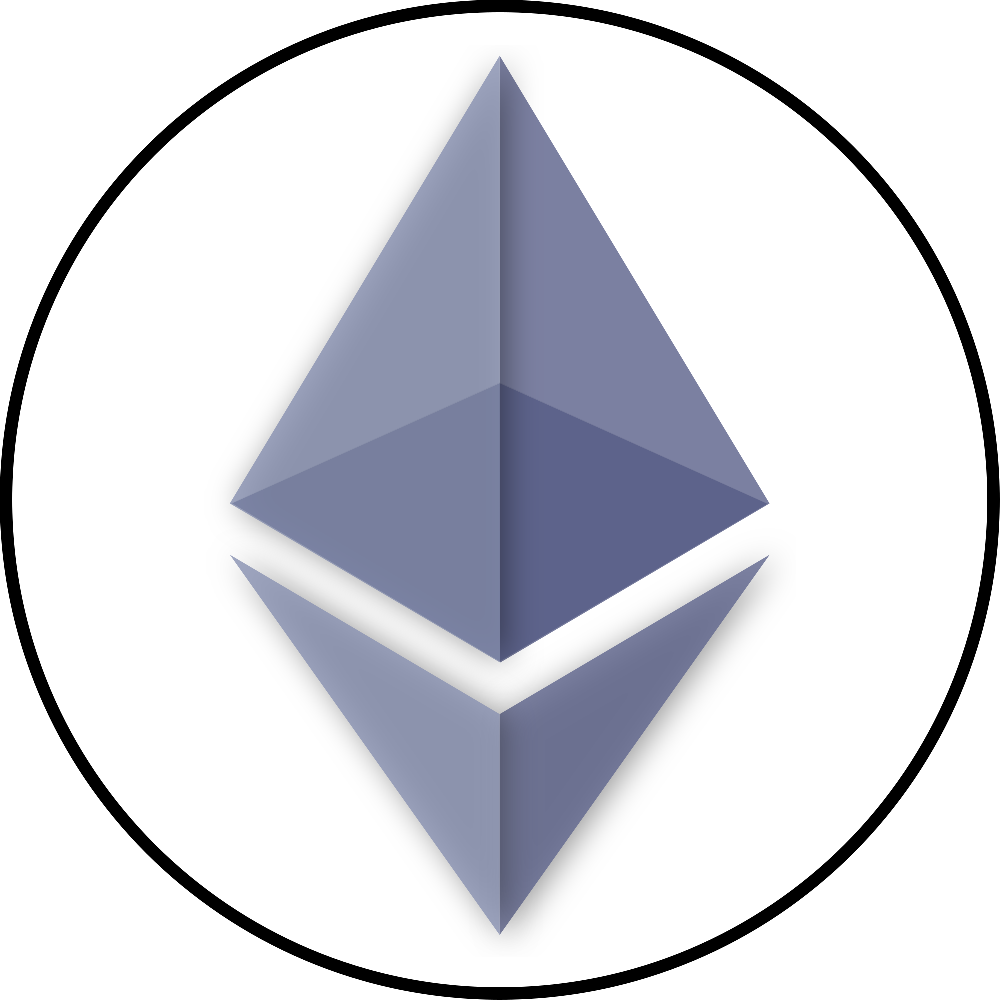
```

### Slide style

To include an image on a slide, either as part of the text or as part of the h2 header, put the following before the first Markdown line of the slide content:

```
<!-- .slide: class="cclogo-slide" -->
```


### Coin logo

The text of the coin logo is the same.  To put it in a h2 header (be sure to include the slide style line, above):

```
## [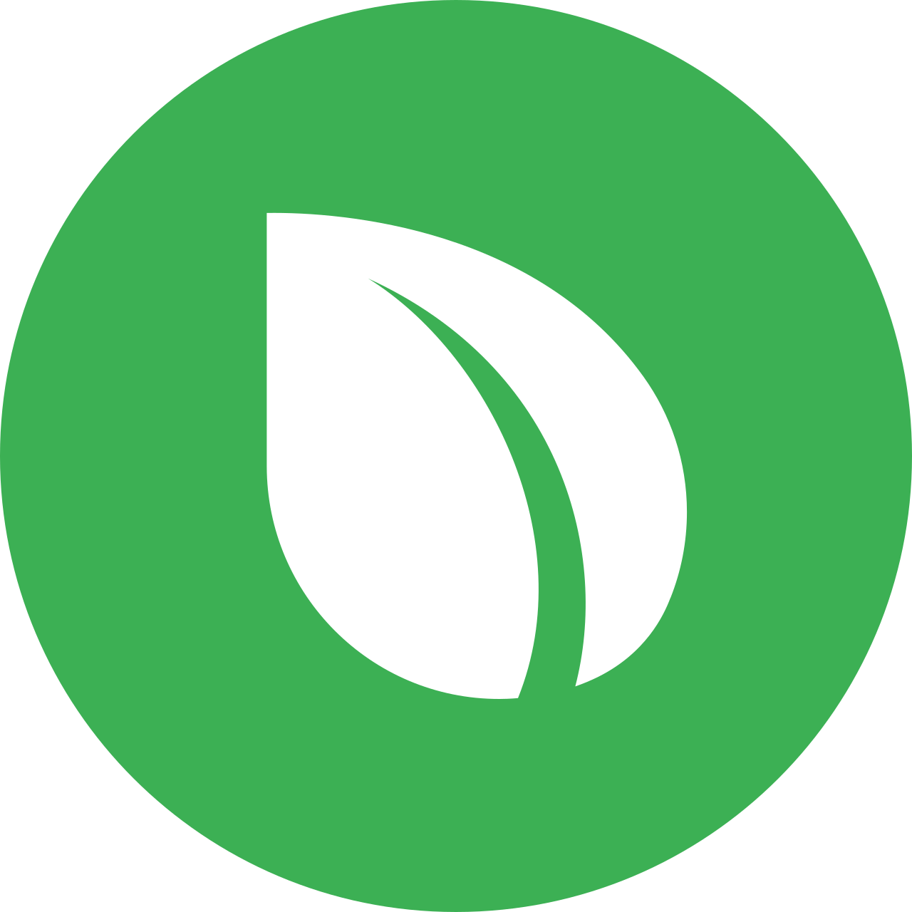{fig-alt='ppc logo'}{fig-alt='ppc logo'}{fig-alt='ppc logo'}{fig-alt='ppc logo'}{fig-alt='ppc logo'}](https://coinmarketcap.com/currencies/peercoin/) Peercoin
```

To put it as part of a list or paragraph:

```
## - [{fig-alt='ppc logo'}{fig-alt='ppc logo'}{fig-alt='ppc logo'}{fig-alt='ppc logo'}{fig-alt='ppc logo'}](https://coinmarketcap.com/currencies/peercoin/) Peercoin
```

### Viewing the coin logos

See [here](images/logos/readme.html) or [here](introduction.html#/allcoins).


### All the coin logos

They are sorted alphabetically by the coin abbreviation.

```
[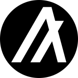{fig-alt='algo logo'}](https://coinmarketcap.com/currencies/algorand/)
[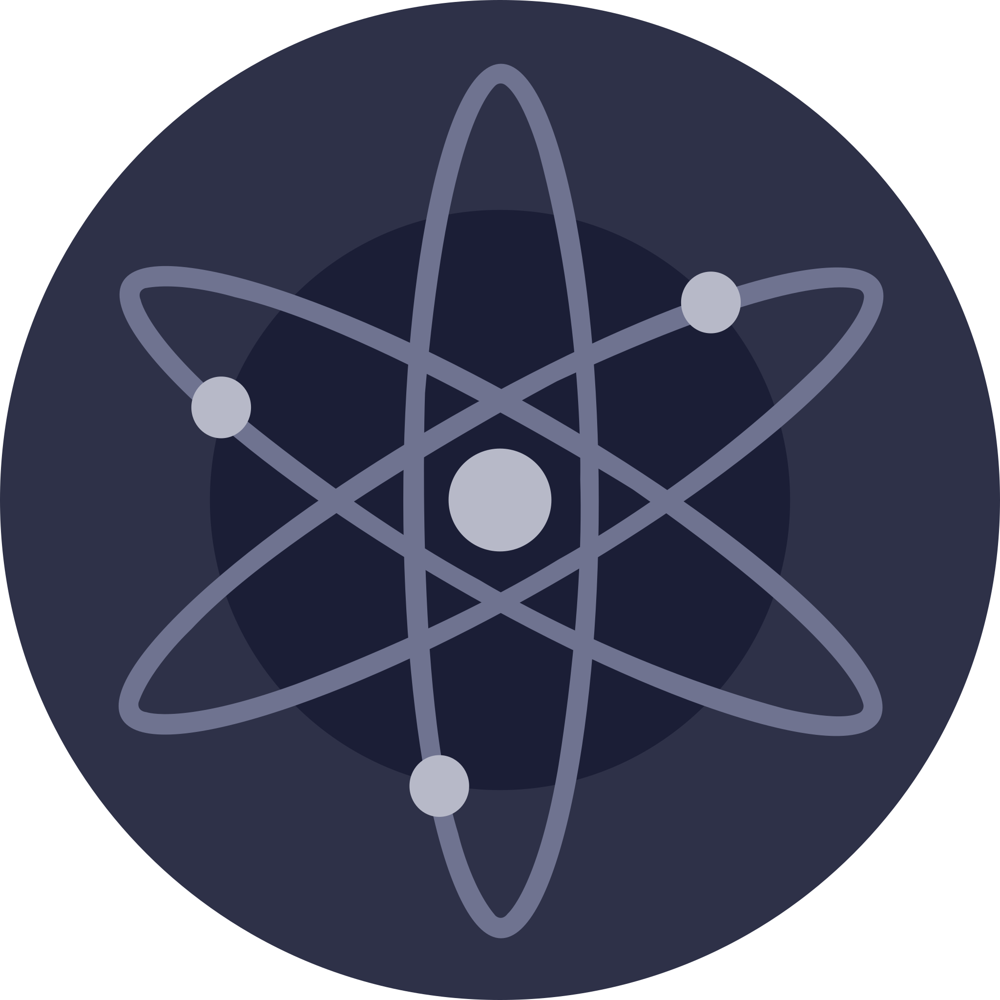{fig-alt='atom logo'}](https://coinmarketcap.com/currencies/cosmos/)
[{fig-alt='aust logo'}](https://coinmarketcap.com/currencies/anchorust/)
[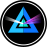{fig-alt='beam logo'}](https://coinmarketcap.com/currencies/beam/)
[{fig-alt='btc logo'}](https://coinmarketcap.com/currencies/bitcoin/)
[{fig-alt='btg logo'}](https://coinmarketcap.com/currencies/bitcoin-gold/)
[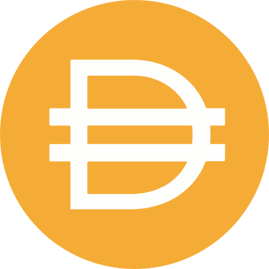{fig-alt='dai logo'}](https://coinmarketcap.com/currencies/multi-collateral-dai/)
[{fig-alt='dot logo'}](https://coinmarketcap.com/currencies/polkadot-new/)
[{fig-alt='erg logo'}](https://coinmarketcap.com/currencies/ergo/)
[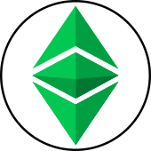{fig-alt='etc logo'}](https://coinmarketcap.com/currencies/ethereum-classic/)
[{fig-alt='eth logo'}](https://coinmarketcap.com/currencies/ethereum/)
[{fig-alt='fei logo'}](https://coinmarketcap.com/currencies/fei-usd/)
[{fig-alt='fil logo'}](https://coinmarketcap.com/currencies/filecoin/)
[{fig-alt='firo logo'}](https://coinmarketcap.com/currencies/firo/)
[{fig-alt='frax logo'}](https://coinmarketcap.com/currencies/frax/)
[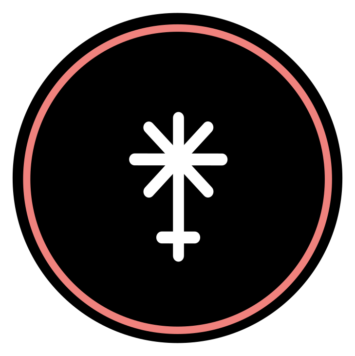{fig-alt='juno logo'}](https://coinmarketcap.com/currencies/juno/)
[{fig-alt='luna logo'}](https://coinmarketcap.com/currencies/terra-luna/)
[{fig-alt='matic logo'}](https://coinmarketcap.com/currencies/polygon/)
[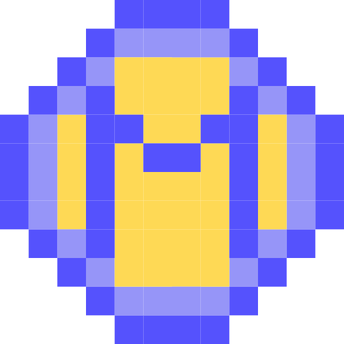{fig-alt='mim logo'}](https://coinmarketcap.com/currencies/magic-internet-money/)
[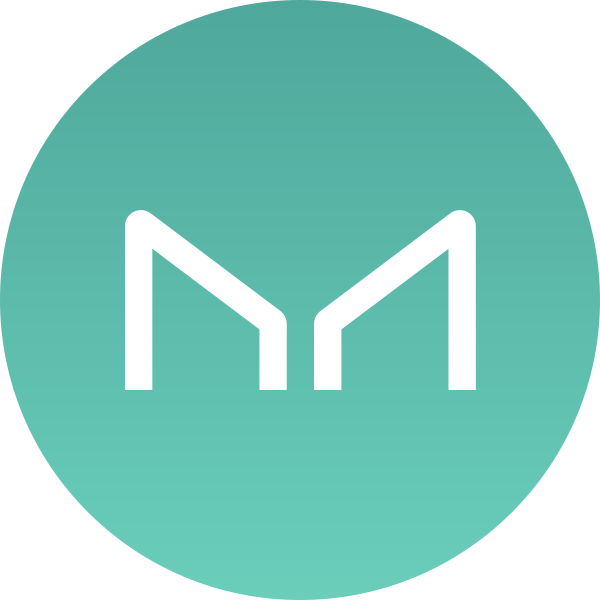{fig-alt='mkr logo'}](https://coinmarketcap.com/currencies/maker/)
[{fig-alt='nmc logo'}](https://coinmarketcap.com/currencies/namecoin/)
[{fig-alt='neox logo'}](https://coinmarketcap.com/currencies/neoxa/)
[{fig-alt='ppc logo'}](https://coinmarketcap.com/currencies/peercoin/)
[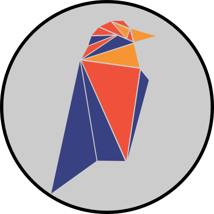{fig-alt='rvn logo'}](https://coinmarketcap.com/currencies/ravencoin/)
[{fig-alt='sai logo'}](https://coinmarketcap.com/currencies/single-collateral-dai/)
[{fig-alt='shib logo'}](https://coinmarketcap.com/currencies/shiba-inu/)
[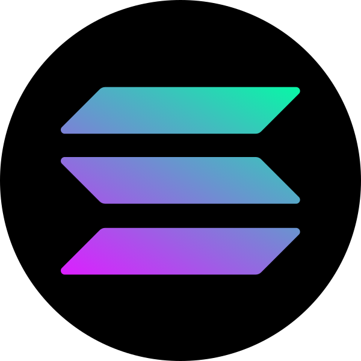{fig-alt='sol logo'}](https://coinmarketcap.com/currencies/solana/)
[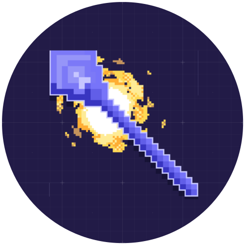{fig-alt='spell logo'}](https://coinmarketcap.com/currencies/spell-token/)
[{fig-alt='storj logo'}](https://coinmarketcap.com/currencies/storj/)
[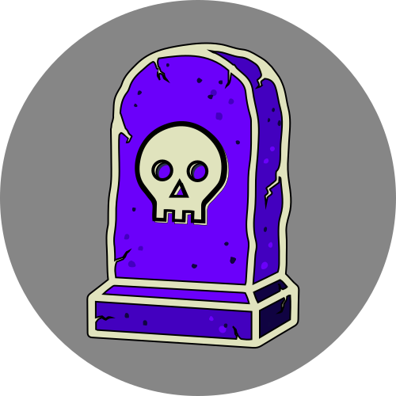{fig-alt='tomb logo'}](https://coinmarketcap.com/currencies/tomb/)
[{fig-alt='tribe logo'}](https://coinmarketcap.com/currencies/tribe/)
[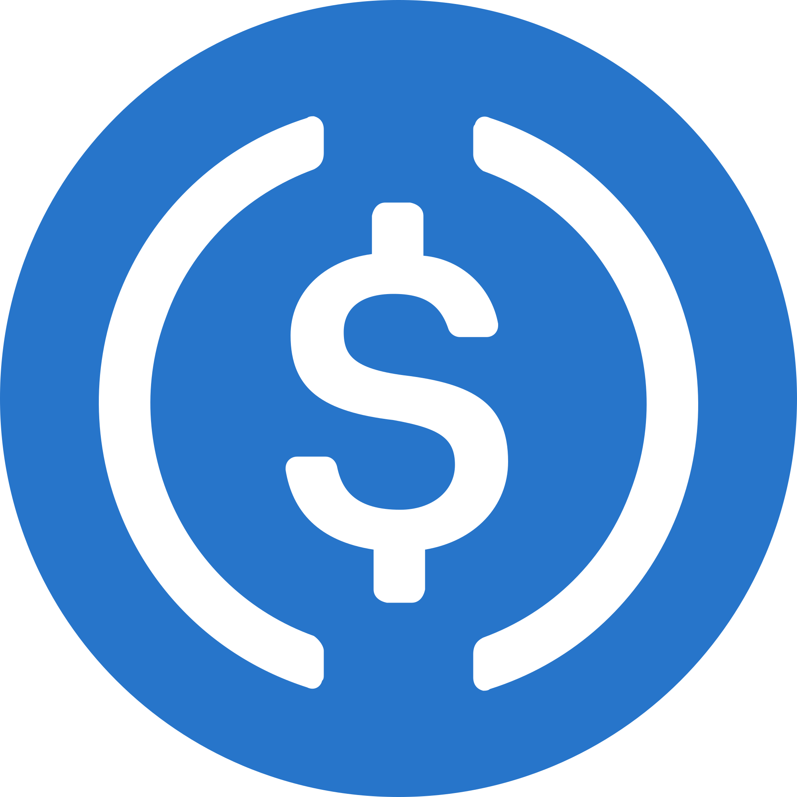{fig-alt='usdc logo'}](https://coinmarketcap.com/currencies/usd-coin/)
[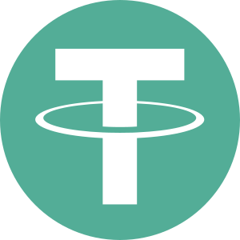{fig-alt='usdt logo'}](https://coinmarketcap.com/currencies/tether/)
[{fig-alt='ustc logo'}](https://coinmarketcap.com/currencies/terrausd/)
[{fig-alt='wbtc logo'}](https://coinmarketcap.com/currencies/wrapped-bitcoin/)
[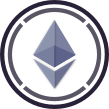{fig-alt='weth logo'}](https://coinmarketcap.com/currencies/weth/)
[{fig-alt='xlm logo'}](https://coinmarketcap.com/currencies/stellar/)
[{fig-alt='xpd logo'}](https://coinmarketcap.com/currencies/petrodollar/)
[{fig-alt='xpm logo'}](https://coinmarketcap.com/currencies/primecoin/)
[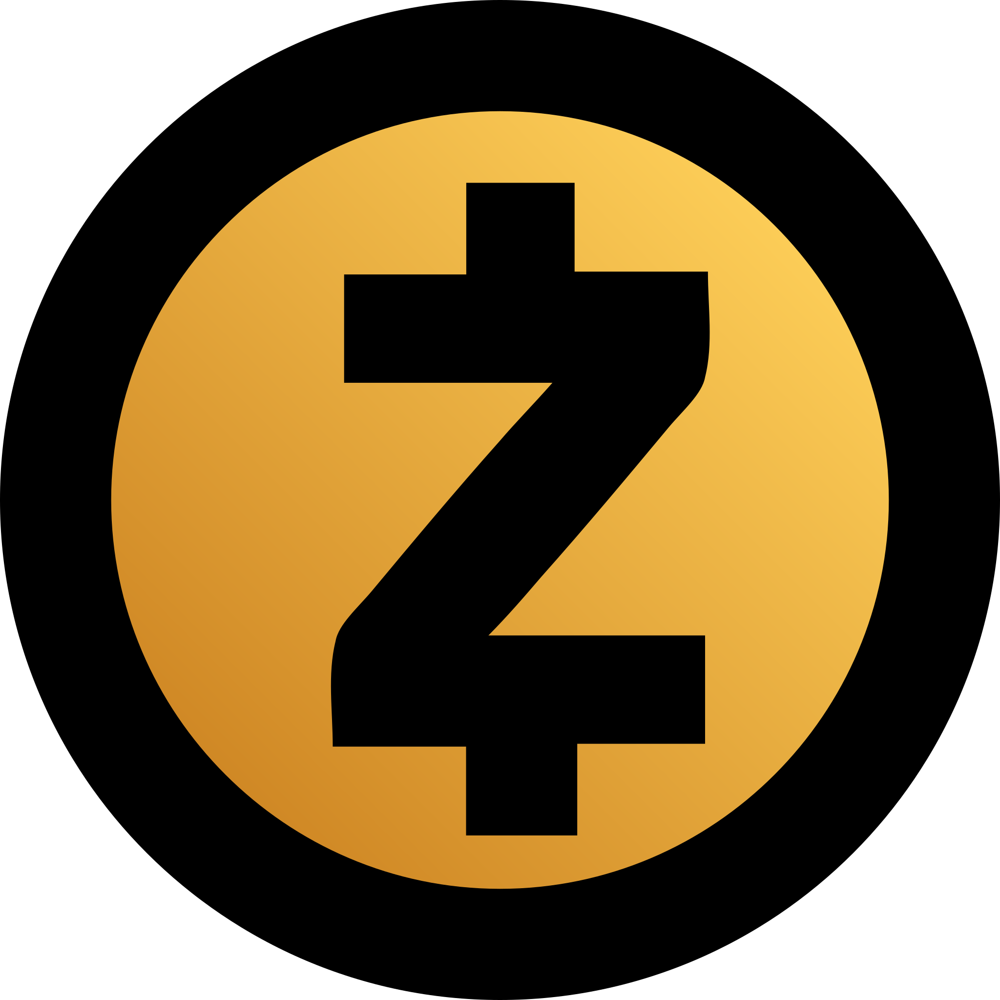{fig-alt='zec logo'}](https://coinmarketcap.com/currencies/zcash/)
```

### All the coin logos as images

<div class="cclogos">

[{fig-alt='algo logo'}](https://coinmarketcap.com/currencies/algorand/)
[{fig-alt='atom logo'}](https://coinmarketcap.com/currencies/cosmos/)
[{fig-alt='aust logo'}](https://coinmarketcap.com/currencies/anchorust/)
[{fig-alt='beam logo'}](https://coinmarketcap.com/currencies/beam/)
[{fig-alt='btc logo'}](https://coinmarketcap.com/currencies/bitcoin/)
[{fig-alt='btg logo'}](https://coinmarketcap.com/currencies/bitcoin-gold/)
[{fig-alt='dai logo'}](https://coinmarketcap.com/currencies/multi-collateral-dai/)
[{fig-alt='dot logo'}](https://coinmarketcap.com/currencies/polkadot-new/)
[{fig-alt='erg logo'}](https://coinmarketcap.com/currencies/ergo/)
[{fig-alt='etc logo'}](https://coinmarketcap.com/currencies/ethereum-classic/)
[{fig-alt='eth logo'}](https://coinmarketcap.com/currencies/ethereum/)
[{fig-alt='fei logo'}](https://coinmarketcap.com/currencies/fei-usd/)
[{fig-alt='fil logo'}](https://coinmarketcap.com/currencies/filecoin/)
[{fig-alt='firo logo'}](https://coinmarketcap.com/currencies/firo/)
[{fig-alt='frax logo'}](https://coinmarketcap.com/currencies/frax/)
[{fig-alt='juno logo'}](https://coinmarketcap.com/currencies/juno/)
[{fig-alt='luna logo'}](https://coinmarketcap.com/currencies/terra-luna/)
[{fig-alt='matic logo'}](https://coinmarketcap.com/currencies/polygon/)
[{fig-alt='mim logo'}](https://coinmarketcap.com/currencies/magic-internet-money/)
[{fig-alt='mkr logo'}](https://coinmarketcap.com/currencies/maker/)
[{fig-alt='nmc logo'}](https://coinmarketcap.com/currencies/namecoin/)
[{fig-alt='neox logo'}](https://coinmarketcap.com/currencies/neoxa/)
[{fig-alt='ppc logo'}](https://coinmarketcap.com/currencies/peercoin/)
[{fig-alt='rvn logo'}](https://coinmarketcap.com/currencies/ravencoin/)
[{fig-alt='sai logo'}](https://coinmarketcap.com/currencies/single-collateral-dai/)
[{fig-alt='shib logo'}](https://coinmarketcap.com/currencies/shiba-inu/)
[{fig-alt='sol logo'}](https://coinmarketcap.com/currencies/solana/)
[{fig-alt='spell logo'}](https://coinmarketcap.com/currencies/spell-token/)
[{fig-alt='storj logo'}](https://coinmarketcap.com/currencies/storj/)
[{fig-alt='tomb logo'}](https://coinmarketcap.com/currencies/tomb/)
[{fig-alt='tribe logo'}](https://coinmarketcap.com/currencies/tribe/)
[{fig-alt='usdc logo'}](https://coinmarketcap.com/currencies/usd-coin/)
[{fig-alt='usdt logo'}](https://coinmarketcap.com/currencies/tether/)
[{fig-alt='ustc logo'}](https://coinmarketcap.com/currencies/terrausd/)
[{fig-alt='wbtc logo'}](https://coinmarketcap.com/currencies/wrapped-bitcoin/)
[{fig-alt='weth logo'}](https://coinmarketcap.com/currencies/weth/)
[{fig-alt='xlm logo'}](https://coinmarketcap.com/currencies/stellar/)
[{fig-alt='xpd logo'}](https://coinmarketcap.com/currencies/petrodollar/)
[{fig-alt='xpm logo'}](https://coinmarketcap.com/currencies/primecoin/)
[{fig-alt='zec logo'}](https://coinmarketcap.com/currencies/zcash/)

</div>
