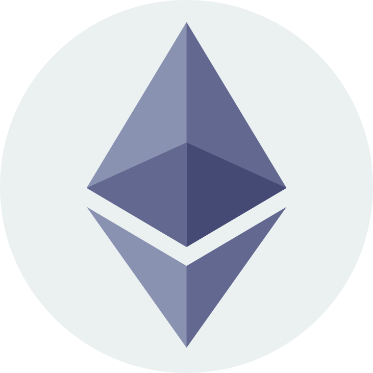
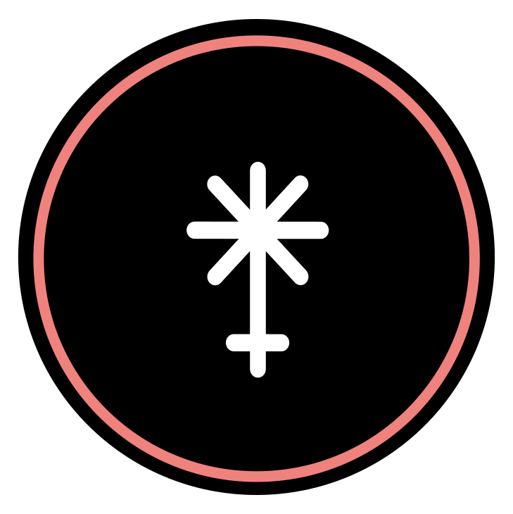
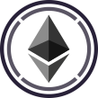

Coin Logos in the slides
========================

[Go up to the slides page](../index.html) ([md](../index.md))


This page has the relevant code to include the coin logos in the reveal.js slides.  It's really just a reference for those creating the slides.  The licensing information for these logos can be found [here](images/logos/readme.html) ([md](images/logos/readme.md)).


### Subtitles

As a subtitle to the slide column header, such as [here](stablecoins.html#/casestudy):

```


```

### Slide style

To include an image on a slide, either as part of the text or as part of the h2 header, put the following before the first Markdown line of the slide content:

```
<!-- .slide: class="cclogo-slide" -->
```


### Coin logo

The text of the coin logo is the same.  To put it in a h2 header (be sure to include the slide style line, above):

```
## [](https://coinmarketcap.com/currencies/peercoin/) Peercoin
```

To put it as part of a list or paragraph:

```
## - [](https://coinmarketcap.com/currencies/peercoin/) Peercoin
```

### Viewing the coin logos

See [here](images/logos/readme.html) or [here](introduction.html#/allcoins).


### All the coin logos

They are sorted alphabetically by the coin abbreviation.

```
[](https://coinmarketcap.com/currencies/algorand/)
[](https://coinmarketcap.com/currencies/cosmos/)
[](https://coinmarketcap.com/currencies/anchorust/)
[](https://coinmarketcap.com/currencies/beam/)
[](https://coinmarketcap.com/currencies/bitcoin/)
[](https://coinmarketcap.com/currencies/bitcoin-gold/)
[](https://coinmarketcap.com/currencies/multi-collateral-dai/)
[](https://coinmarketcap.com/currencies/polkadot-new/)
[](https://coinmarketcap.com/currencies/ergo/)
[](https://coinmarketcap.com/currencies/ethereum-classic/)
[](https://coinmarketcap.com/currencies/ethereum/)
[](https://coinmarketcap.com/currencies/fei-usd/)
[](https://coinmarketcap.com/currencies/filecoin/)
[](https://coinmarketcap.com/currencies/firo/)
[](https://coinmarketcap.com/currencies/frax/)
[](https://coinmarketcap.com/currencies/juno/)
[](https://coinmarketcap.com/currencies/terra-luna/)
[](https://coinmarketcap.com/currencies/polygon/)
[](https://coinmarketcap.com/currencies/magic-internet-money/)
[](https://coinmarketcap.com/currencies/maker/)
[](https://coinmarketcap.com/currencies/namecoin/)
[](https://coinmarketcap.com/currencies/neoxa/)
[](https://coinmarketcap.com/currencies/peercoin/)
[](https://coinmarketcap.com/currencies/ravencoin/)
[](https://coinmarketcap.com/currencies/single-collateral-dai/)
[](https://coinmarketcap.com/currencies/shiba-inu/)
[](https://coinmarketcap.com/currencies/solana/)
[](https://coinmarketcap.com/currencies/spell-token/)
[](https://coinmarketcap.com/currencies/storj/)
[](https://coinmarketcap.com/currencies/tomb/)
[](https://coinmarketcap.com/currencies/tribe/)
[](https://coinmarketcap.com/currencies/usd-coin/)
[](https://coinmarketcap.com/currencies/tether/)
[](https://coinmarketcap.com/currencies/terrausd/)
[](https://coinmarketcap.com/currencies/wrapped-bitcoin/)
[](https://coinmarketcap.com/currencies/weth/)
[](https://coinmarketcap.com/currencies/stellar/)
[](https://coinmarketcap.com/currencies/petrodollar/)
[](https://coinmarketcap.com/currencies/primecoin/)
[](https://coinmarketcap.com/currencies/zcash/)
```

### All the coin logos as images

<div class="cclogos">

[](https://coinmarketcap.com/currencies/algorand/)
[](https://coinmarketcap.com/currencies/cosmos/)
[](https://coinmarketcap.com/currencies/anchorust/)
[](https://coinmarketcap.com/currencies/beam/)
[](https://coinmarketcap.com/currencies/bitcoin/)
[](https://coinmarketcap.com/currencies/bitcoin-gold/)
[](https://coinmarketcap.com/currencies/multi-collateral-dai/)
[](https://coinmarketcap.com/currencies/polkadot-new/)
[](https://coinmarketcap.com/currencies/ergo/)
[](https://coinmarketcap.com/currencies/ethereum-classic/)
[](https://coinmarketcap.com/currencies/ethereum/)
[](https://coinmarketcap.com/currencies/fei-usd/)
[](https://coinmarketcap.com/currencies/filecoin/)
[](https://coinmarketcap.com/currencies/firo/)
[](https://coinmarketcap.com/currencies/frax/)
[](https://coinmarketcap.com/currencies/juno/)
[](https://coinmarketcap.com/currencies/terra-luna/)
[](https://coinmarketcap.com/currencies/polygon/)
[](https://coinmarketcap.com/currencies/magic-internet-money/)
[](https://coinmarketcap.com/currencies/maker/)
[](https://coinmarketcap.com/currencies/namecoin/)
[](https://coinmarketcap.com/currencies/neoxa/)
[](https://coinmarketcap.com/currencies/peercoin/)
[](https://coinmarketcap.com/currencies/ravencoin/)
[](https://coinmarketcap.com/currencies/single-collateral-dai/)
[](https://coinmarketcap.com/currencies/shiba-inu/)
[](https://coinmarketcap.com/currencies/solana/)
[](https://coinmarketcap.com/currencies/spell-token/)
[](https://coinmarketcap.com/currencies/storj/)
[](https://coinmarketcap.com/currencies/tomb/)
[](https://coinmarketcap.com/currencies/tribe/)
[](https://coinmarketcap.com/currencies/usd-coin/)
[](https://coinmarketcap.com/currencies/tether/)
[](https://coinmarketcap.com/currencies/terrausd/)
[](https://coinmarketcap.com/currencies/wrapped-bitcoin/)
[](https://coinmarketcap.com/currencies/weth/)
[](https://coinmarketcap.com/currencies/stellar/)
[](https://coinmarketcap.com/currencies/petrodollar/)
[](https://coinmarketcap.com/currencies/primecoin/)
[](https://coinmarketcap.com/currencies/zcash/)

</div>
