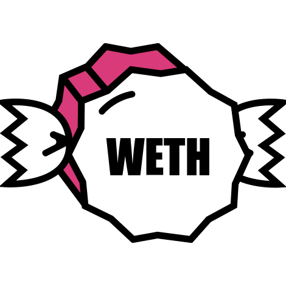

Cryptocurrency logos
====================

All the logos herein are from sources whose licenses allow redistribution in this repository.

-  Bitcoin (BTC): adapted from [here](https://commons.wikimedia.org/wiki/File:btc-coin-symbol.svg), which is from the [Bitcoin Wikipedia article](https://en.wikipedia.org/wiki/Bitcoin)  
-  Ravencoin: adapted from a [this image from Wikimedia Commons](https://commons.wikimedia.org/wiki/File:rvn-logo.png)  
-  Ethereum: [this image from Wikimedia Commons](https://commons.wikimedia.org/wiki/File:eth-logo.svg), which is from the [Ethereum Wikipedia article](https://en.wikipedia.org/wiki/Ethereum)  
-  Ethereum classic: [this image from Wikimedia Commons](https://commons.wikimedia.org/wiki/File:Ethereum_Classic_Logo.svg)  
-  ZCash (ZEC): the logo image is [the one they provide](https://cryptologos.cc/zcash) and no license is provided on that page; it is used here under free use guidelines  
-  Firo (FIRO) from [Wikimedia commons](https://commons.wikimedia.org/wiki/File:firo-coin-symbol.svg)  
-  Wrapped Bitcoin (WBTC) from [here](https://cryptologos.cc/wrapped-bitcoin)  
-  Stellar Lumens (XLM) adapted from [here](https://cryptologos.cc/stellar)  
-  Polygon (MATIC) adapted from [here](https://cryptologos.cc/logos/matic-coin-symbol.svg?v=022)  
-  DOT adapted from [here](https://cryptologos.cc/polkadot-new)  
-  SOL adapted from [here](https://cryptologos.cc/solana)  
-  Cosmos (ATOM) from [here](https://cryptologos.cc/cosmos)  
-  Dai (DAI) from [here](https://cryptologos.cc/multi-collateral-dai)  
-  Peercoin (PPC) from [here](https://cryptologos.cc/peercoin)  
-  Primecoin (XPM) from [here](https://cryptologos.cc/primecoin)  
-  Namecoin (NMC) from [here](https://cryptologos.cc/namecoin)  
-  Filecoin (FIL) from [here](https://cryptologos.cc/filecoin)  
-  Greencoin (GRE) was from a Pinterest site, but they don't hold the copyright; it's on various other sites, so the assumption is that it's legal to use and include it under free use guidelines  
-  WETH adapted from [here](https://neironix.io/cryptocurrency/wrapped_ether), and included under free use guidelines 
-  STORJ adapted from [here](https://cryptologos.cc/storj)  
-  STORJ adapted from [here](https://cryptologos.cc/shiba-inu)  
-  UDSC (USDC) from [here](https://cryptologos.cc/usd-coin)  
-  Tether (USDT) adapted from [here](https://cryptologos.cc/usd-coin)  

