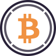

Cryptocurrency logos
====================

All the logos herein are from sources whose licenses allow redistribution in this repository, or are included under free use guidelines.

-  Bitcoin (BTC) adapted from [this image from Wikimedia Commons](https://commons.wikimedia.org/wiki/File:Bitcoin_logo.svg), which is from the [Bitcoin Wikipedia article](https://en.wikipedia.org/wiki/Bitcoin)  
-  Ravencoin (RVN) adapted from [this image from Wikimedia Commons](https://commons.wikimedia.org/wiki/File:Ravencoin-logo.png)  
-  Ethereum (ETH) was adapted from [here](https://logowik.com/ethereum-vector-logo-1-7602.html), and the [old version](eth-coin-symbol-old.svg) was adapted from [this image from Wikimedia Commons](https://commons.wikimedia.org/wiki/File:Ethereum_logo_translucent.svg), which is from the [Ethereum Wikipedia article](https://en.wikipedia.org/wiki/Ethereum)  
-  Ethereum classic (ETC) adapted from the [logo file](etc-logo.svg), which is from [this image from Wikimedia Commons](https://commons.wikimedia.org/wiki/File:Ethereum_Classic_Logo.svg); the [old version](etc-coin-symbol-old.svg) was from the same file  
-  ZCash (ZEC): from [cryptologos.cc](https://cryptologos.cc/zcash)  
-  Firo (FIRO) from [this image from Wikimedia Commons](https://commons.wikimedia.org/wiki/File:Firo-logo.svg)  
-  Wrapped Bitcoin (WBTC) from [cryptologos.cc](https://cryptologos.cc/wrapped-bitcoin)  
-  Stellar Lumens (XLM) adapted from [cryptologos.cc](https://cryptologos.cc/stellar)  
-  Polygon (MATIC) adapted from [cryptologos.cc](https://cryptologos.cc/logos/matic-coin-symbol.svg?v=022)  
-  DOT adapted from [cryptologos.cc](https://cryptologos.cc/polkadot-new)  
-  SOL adapted from [cryptologos.cc](https://cryptologos.cc/solana)  
-  Cosmos (ATOM) from [cryptologos.cc](https://cryptologos.cc/cosmos)  
-  Dai (DAI) from [cryptologos.cc](https://cryptologos.cc/multi-collateral-dai)  
-  Peercoin (PPC) from [cryptologos.cc](https://cryptologos.cc/peercoin)  
-  Primecoin (XPM) from [cryptologos.cc](https://cryptologos.cc/primecoin)  
-  Namecoin (NMC) from [cryptologos.cc](https://cryptologos.cc/namecoin)  
-  Filecoin (FIL) from [cryptologos.cc](https://cryptologos.cc/filecoin)  
-  Greencoin (GRE) was from a Pinterest site, but they don't hold the copyright; it's on various other sites, so the assumption is that it's legal to use and include it under free use guidelines  
-  WETH adapted from [here](https://neironix.io/cryptocurrency/wrapped_ether), and included under free use guidelines 
-  STORJ adapted from [cryptologos.cc](https://cryptologos.cc/storj)  
-  SHIB adapted from [cryptologos.cc](https://cryptologos.cc/shiba-inu)  
-  UDSC (USDC) from [cryptologos.cc](https://cryptologos.cc/usd-coin)  
-  Tether (USDT) adapted from [cryptologos.cc](https://cryptologos.cc/usd-coin)  
-  Beam (BEAM) from [cryptologos.cc](https://cryptologos.cc/beam)  

