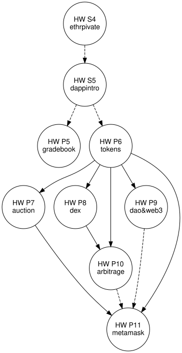
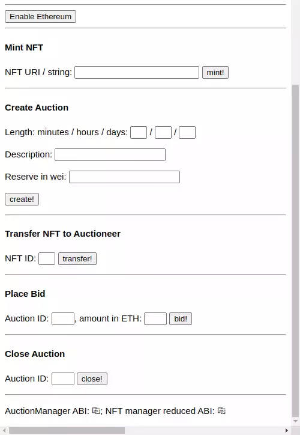

## Disclaimer

{style="float:right;margin-left:20px;height:unset;width:300px" alt='disclaimer icon'}

- This presentation and course are not about cryptocurrency investing
	- Nor is it (or I) trying to promote cryptocurrency
	- Rather, its focus is to understand the technology and theory behind cryptocurrency
- You will need to consider legal authorization from your institution
	- Cryptocurrency mining is typically forbidden by universities
		- Or on state property, or with state equipment, or using state electricity, etc.

----

<figure style="float:right;margin-left:20px">

<a href="https://aaronbloomfield.github.io/ccc/slides/sigcse2025.html#/">https://aaronbloomfield. github.io/ccc/slides/ sigcse2025.html#/</a>

</figure>

<h2>Introduction</h2>

[BTC](https://finance.yahoo.com/quote/BTC-USD): `$`83,192; [ETH](https://finance.yahoo.com/quote/ETH-USD): `$`2,144; [ETH gas](https://etherscan.io/gastracker): 0.938 gwei => `$`0.04 @ 2025-03-01 10:39:52

- CS 4790: Cryptocurrency, first taught in spring 2022 at UVA
  - Currently in its 6th semester
- Goals
	- To create a 4th year CS elective on cryptocurrency
	- To make the course materials available to all
		- Source code released under a [GPL 3.0](https://www.gnu.org/licenses/gpl-3.0.en.html) license
		- {style="float:right;padding:5px;margin-left:10px" alt='cc-by-sa icon'} Non-source code content released under a [Creative Commons BY-SA license](https://creativecommons.org/licenses/by-sa/4.0/)

## Background

- *Blockchain*: it's just an append-only linked list
	- Blockchain is simple; what's *on* the blockchain is what's interesting
- *Web3*: programs and libraries that interact with a blockchain
  - Websites, command-line programs, GUI cryptocurrency wallets, etc.
  - Typically through a software endpoint or API
- *Mining*: a process that takes recent transactions and puts them into a block to go onto the blockchain
  - Can be *very* computationally expensive
- *Smart contract*: a program whose compiled binary is on the blockchain
  - It is executed by each of the nodes in the cryptocurrency's P2P network

## Course Goals

::: {.right-float-img-600 .no-border}

{alt='soccer ball in goal image'}

- Understand the theoretical aspects of cryptocurrency
- Understand the basics of blockchain in general, and the details of a selected number of blockchains
- Understand the uses of cryptocurrency and blockchain beyond that as a form of money
- Understand the policy, ethical, legal, and tax implications of cryptocurrency
- Be able to develop programs for a specific Blockchain
- Implement a fully working modern cryptocurrency

:::

## Course Structure

- [{fig-alt="btc logo"}{alt='btc logo'}{style="width:75px;height:75px"}](https://coinmarketcap.com/currencies/bitcoin/) Introduction and Bitcoin: [Introduction](introduction.html#/), [Overview](overview.html#/), [Encryption](encryption.html#/), [Bitcoin](bitcoin.html#/), [Mining](mining.html#/)
- [{fig-alt="eth logo"}{alt='eth logo'}{style="width:75px;height:75px"}](https://coinmarketcap.com/currencies/ethereum/) Ethereum and Web3: [Ethereum](ethereum.html#/), [Solidity](solidity.html#/), [Tokens](tokens.html#/), [Blockchain Applications](applications.html#/)
- Advanced concepts: [Scalability](scalability.html#/), [Consensus](consensus.html#/), [Stablecoins](stablecoins.html#/), [Zero-knowledge proofs](znps.html#/)
- [Ethics, Legality, and Policy](ethics-legal-policy.html#/)
- [The Dark Side of Cryptocurrency](darkside.html#/)
- [Course Conclusion](conclusion.html)

## Environment

- We setup our own Ethereum blockchain
  - All *ether* on that blockchain is free
- The students have nothing to buy at all in the course
- The development IDE we use is [Remix](https://remix.ethereum.org) (online and desktop versions)
  - Other ideas considered: [Truffle Suite](https://archive.trufflesuite.com/truffle/), [Hardhat](https://hardhat.org/), [solc](https://docs.soliditylang.org/en/latest/installing-solidity.html) & [geth](https://geth.ethereum.org/downloads)

<iframe src='https://remix.ethereum.org' style="width:95%;height:50%;border-radius:20px"></iframe>

## 40 Cryptocurrencies studied
[{fig-alt="algo logo"}{alt='algo logo'}](https://coinmarketcap.com/currencies/algorand/)
[{fig-alt="atom logo"}{alt='atom logo'}](https://coinmarketcap.com/currencies/cosmos/)
[{fig-alt="aust logo"}{alt='aust logo'}](https://coinmarketcap.com/currencies/anchorust/)
[{fig-alt="beam logo"}{alt='beam logo'}](https://coinmarketcap.com/currencies/beam/)
[{fig-alt="btc logo"}{alt='btc logo'}](https://coinmarketcap.com/currencies/bitcoin/)
[{fig-alt="btg logo"}{alt='btg logo'}](https://coinmarketcap.com/currencies/bitcoin-gold/)
[{fig-alt="dai logo"}{alt='dai logo'}](https://coinmarketcap.com/currencies/multi-collateral-dai/)
[{fig-alt="dot logo"}{alt='dot logo'}](https://coinmarketcap.com/currencies/polkadot-new/)
[{fig-alt="erg logo"}{alt='erg logo'}](https://coinmarketcap.com/currencies/ergo/)
[{fig-alt="etc logo"}{alt='etc logo'}](https://coinmarketcap.com/currencies/ethereum-classic/)
[{fig-alt="eth logo"}{alt='eth logo'}](https://coinmarketcap.com/currencies/ethereum/)
[{fig-alt="fei logo"}{alt='fei logo'}](https://coinmarketcap.com/currencies/fei-usd/)
[{fig-alt="fil logo"}{alt='fil logo'}](https://coinmarketcap.com/currencies/filecoin/)
[{fig-alt="firo logo"}{alt='firo logo'}](https://coinmarketcap.com/currencies/firo/)
[{fig-alt="frax logo"}{alt='frax logo'}](https://coinmarketcap.com/currencies/frax/)
[{fig-alt="juno logo"}{alt='juno logo'}](https://coinmarketcap.com/currencies/juno/)
[{fig-alt="luna logo"}](https://coinmarketcap.com/currencies/terra-luna/)
[{fig-alt="matic logo"}{alt='matic logo'}](https://coinmarketcap.com/currencies/polygon/)
[{fig-alt="mim logo"}{alt='mim logo'}](https://coinmarketcap.com/currencies/magic-internet-money/)
[{fig-alt="mkr logo"}{alt='mkr logo'}](https://coinmarketcap.com/currencies/maker/)
[{fig-alt="neox logo"}{alt='neox logo'}](https://coinmarketcap.com/currencies/neoxa/)
[{fig-alt="nmc logo"}{alt='nmc logo'}](https://coinmarketcap.com/currencies/namecoin/)
[{fig-alt="ppc logo"}{alt='ppc logo'}](https://coinmarketcap.com/currencies/peercoin/)
[{fig-alt="rvn logo"}{alt='rvn logo'}](https://coinmarketcap.com/currencies/ravencoin/)
[{fig-alt="sai logo"}{alt='sai logo'}](https://coinmarketcap.com/currencies/single-collateral-dai/)
[{fig-alt="shib logo"}{alt='shib logo'}](https://coinmarketcap.com/currencies/shiba-inu/)
[{fig-alt="sol logo"}{alt='sol logo'}](https://coinmarketcap.com/currencies/solana/)
[{fig-alt="spell logo"}{alt='spell logo'}](https://coinmarketcap.com/currencies/spell-token/)
[{fig-alt="storj logo"}{alt='storj logo'}](https://coinmarketcap.com/currencies/storj/)
[{fig-alt="tomb logo"}{alt='tomb logo'}](https://coinmarketcap.com/currencies/tomb/)
[{fig-alt="tribe logo"}{alt='tribe logo'}](https://coinmarketcap.com/currencies/tribe/)
[{fig-alt="usdc logo"}{alt='usdc logo'}](https://coinmarketcap.com/currencies/usd-coin/)
[{fig-alt="usdt logo"}{alt='usdt logo'}](https://coinmarketcap.com/currencies/tether/)
[{fig-alt="ustc logo"}{alt='ustc logo'}](https://coinmarketcap.com/currencies/terrausd/)
[{fig-alt="wbtc logo"}{alt='wbtc logo'}](https://coinmarketcap.com/currencies/wrapped-bitcoin/)
[{fig-alt="weth logo"}{alt='weth logo'}](https://coinmarketcap.com/currencies/weth/)
[{fig-alt="xlm logo"}{alt='xlm logo'}](https://coinmarketcap.com/currencies/stellar/)
[{fig-alt="xpd logo"}{alt='xpd logo'}](https://coinmarketcap.com/currencies/petrodollar/)
[{fig-alt="xpm logo"}{alt='xpm logo'}](https://coinmarketcap.com/currencies/primecoin/)
[{fig-alt="zec logo"}{alt='zec logo'}](https://coinmarketcap.com/currencies/zcash/)

----

<h2>Assignments</h2>

<table class="transparent">
<tr><td style="width:40%">

&quot;Small&quot; homeworks

- S1: Intro survey
- S2: Read the [Bitcoin whitepaper](https://bitcoinwhitepaper.co/)
- S3: Read the [Ethereum whitepaper](https://ethereum.org/en/whitepaper/) ([PDF](https://blockchainlab.com/pdf/Ethereum_white_paper-a_next_generation_smart_contract_and_decentralized_application_platform-vitalik-buterin.pdf))
- [S4: Private Ethereum Blockchain](../hws/ethprivate/index.html)
- [S5: dApp Introduction](../hws/dappintro/index.html)

</td><td class="top" style="width:60%;padding-right:0">

Programming homeworks

- [P1: Introductory homework](../hws/intro/index.html)
- [P2: ECDSA implementation](../hws/ecdsa/index.html)
- [P3: BTC parser](../hws/btcparser/index.html)
- [P4: Bitcoin scripting](../hws/btcscript/index.html)
- [P5: dApp Gradebook](../hws/gradebook/index.html)
- [P6: dApp Tokens](../hws/tokens/index.html)
- [P7: dApp Auction](../hws/auction/index.html)
- [P8: DEX](../hws/dex/index.html)
- [P9: DAO & web3](../hws/daoweb3/index.html)
- [P10: Arbitrage trading](../hws/arbitrage/index.html)
- [P11: MetaMask](../hws/metamask/index.html)

</td></tr></table>

----

<h2>NFTs</h2>

- NFT = Non-fungible token
	- Non-fungible: cannot be broken into parts or split (like how money can)
- A blockchain entry that "represents" something *off* the blockchain
- This one sold for 430 ETH or $1.63 million ([article](https://nftevening.com/this-bored-ape-nft-sold-for-430-eth-but-weirdly-enough-its-not-a-rare-one/), [sale](https://etherscan.io/tx/0x851d5ec47f2d766278193961c3fd582011af1fda286f883331750fd3f1d02338))
- Actual use: a design pattern to represent *something*, such as membership in an organization
- Students make their own in the course, often with the (allowed) use of generative AI
- Formally: an [ERC-721](https://ethereum.org/en/developers/docs/standards/tokens/erc-721/) (or [ERC-1155](https://ethereum.org/en/developers/docs/standards/tokens/erc-1155/), etc.) token

----

<h2 style="font-size:150%">Token cryptocurrencies</h2>

- A cryptocurrency that does not have its own blockchain, but is a smart contract on another blockchain, such as Ethereum
- Some of the most well-known: 
   - [{fig-alt="usdt logo"}{alt='usdt logo'}{style="width:75px;height:75px"}](https://coinmarketcap.com/currencies/tether/)
 Tether (USDT) 
   - [{fig-alt="usdc logo"}{alt='usdc logo'}{style="width:75px;height:75px"}](https://coinmarketcap.com/currencies/usd-coin/)
 USDC 
   - [{fig-alt="shib logo"}{alt='shib logo'}{style="width:75px;height:75px"}](https://coinmarketcap.com/currencies/shiba-inu/)
Shiba Inu 
- Students also create their own 
- Formally: an [ERC-20](https://ethereum.org/en/developers/docs/standards/tokens/erc-20/) (or [ERC-777](https://ethereum.org/en/developers/docs/standards/tokens/erc-777/), etc.) token

## ~50 Cryptocurrencies created
{alt='student TCC logo'}
{alt='student TCC logo'}
{alt='student TCC logo'}
{alt='student TCC logo'}
{alt='student TCC logo'}
{alt='student TCC logo'}
{alt='student TCC logo'}
{alt='student TCC logo'}
{alt='student TCC logo'}
{alt='student TCC logo'}
{alt='student TCC logo'}
{alt='student TCC logo'}
{alt='student TCC logo'}
{alt='student TCC logo'}
{alt='student TCC logo'}
{alt='student TCC logo'}
{alt='student TCC logo'}
{alt='student TCC logo'}
{alt='student TCC logo'}
{alt='student TCC logo'}
{alt='student TCC logo'}
{alt='student TCC logo'}
{alt='student TCC logo'}
{alt='student TCC logo'}
{alt='student TCC logo'}
{alt='student TCC logo'}
{alt='student TCC logo'}
{alt='student TCC logo'}
{alt='student TCC logo'}
{alt='student TCC logo'}
{alt='student TCC logo'}
{alt='student TCC logo'}
{alt='student TCC logo'}
{alt='student TCC logo'}
{alt='student TCC logo'}
{alt='student TCC logo'}
{alt='student TCC logo'}
{alt='student TCC logo'}
{alt='student TCC logo'}
{alt='student TCC logo'}
{alt='student TCC logo'}
{alt='student TCC logo'}
{alt='student TCC logo'}
{alt='student TCC logo'}
{alt='student TCC logo'}
{alt='student TCC logo'}
{alt='student TCC logo'}
{alt='student TCC logo'}
{alt='student TCC logo'}
{alt='student TCC logo'}
{alt='student TCC logo'}
{alt='student TCC logo'}
{alt='student TCC logo'}

----

<h2>Final assignment</h2>

- [HW P11: Metamask](../hws/metamask/index.html)
- A Web3 based assignment
  - A HTML page that interactions with their auction smart contract
  - ... to allow auctioning their NFTs
- Uses MetaMask, a Chrome extension, to allow access to their Ethereum wallet
- Similar, in concept, to a site such as [opensea.io](https://opensea.io)

## Ethics & Scams

<iframe src="https://www.web3isgoinggreat.com" style="width:95%;height:70%;margin-bottom:0;border-radius:30px"></iframe>

<a href='https://www.web3isgoinggreat.com'>https://www.web3isgoinggreat.com</a>

## Results

::: {.right-float-img-500}

{alt='results title image'}

- Was well received by the students based on SETs
  - They enjoyed the progression of assignments and the coverage of topics
  - Even by those who were generally opposed to cryptocurrencies
- They were (slightly) *less* likely to invest in cryptocurrency after the class
- Exam and assignment results indicated they accomplished the course goals
- Many students said it was one of the best courses they have taken

:::

## Availability

<iframe src="https://aaronbloomfield.github.io/ccc" style="width:95%;height:70%;margin-bottom:0;background-color:white;border-radius:30px"></iframe>

<a href='https://github.com/aaronbloomfield/ccc'>https://github.com/aaronbloomfield/ccc</a>

<a href='https://aaronbloomfield.github.io/ccc'>https://aaronbloomfield.github.io/ccc</a>

## Conclusions

::: {.right-float-img-500 .no-border}

{alt='conclusions title image'}

- We developed a 4th year undergraduate elective course on cryptocurrency
  - Was well received by the students
- All materials available under public copyright licenses
- Lecture topics are comprehensive
- Homeworks build upon each other to create a real-world final assignment deliverable
- All learning objectives and course goals achieved

:::

## Resources

::: {.right-float-img .no-border .font-90}

{style="width:400px;max-width:unset;padding:10px" alt='Settlers of Catan resource cards image'}

- Github repository: [https://github.com/aaronbloomfield/ccc](https://github.com/aaronbloomfield/ccc)
	- Instructor github repo available upon request
- Easier-to-view version: [https://aaronbloomfield.github.io/ccc](https://aaronbloomfield.github.io/ccc)
- Web3 is going great: [https://www.web3isgoinggreat.com](https://www.web3isgoinggreat.com)

:::

## Questions?

{style="background-color:transparent;box-shadow:none;width:50%" alt='question mark image'}